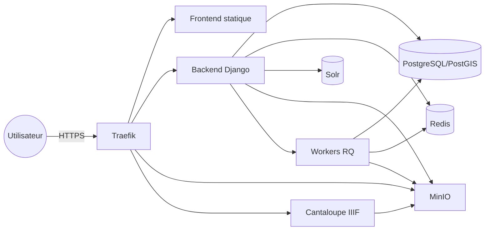

# Installation d'un environnement Arkindex

Ce dépôt fournit la configuration nécessaire pour démarrer rapidement les services
externes indispensables à une instance Arkindex (base de données, Redis, MinIO,
Traefik, …) ainsi que quelques indications pour récupérer le frontal.

## Vue d'ensemble des services



Ce schéma illustre les principaux conteneurs démarrés par `install/docker-compose.yml`
et la façon dont Traefik expose les services nécessaires à une instance de
développement Arkindex.

## Pré-requis

- Docker et les plugins Docker Compose **et Docker Buildx**
- Git

## Récupérer le frontend

Le frontal statique est distribué depuis le dépôt GitLab
[`arkindex/frontend`](https://gitlab.teklia.com/arkindex/frontend). Le script
`install.sh` se charge désormais de récupérer automatiquement l'archive de la
version indiquée par la variable d'environnement `ARK_FRONTEND_VERSION`
(définie par défaut à `1.9.0` dans `.env`) et de l'extraire dans le dossier
`frontend` situé au même niveau que `install/`.

Si vous souhaitez personnaliser la source ou le dossier cible, vous pouvez
définir les variables suivantes dans `.env.local` avant d'exécuter `install.sh`
:

- `ARK_FRONTEND_VERSION` : version du frontal à télécharger ;
- `ARK_FRONTEND_ARCHIVE_URL` : URL complète de l'archive à récupérer (par
  défaut `https://gitlab.teklia.com/arkindex/frontend/-/archive/<VERSION>/frontend-<VERSION>.zip`) ;
- `ARK_FRONTEND_DIR` : chemin du dossier où extraire les fichiers (par défaut
  `../frontend`).

Dans le cas où vous souhaitez gérer le téléchargement manuellement, l'option
`--skip-frontend-download` de `install.sh` permet d'ignorer cette étape.

Après téléchargement, reportez la version retenue dans la clé
`static.frontend_version` du fichier `config.yml` afin que le backend référence
les bons fichiers statiques.

## Démarrer les services pour le backend

1. Préparez le dossier de travail puis récupérez ce dépôt :

   ```bash
   mkdir -p ~/arkindex-project
   cd ~/arkindex-project
   git clone https://github.com/IA-Generative/arkindex.git
   cd arkindex/install
   ```

2. Positionnez-vous dans le dossier `install` et personnalisez votre
   configuration. Le fichier `config.yml`, monté en lecture seule dans les
   conteneurs backend/worker via le volume Docker `CONFIG_PATH`, est généré à
   partir de `config.template.yml` en utilisant les variables définies dans
   `.env` (notamment `ARK_DOMAIN`).

   ```bash
   cp .env .env.local  # facultatif si vous souhaitez versionner votre configuration
   # éditez .env ou .env.local pour mettre à jour ARK_DOMAIN et, si besoin,
   # ARK_SUPERUSER_EMAIL / ARK_SUPERUSER_PASSWORD / ARK_SUPERUSER_USERNAME
   # ainsi que ARK_ACME_EMAIL lorsque vous exposez un domaine public via Traefik
   ```

   Le script d'installation unique se charge de régénérer `config.yml` si le
   fichier est absent. Utilisez l'option `--regenerate-config` pour forcer sa
   reconstruction à partir du gabarit après modification des variables.

3. Exécutez le script d'installation qui prépare la configuration et lance
   l'infrastructure support ainsi que les tâches du premier démarrage :

   ```bash
   ./install.sh
   ```

   Ce script vérifie la présence de Docker et de son plugin Compose, régénère
   la configuration si nécessaire, met à jour la configuration Traefik avec
   l'adresse e-mail fournie pour Let's Encrypt puis délègue à `launch.sh` le
   démarrage des conteneurs (`docker compose up -d`) et l'exécution des migrations,
   initialisations et configuration des workers. Lors de la première
   exécution, il ouvre un terminal interactif pour créer le super-utilisateur
   Django, sauf si les variables correspondantes sont définies dans `.env`. Une
   fois ces étapes réalisées, un fichier `.first-launch.done` est créé pour
   éviter de relancer la séquence ; supprimez ce fichier si vous souhaitez
   forcer une nouvelle initialisation. L'option `--skip-launch` permet de ne
   préparer que la configuration sans démarrer les conteneurs.

  Les services indispensables (PostgreSQL, Redis, Solr, MinIO, Traefik, …)
  seront ainsi lancés et accessibles pour votre backend Arkindex. Lorsque les
  conteneurs sont en ligne, pointez votre backend Arkindex vers ces services
  via le fichier `config.yml`.

## Déploiement avec Helm

Une alternative à Docker Compose consiste à déployer l'ensemble des services
Arkindex dans un cluster Kubernetes à l'aide du chart Helm fourni dans
`helm/arkindex/`.

1. Vérifiez que Helm est installé, puis préparez un fichier de valeurs
   personnalisé (par exemple `my-values.yaml`). Les paramètres essentiels sont :

   | Variable `.env` historique | Valeur Helm équivalente | Description |
   | --- | --- | --- |
  | `ARK_DOMAIN` | `global.domain` | Domaine racine : l'interface est exposée sur `ark.<domaine>` et les services annexes sur `<service>-ark.<domaine>` |
   | `ARK_FRONTEND_VERSION` | `config.static.frontendVersion` | Version du frontend statique à exposer |

   Les autres clés de `config.template.yml` sont couvertes par la section
   `config` du chart (`config.database.*`, `config.redis.host`, `config.s3.*`,
   etc.). Ajoutez par exemple le bloc ci-dessous dans votre fichier de valeurs
   pour refléter la configuration Compose par défaut :

   ```yaml
   global:
     domain: localhost

   config:
     static:
       frontendVersion: "1.9.0"
   ```

2. Installez le chart dans le namespace de votre choix :

   ```bash
   helm install arkindex ./helm/arkindex \
     --namespace arkindex --create-namespace \
     --values my-values.yaml
   ```

   Cette commande provisionne toutes les ressources Kubernetes équivalentes aux
   services Docker Compose (`Deployments`/`StatefulSets`, `Services`, `Ingress`),
   génère le `config.yml` attendu par le backend via un `Secret` et crée les
   buckets MinIO via un `Job` dédié.

3. Pour mettre à jour la configuration, modifiez votre fichier de valeurs puis
   appliquez les changements avec `helm upgrade` :

   ```bash
   helm upgrade arkindex ./helm/arkindex \
     --namespace arkindex \
     --values my-values.yaml
   ```

   Utilisez `helm uninstall arkindex --namespace arkindex` pour supprimer les
   ressources déployées.

## Arrêter et désinstaller l'infrastructure

Lorsque vous souhaitez stopper l'environnement de développement Arkindex, le
script `install/uninstall.sh` se charge de mettre fin aux conteneurs Docker et
de nettoyer les fichiers générés sur demande.

```bash
cd install
./uninstall.sh            # Arrête les conteneurs
./uninstall.sh --purge-all # Supprime également volumes, images, frontal téléchargé et fichiers générés
```

Les options disponibles permettent notamment de supprimer les volumes Docker,
les images construites localement, le frontal téléchargé ainsi que les
certificats TLS et fichiers de configuration générés lors de l'installation.

## Accéder à l'interface web

Une fois les conteneurs démarrés, l'interface doit être consultée via le nom de
domaine local configuré dans `.env` (par défaut `https://ark.localhost`). Ce
domaine est pris en charge par Traefik (service `lb` dans
`install/docker-compose.services.yml`), qui assure la terminaison HTTPS et le
routage vers les conteneurs concernés.

Le service `frontend` publie également un port HTTP (`http://127.0.0.1:8080` ou
`http://localhost:8080`). Cette URL charge bien les fichiers statiques, mais les
actions qui nécessitent un échange avec l'API (authentification, recherche,
consultation de documents…) échouent car les requêtes sont envoyées hors de
Traefik et l'en-tête `Host` attendu (`ark.localhost` par défaut) n'est pas
présent. Le frontal redirige alors vers `/errors/unreachable` et Nginx répond
par un code HTTP 405.

Pour bénéficier d'un fonctionnement complet (login compris), utilisez
systématiquement l'URL `https://ark.localhost` (ou la valeur personnalisée de
`ARK_DOMAIN`) et pensez à ajouter les entrées correspondantes dans votre fichier
`/etc/hosts` si nécessaire :

```bash
echo "127.0.0.1 ark.localhost traefik-ark.localhost iiif-ark.localhost ingest-iiif-ark.localhost uploads-iiif-ark.localhost minio-ark.localhost minio-console-ark.localhost" | sudo tee -a /etc/hosts
```

Traefik publie ainsi l'interface principale sur `ark.${ARK_DOMAIN}` tandis que
les services auxiliaires (MinIO, console MinIO, IIIF, tableau de bord Traefik…)
sont accessibles via des sous-domaines de la forme `<service>-ark.${ARK_DOMAIN}`.

Lors du premier lancement, `install.sh` génère automatiquement une autorité
de certification locale et un certificat TLS pour le domaine configuré via le
script `generate-certificates.sh`. Les fichiers sont créés dans
`install/ssl/` (`rootCA.pem`, `tls.crt`, `tls.key`, …) et montés dans Traefik.
Pour éviter l'erreur `PR_CONNECT_RESET_ERROR` ou les avertissements de
sécurité, importez le certificat `rootCA.pem` dans le trousseau de votre
machine (ou dans votre navigateur) afin de faire confiance aux certificats
délivrés pour `https://ark.<ARK_DOMAIN>` et ses sous-domaines.

### Faire confiance à la racine locale dans les navigateurs

1. Récupérez le certificat d'autorité généré automatiquement dans
   `ssl/rootCA.pem`.
2. Selon votre système, importez-le dans le magasin de certificats :
   - **Linux (distributions Debian/Ubuntu)** :
     ```bash
     sudo cp ssl/rootCA.pem /usr/local/share/ca-certificates/arkindex-rootCA.crt
     sudo update-ca-certificates
     ```
     Redémarrez ensuite votre navigateur.
   - **macOS** : double-cliquez sur `rootCA.pem`, choisissez « Système » comme
     trousseau dans Trousseaux d'accès puis, dans la fiche du certificat,
     définissez « Toujours approuver » pour l'utilisation SSL.
   - **Windows** : exécutez `certmgr.msc`, importez `rootCA.pem` dans
     « Autorités de certification racines de confiance » puis redémarrez votre
     navigateur.
3. Si vous utilisez Firefox avec son magasin de certificats interne,
   ouvrez `about:preferences#privacy`, cliquez sur « Afficher les certificats »
   puis importez `rootCA.pem` dans l'onglet « Autorités ».

Après cette opération, les pages servies par Traefik (`https://ark.localhost`,
`https://minio-ark.localhost`, etc.) sont reconnues comme sûres par le
navigateur et les imports via MinIO fonctionnent sans erreur TLS côté client.

## Finaliser la configuration dans l'interface d'administration

Une fois l'instance accessible, connectez-vous à l'interface d'administration
de Django (`https://ark.localhost/admin/` par défaut) avec le compte
super-utilisateur créé lors de l'installation. Dans le menu « Image servers »,
ouvrez les deux objets suivants et mettez à jour les champs **IIIF URL** pour
faire correspondre votre nom de domaine :

- **Ingested** : remplacer `https://ingest-iiif-ark.localhost/iiif/2` par
  `https://ingest-iiif-ark.<votre-domaine>/iiif/2` ;
- **Uploaded** : remplacer `https://uploads-iiif-ark.localhost/iiif/2` par
  `https://uploads-iiif-ark.<votre-domaine>/iiif/2`.

Utilisez la valeur définie dans `ARK_DOMAIN` (ou son équivalent Helm) pour
composer les nouvelles URL, par exemple `https://ingest-iiif-ark.domain/iiif/2` et
`https://uploads-iiif-ark.domain/iiif/2` pour un domaine racine `domain`.
