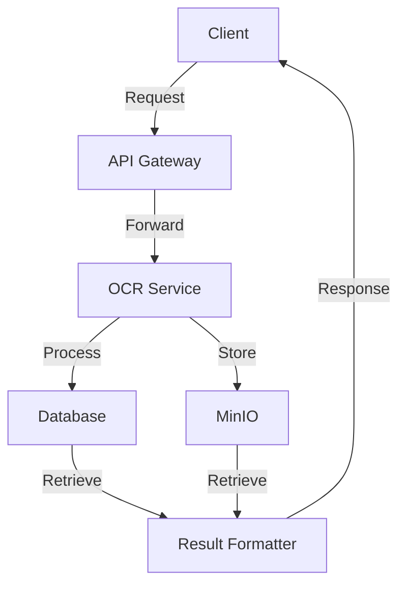

# OCR API
## Introduction

OCR API est une solution complète pour extraire du texte à partir de fichiers PDF, d’images, de documents bureautiques (DOCX, XLSX, ODT, ODS, ODP, CSV) et d’emails (.eml). Elle utilise des technologies avancées comme PaddleOCR et un pipeline asynchrone pour offrir des résultats rapides et précis. Cette API est conçue pour être facilement intégrée dans vos projets grâce à son SDK Python et ses fonctionnalités robustes.

---

## Table des matières

- [Introduction](#introduction)
- Fonctionnalités disponibles
  - [OCR](docs/ocr/README.md)
  - [Classification](docs/classification/README.md)
  - [Extractions d'entités](docs/extractions/README.md)
  - [Templates](docs/templates/README.md)
- [Installation](docs/server/INSTALL.md)
- [Usage](docs/server/USAGE.md)

---

## Fonctionnement Asynchrone

Ce diagramme illustre le fonctionnement asynchrone de l'application, mettant en évidence les interactions entre les différents composants.

---

## Formats de fichiers supportés

L'API accepte plusieurs familles de formats, traitées selon leur nature :

| Format | Extensions | Traitement |
| --- | --- | --- |
| PDF | `.pdf` | OCR PaddleOCR sur chaque page rendue en image |
| Images | `.jpg`, `.jpeg`, `.png` | OCR PaddleOCR |
| Bureautique | `.docx`, `.xlsx`, `.csv`, `.odt`, `.ods`, `.odp` | Texte extrait directement (liteparse), sans OCR |
| Email | `.eml` | Extraction du contenu de l'email + traitement des pièces jointes |

### Documents bureautiques

Les fichiers bureautiques sont convertis en images pour l'affichage, mais leur **texte est extrait directement** (positions normalisées 0‑1), évitant une passe OCR coûteuse et garantissant une précision maximale.

### Emails (.eml)

Le traitement d'un email produit une séquence de pages composée :

1. d'une **page de synthèse** reprenant les métadonnées (sujet, expéditeur, destinataires, date), le **corps du message** et la **liste des pièces jointes** (avec la page à laquelle chacune commence) ;
2. des **pages de chaque pièce jointe**, ajoutées à la suite avec une indexation continue.

Chaque pièce jointe est traitée selon son type : texte extrait directement pour les documents bureautiques, OCR PaddleOCR pour les PDF et les images.

