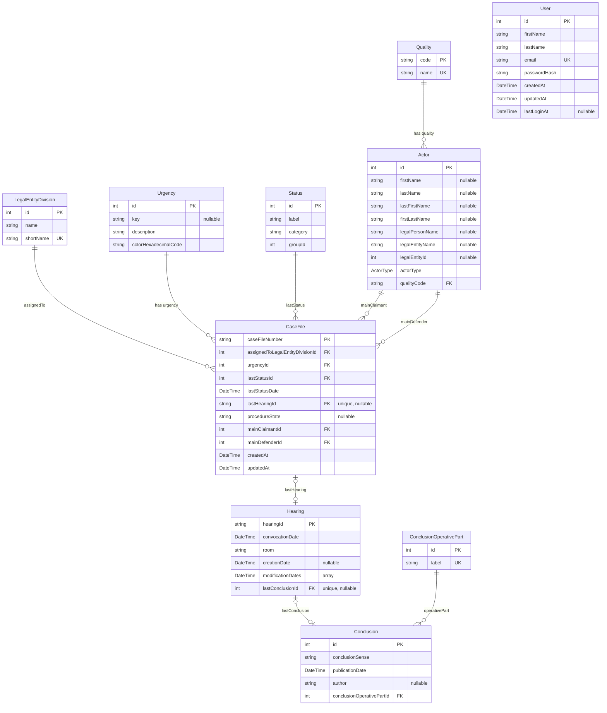

# DAHL'ia

Application d'aide pour organiser les défenses des dossier DALO, DAHO et DAHU
permets de récupérer les dossiers de contentieux du droit aux logements que les départements doivent défendre

Ce répertoire contient le code de la webapp DAHL'ia

- Application NextJS
- Utilisation du DSFR via `@codegouvfr/react-dsfr`

## Getting Started

### Installation

Lancement des services tiers (postgresql)

```sh
docker compose up -d
```

Installation des librairies JS

```sh
pnpm ci
```

Lancement de l'application en envronnement de développement

```sh
pnpm dev
```

Ouvrir [http://localhost:3000](http://localhost:3000) dans votre navigateur pour voir le résultat.

## Schéma de base de données

Source de vérité : `prisma/schema/*.prisma`. Le diagramme ci-dessous est généré
manuellement à partir de ces fichiers ; pensez à le mettre à jour lors d'un
changement de schéma.



## Questions Ouvertes

### Pièces jointes

Le pièces sont enregistrées dans Télérecours
Puis on ajoute des pièces dans DAHL'ia
Et on les repartages dans Télérecours et/ou LITIJ

Est-ce qu'on peut s'épargner de stocker les pièces qui le sont déjà dans Télérecours ?
