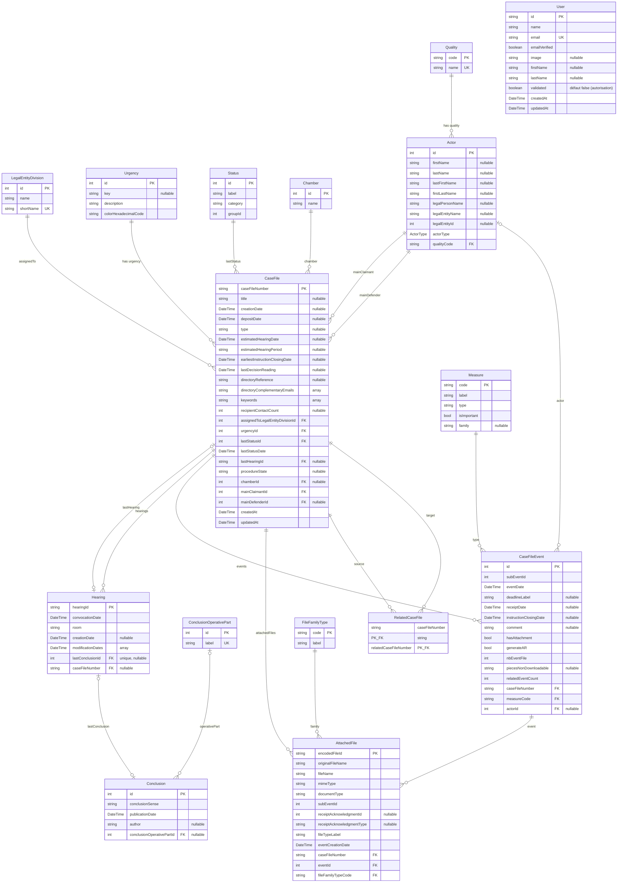

# DAHL'ia

Application d'aide pour organiser les défenses des dossier DALO, DAHO et DAHU
permets de récupérer les dossiers de contentieux du droit aux logements que les départements doivent défendre

Ce répertoire contient le code de la webapp DAHL'ia

- Application NextJS
- Utilisation du DSFR via `@codegouvfr/react-dsfr`

## Getting Started

### Installation

Lancement des services tiers (postgresql)

```sh
docker compose up -d
```

Installation des librairies JS

```sh
pnpm ci
```

Lancement de l'application en envronnement de développement

```sh
pnpm dev
```

Ouvrir [http://localhost:3000](http://localhost:3000) dans votre navigateur pour voir le résultat.

## Authentification & autorisation (ProConnect)

L'authentification repose sur [better-auth](https://www.better-auth.com/) avec le
plugin `genericOAuth` configuré pour **ProConnect** (OIDC). La configuration vit
dans [`app/lib/auth.ts`](app/lib/auth.ts) (serveur) et
[`app/lib/auth-client.ts`](app/lib/auth-client.ts) (client). Les routes d'auth
sont montées sur `/api/auth/*`.

### Variables d'environnement requises (`.env`)

| Variable                   | Description                                                                                                                   |
| -------------------------- | ----------------------------------------------------------------------------------------------------------------------------- |
| `BETTER_AUTH_SECRET`       | Clé de signature des sessions. Générer avec `openssl rand -base64 32`.                                                        |
| `BETTER_AUTH_URL`          | URL de base de l'app (ex. `http://localhost:3000`).                                                                           |
| `PROCONNECT_CLIENT_ID`     | Identifiant client de l'app déclarée sur l'espace partenaire ProConnect.                                                      |
| `PROCONNECT_CLIENT_SECRET` | Secret client ProConnect.                                                                                                     |
| `PROCONNECT_URL`           | Domaine de base ProConnect (intégration : `https://fca.integ01.dev-agentconnect.fr`). Les endpoints OIDC sont sous `/api/v2`. |

> Côté espace partenaire ProConnect, déclarer la **redirect URI**
> `http://localhost:3000/api/auth/oauth2/callback/proconnect` et la
> **post-logout redirect URI** `http://localhost:3000/`.

### Flux

- La page d'accueil `/` est **publique** ; toutes les autres pages exigent un
  compte **connecté et validé** (cf. `proxy.ts` + `app/(protected)/layout.tsx`).
- À la première connexion ProConnect, l'utilisateur est créé en base avec
  `validated = false`. Tant qu'il n'est pas validé, il voit un message d'attente.
- **Validation manuelle** (admin) via Prisma Studio (`pnpm db:studio`) ou en SQL :

  ```sql
  UPDATE users SET "validated" = true WHERE email = 'prenom.nom@exemple.gouv.fr';
  ```

- La particularité ProConnect du `userinfo` renvoyé en **JWT signé** est gérée par
  un `getUserInfo` personnalisé (vérification via JWKS avec `jose`). La
  déconnexion fait un logout complet (`end_session_endpoint`).

## Import des données (scraping Télérecours)

Le script [data/scrape-telerecours.ts](data/scrape-telerecours.ts) interroge l'API
Télérecours et **upsert** les dossiers en base. Il se lance via :

```sh
pnpm scrape:dev -- [options]
```

### Pré-requis (`.env`)

Le script lit les variables d'environnement, préfixées par le code de juridiction
ciblé (`<JURIDICTION>_…`) :

| Variable                              | Rôle                                                                                                                                    |
| ------------------------------------- | --------------------------------------------------------------------------------------------------------------------------------------- |
| `DATABASE_URL`                        | Connexion Postgres où les données sont upsertées                                                                                        |
| `<JURIDICTION>_TELERECOURS_USERNAME`  | Identifiant Télérecours (ex. `TA069_TELERECOURS_USERNAME`)                                                                              |
| `<JURIDICTION>_TELERECOURS_PASSWORD`  | Mot de passe Télérecours                                                                                                                |
| `<JURIDICTION>_TELERECOURS_DIVISIONS` | IDs des divisions par défaut, séparés par des virgules (ex. `2488,1234`) — utilisé si `--legalEntityDivisionIds` n'est pas passé en CLI |

### Options

| Option                           | Défaut            | Description                                                                                                                                                            |
| -------------------------------- | ----------------- | ---------------------------------------------------------------------------------------------------------------------------------------------------------------------- |
| `--jurisdiction <code>`          | `TA069`           | Code de la juridiction. Détermine aussi quelles variables d'env sont lues (`<code>_TELERECOURS_*`) et l'en-tête `X-Jurisdiction-Code` envoyé à l'API.                  |
| `--page <n>`                     | `0`               | Page de départ (0-based) pour la liste des dossiers (Phase A). Le script continue ensuite jusqu'à la dernière page.                                                    |
| `--size <n>`                     | `30`              | Nombre de dossiers par page lors de l'appel à `/api/case-file`.                                                                                                        |
| `--sort <champ>`                 | _(aucun)_         | Critère de tri transmis tel quel à l'API (paramètre `sort`).                                                                                                           |
| `--all`                          | `false`           | Récupère **tous** les dossiers. Sans ce flag, seuls les dossiers « inscrits au rôle » sont demandés (`onlyEnrolled=true`).                                             |
| `--legalEntityDivisionIds <ids>` | env `…_DIVISIONS` | Liste d'IDs de divisions à filtrer, séparés par des virgules (ex. `2488,1234`). Surcharge la variable d'env. Sert aussi à cibler les dossiers à enrichir (Phases B/C). |
| `--anonymize`                    | `true` sauf si `ENV=prod` | Anonymise les acteurs (requérants/défendeurs) avant insertion en base. Le défaut dépend de la variable d'env `ENV` : anonymisation activée en dev/preprod, désactivée en prod. |
| `--skipEnrichment`               | `false`           | N'exécute que la Phase A (liste des dossiers) et saute les Phases B et C (détails, audiences, mesures, pièces jointes, dossiers liés).                                 |

### Déroulé du script

1. **Phase A** — scrape la liste `/api/case-file` (paginée) et upsert chaque dossier
   avec ses entités de base (acteurs, statut, urgence, division, dernière audience…).
2. **Phase B** _(sautée si `--skipEnrichment`)_ — pour chaque dossier en base au
   statut « Inscrit au rôle d'une audience » et dans les divisions ciblées, récupère
   le détail enrichi, **toutes** les audiences, les mesures (events) et les pièces
   jointes.
3. **Phase C** _(sautée si `--skipEnrichment`)_ — crée les liens entre dossiers liés
   (`related-case-files`) pour les mêmes dossiers cibles.

### Exemples

```sh
# Scrape complet de la juridiction par défaut (TA069), divisions issues de l'env
pnpm scrape:dev

# Cibler une juridiction et des divisions précises
pnpm scrape:dev -- --jurisdiction TA069 --legalEntityDivisionIds 2488

# Récupérer tous les dossiers (pas seulement les « inscrits au rôle »)
pnpm scrape:dev -- --all

# Tester rapidement la seule Phase A, anonymisée, sur une page
pnpm scrape:dev -- --page 0 --size 30 --skipEnrichment --anonymize
```

## Schéma de base de données

Source de vérité : `prisma/schema/*.prisma`. Le diagramme ci-dessous est généré
manuellement à partir de ces fichiers ; pensez à le mettre à jour lors d'un
changement de schéma.



## Questions Ouvertes

### Pièces jointes

Le pièces sont enregistrées dans Télérecours
Puis on ajoute des pièces dans DAHL'ia
Et on les repartages dans Télérecours et/ou LITIJ

Est-ce qu'on peut s'épargner de stocker les pièces qui le sont déjà dans Télérecours ?
