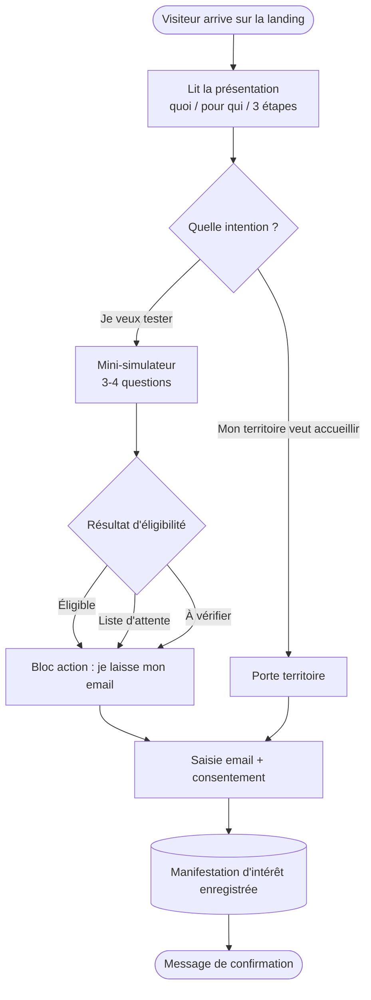
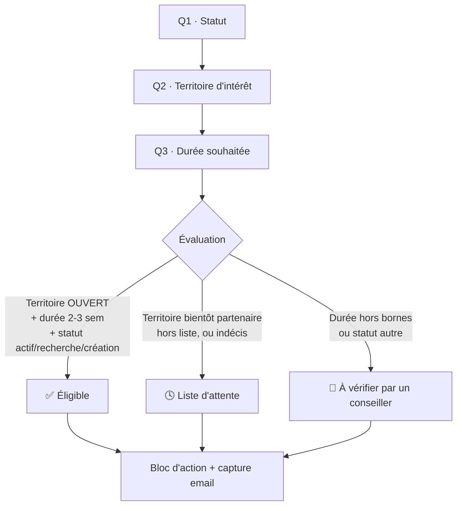
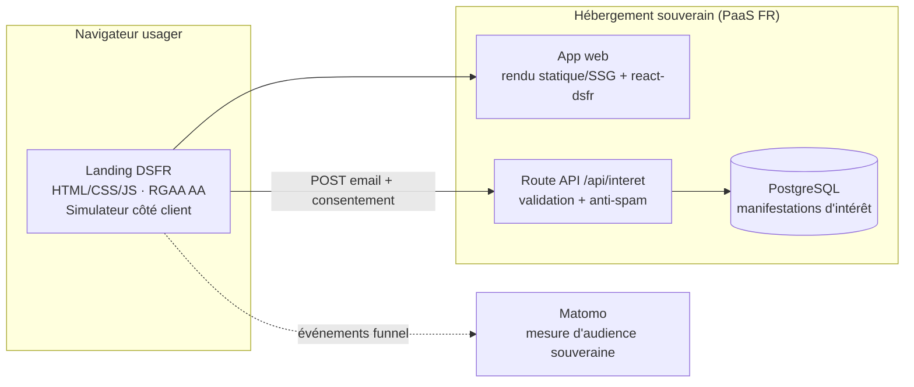
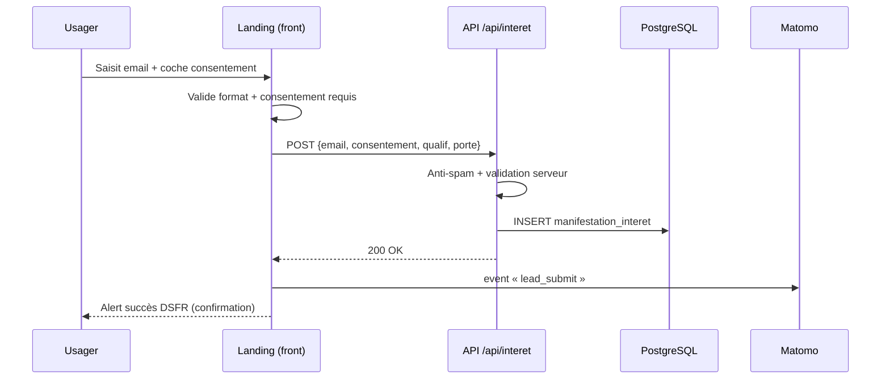
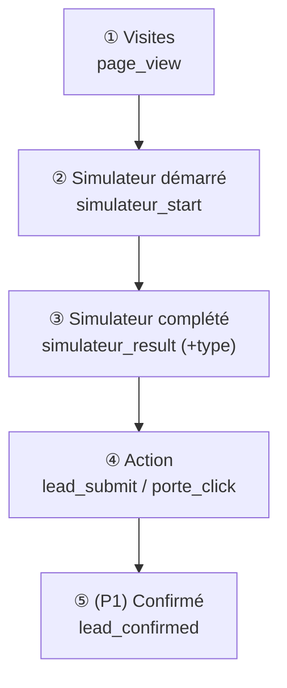

# TerriTest — séjour d'essai territorial

> **Dispositif FICTIF.** Cette politique publique n'existe pas : elle sert de support de démonstration. Inutile de la confronter à l'existant.

Dépôt de démonstration (atelier). Objectif : partir de **retours terrain** et dérouler la chaîne
**investigation → spec → maquette → tickets → PR** jusqu'à une **landing page DSFR** fonctionnelle.

## Contenu du dépôt

- [investigation-terrain-territest.md](investigation-terrain-territest.md) — matériau brut d'investigation (5 entretiens terrain).
- **Ce README** — la spec macro d'implémentation du MVP (ci-dessous).

| Étape | Statut |
|-------|--------|
| Investigation terrain | ✅ fait |
| **Spec macro (ce document)** | ✅ fait |
| Maquette / design DSFR | ⬜ à venir |
| Découpage en tickets | ⬜ à venir |
| PR → landing page fonctionnelle | ⬜ à venir |

---

# Spec macro d'implémentation

> **Statut :** v0.1 — spec synthétique (macro), à valider avant design / tickets / PR.
> **Source :** [investigation-terrain-territest.md](investigation-terrain-territest.md) (5 entretiens terrain).
> **Périmètre de la démo :** une **landing page** fonctionnelle (cf. §7 de l'investigation).
> **Rappel :** dispositif **fictif**. Les règles métier ci-dessous sont des hypothèses d'illustration, à arbitrer avec le commanditaire.

## 0. En une phrase

> Une **vitrine publique en langage clair** qui explique le séjour d'essai territorial, **qualifie** le visiteur en 3-4 questions, l'**oriente** vers la bonne action (candidat ou territoire), capte son **email avec consentement**, et **mesure le funnel** de bout en bout — sans construire (encore) la machine logistique derrière.

C'est exactement ce que demande R2 : *« Ce qu'il nous faut d'abord, ce n'est pas la machine complète, c'est une vitrine qui qualifie la personne, l'oriente, et nous dit combien de gens arrivent. »*

---

## 1. Problème & opportunité (synthèse du terrain)

| # | Irritant terrain | Preuve (verbatim) | Ce que la landing y répond |
|---|------------------|-------------------|----------------------------|
| I1 | **Le saut dans le vide** : l'envie existe, le risque perçu bloque | U1 : *« Le problème ce n'est pas l'envie, c'est le saut dans le vide »* | Message clair « tester sans s'engager » + 3 étapes rassurantes |
| I2 | **Pas de point d'entrée** unique | R2 : *« aucun point d'entrée grand public »* | Une URL publique, une promesse, une action évidente |
| I3 | **Curiosités perdues** côté territoire | R1 : *« on répond à la main, on perd la moitié des contacts »* | Capture email structurée + porte « territoire » |
| I4 | **Aucune mesure** de l'intérêt | R2 : *« aucun moyen de mesurer l'intérêt »* | Funnel instrumenté dès J1 (Matomo) |
| I5 | **Vision abstraite** : décision sur photos = pas de décision | U3 : *« on ne peut pas décider sur des photos »* | Promesse d'immersion concrète + qualification du besoin réel |

**Opportunité.** Marché à deux faces non connectées : des actifs prêts à bouger (U1, U2, U3) et des territoires en tension prêts à accueillir (R1). Personne ne tient aujourd'hui le point de contact. La landing est le coût d'entrée minimal pour **valider l'intérêt avant d'investir** (R2 : *« partir petit avant d'industrialiser »*).

---

## 2. Objectifs / Non-objectifs

### Objectifs (ce que le MVP doit prouver)
- **O1 — Compréhension :** un visiteur comprend le dispositif et sait s'il est concerné en **< 1 min** (critère démo §8).
- **O2 — Qualification :** transformer une curiosité diffuse en **statut d'éligibilité** + une **action** (email / porte).
- **O3 — Captation :** ne plus perdre les contacts → base d'emails consentis, exploitable par les territoires (I3).
- **O4 — Mesure :** rendre le **funnel mesurable de bout en bout** (I4, critère démo §8).
- **O5 — Conformité :** livrer un socle **RGAA + DSFR + souverain** réutilisable pour les itérations suivantes.

### Non-objectifs (explicitement hors v1)
- **N1 — Pas de matching** candidat ↔ territoire (algorithme de mise en relation). *Pourquoi : prématuré tant que l'intérêt n'est pas prouvé ; lourd.*
- **N2 — Pas de logistique** (réservation logement / transport). *Pourquoi : back-office complexe, hors « vitrine ».*
- **N3 — Pas d'espace territoire** pour gérer les candidatures reçues. *Pourquoi : suppose comptes + droits ; on capte d'abord, on outille ensuite.*
- **N4 — Pas de compte / authentification usager.** *Pourquoi : aucune donnée à protéger côté usager au stade vitrine ; friction inutile.*
- **N5 — Pas de données sensibles** collectées (santé, situation familiale détaillée, revenus). *Pourquoi : minimisation RGPD ; non nécessaire pour qualifier.*

> N1→N3 sont **assumés architecturalement** (§4, P2) : on ne se ferme aucune porte, mais on ne les construit pas.

---

## 3. Personae & parcours cibles

| Persona | Porte | Besoin déclencheur | Sortie attendue |
|---------|-------|--------------------|-----------------|
| **U1** cadre télétravail | Candidat | Réduire le risque perçu | Comprend, se sent éligible, laisse son email |
| **U2** en recherche d'emploi | Candidat | Savoir s'il est éligible + durée | Réponse claire éligibilité → action |
| **U3** couple + enfant | Candidat | Tester en famille, voir services | Qualifié, recontacté pour un séjour |
| **R1** élue d'accueil | Territoire | Capter/qualifier les curieux | Déclare son territoire candidat à l'accueil |
| **R2** chargé de mission | (commanditaire) | Mesurer l'intérêt + conformité | Dashboard funnel + base consentie |

---

## 4. Périmètre fonctionnel & justification des features

Priorisation **MoSCoW** : **P0** = la vitrine ne résout pas le problème sans ça • **P1** = améliore fortement (fast-follow) • **P2** = hors v1, mais on n'obère pas l'avenir.

| ID | Feature | Prio | Besoin terrain couvert | Pourquoi ce choix | Composants DSFR |
|----|---------|:----:|------------------------|-------------------|-----------------|
| **F1** | **Présentation langage clair** (le quoi / pour qui / bénéfice / les 3 étapes du séjour) | **P0** | I1, I2 · O1 · U1, U2 | Sans compréhension immédiate, tout le reste tombe. Répond directement au critère « < 1 min ». | `header`, `composition` (hero), `content`, `stepper`, `accordion` (FAQ) |
| **F2** | **Mini-simulateur d'éligibilité** (3-4 questions → réponse immédiate *éligible / liste d'attente / à vérifier*) | **P0** | O2 · U2 (*« savoir si je suis éligible »*), U1, R1 (qualifier), R2 (qualifier) | Cœur de la valeur : convertit une envie diffuse en statut + action. Qualifie côté usager **et** côté territoire. | `radio`, `select`, `input`, `stepper`, `alert`/`callout` (résultat) |
| **F3** | **Deux portes de sortie** (« je veux tester » / « mon territoire veut accueillir ») | **P0** | I3 · marché 2 faces · R1, U1-U3 | Le dispositif n'existe que si les deux côtés s'inscrivent. Deux CTA distincts, deux intentions. | `tile` / `card`, `button` |
| **F4** | **Capture d'intérêt légère** (email + consentement explicite) | **P0** | I3 · O3 · R1 (*« on perd la moitié des contacts »*), R2 (*« repartent avec une action »*) | La seule donnée qui permet le recontact. Minimale, consentie. | `pattern/email`, `checkbox` (consentement), `button`, `alert` (succès) |
| **F5** | **Mesure de funnel bout-en-bout** (visites → simulateur → résultat → action) | **P0** | I4 · O4 · R2 (*« combien arrivent, éligibles, repartent avec une action »*) | C'est la demande n°1 du commanditaire et le critère de réussite de la démo. | (Matomo, hors DSFR) |
| **F6** | **Socle conformité & confiance** (footer mentions légales / accessibilité / données perso, liens d'évitement, thème) | **P0** | O5 · R2 (*« RGAA et hébergé proprement »*) | Contrainte **non négociable** + signal de confiance « service de l'État ». | `footer`, `skiplink`, `display` (thème), `consent` si besoin |
| **F7** | Page de résultat **enrichie par territoire** (aperçu services : école / santé / mobilité) | **P1** | I5 · U2, U3 (*« voir l'école, les services »*) | Renforce la projection concrète, mais demande du contenu éditorial par territoire → après validation de l'intérêt. | `content`, `card`, `tag` |
| **F8** | **Réponse personnalisée** selon statut/projet (solo vs famille) | **P1** | U3 (projet à deux) | Améliore la pertinence ; le moteur F2 est conçu pour le permettre, on l'active ensuite. | — |
| **F9** | **Double opt-in** email + lettre d'info | **P1** | O3 · qualité base / conformité renforcée | Améliore la qualité de la base et la robustesse RGPD ; non bloquant pour mesurer. | `follow` |
| **F10** | Matching candidat ↔ territoire | **P2** | (N1) | Hors v1 — prématuré (§7). Modèle de données prévu pour le rendre possible plus tard. | — |
| **F11** | Logistique séjour (logement / transport) | **P2** | (N2) | Hors v1 (§7). | — |
| **F12** | Espace territoire (gestion des candidatures, comptes) | **P2** | (N3) | Hors v1 (§7). `connect` (FranceConnect) disponible le jour venu. | `connect`, `user` |

**Lecture :** les 6 features **P0** sont le strict nécessaire pour répondre aux 5 irritants **et** aux 2 critères de réussite de la démo. Aucune n'est décorative ; chacune trace vers un verbatim. Tout le reste est repoussé pour rester sur une **vitrine livrable rapidement** (principe R2 « partir petit »).

---

## 5. Parcours & logigrammes

### 5.1 Parcours utilisateur global



### 5.2 Structure de la landing (wireframe macro)

```
┌──────────────────────────────────────────────────────────┐
│ [header DSFR]  Marianne · TerriTest        [thème clair/●] │  ← F6
├──────────────────────────────────────────────────────────┤
│ [notice] « Dispositif en expérimentation »                 │  (optionnel)
├──────────────────────────────────────────────────────────┤
│ HERO (composition)                                         │
│   Titre clair + sous-titre bénéfice                        │  ← F1 / O1
│   [ Tester mon éligibilité ]  (CTA principal → §5.3)       │
├──────────────────────────────────────────────────────────┤
│ « Comment ça marche » — stepper 3 étapes                   │  ← F1
│   1. Candidater  →  2. Immersion 2-3 sem  →  3. Décider    │
├──────────────────────────────────────────────────────────┤
│ MINI-SIMULATEUR (stepper + radio/select)                   │  ← F2 / O2
│   Q1 statut · Q2 territoire · Q3 durée · (Q4 projet)       │
│   ⇒ [alert] Résultat : Éligible / Liste d'attente / À vérif│
├──────────────────────────────────────────────────────────┤
│ DEUX PORTES (tile × 2)                                     │  ← F3
│   ┌───────────────────┐   ┌───────────────────────────┐    │
│   │ Je veux tester    │   │ Mon territoire veut        │    │
│   │ un territoire     │   │ accueillir                 │    │
│   └───────────────────┘   └───────────────────────────┘    │
├──────────────────────────────────────────────────────────┤
│ CAPTURE EMAIL (pattern/email + checkbox consentement)      │  ← F4 / O3
│   [ email ............ ]  ☐ J'accepte d'être recontacté    │
│   [ Être recontacté ]                                      │
├──────────────────────────────────────────────────────────┤
│ FAQ (accordion)  ·  [footer] mentions / accessibilité /    │  ← F1 / F6
│                     données personnelles / contact         │
└──────────────────────────────────────────────────────────┘
```

### 5.3 Logigramme d'éligibilité (règles d'illustration)

> ⚠️ Règles **fictives**, à calibrer avec le métier (R2). L'intérêt est de montrer un moteur **transparent et explicable**.



| Entrée | Valeurs | Effet sur le résultat |
|--------|---------|-----------------------|
| Statut | télétravail · recherche d'emploi · indépendant/création · **autre** | « autre » → *À vérifier* |
| Territoire | ouvert · bientôt · hors liste · indécis | tout sauf « ouvert » → *Liste d'attente* |
| Durée | < 2 sem · **2-3 sem** · > 3 sem | hors « 2-3 sem » → *À vérifier* |

**Tous les chemins convergent vers la capture d'email** : même « à vérifier » ou « liste d'attente » repart avec une action (objectif O3) — on ne perd aucun contact (I3).

---

## 6. Architecture technique (macro)



### Stack recommandée (et pourquoi)

| Brique | Choix recommandé | Justification | Alternative |
|--------|------------------|---------------|-------------|
| **UI / DSFR** | `@codegouvfr/react-dsfr` sur **Next.js (SSG)** | Intégration DSFR maintenue et **conforme RGAA out-of-the-box** (polices Marianne, thème, focus visible) → réduit le risque d'accessibilité. SSG = page **rapide et indexable** (vitrine grand public). | DSFR « vanilla » (HTML/CSS/JS) si zéro framework souhaité |
| **Interactivité simulateur** | Logique **100 % côté client** (pas d'appel réseau) | Réponse immédiate (O2), aucune donnée envoyée tant que pas de consentement → minimisation RGPD. | — |
| **Capture email** | Route API + validation serveur + anti-spam (honeypot + rate-limit) | Une seule écriture, simple à sécuriser. | Service de formulaire tiers (écarté : souveraineté) |
| **Stockage** | **PostgreSQL** managé | Standard, durable, requêtable pour le suivi. Email = seule PII. | — |
| **Mesure** | **Matomo** en **mode exempté de consentement** (audience anonymisée, conforme CNIL) | **Funnel mesurable dès J1 sans mur de cookies** (O4). Souverain. | — |
| **Hébergement** | PaaS souverain (Scalingo / Clever Cloud) | Hébergeurs français, RGPD, déploiement simple. *À confirmer avec l'ops (Q-ops).* | OVHcloud |

### Séquence — capture d'une manifestation d'intérêt



---

## 7. Modèle de données (minimal)

Une seule table — pensée pour absorber les itérations P2 sans refonte.

```
manifestation_interet
├── id                      uuid
├── cree_le                 timestamptz
├── type_porte              enum(candidat, territoire)
├── email                   text            -- seule donnée personnelle
├── consentement            boolean         -- obligatoire = true pour enregistrer
├── consentement_le         timestamptz
├── version_mentions        text            -- traçabilité RGPD
├── qualif_statut           text   null     -- candidat
├── qualif_territoire       text   null     -- candidat / territoire
├── qualif_duree            text   null     -- candidat
├── resultat_eligibilite    enum  null      -- eligible | liste_attente | a_verifier
└── source_utm              text   null     -- attribution (non perso)
```

**Principes :** minimisation (pas de nom, ni données sensibles → N5) · base légale = **consentement** · durée de conservation définie + purge · pas de PII dans Matomo.

---

## 8. Plan de mesure — funnel mesurable bout-en-bout (O4)



| Événement | Déclencheur | Propriétés | KPI commanditaire (R2) |
|-----------|-------------|------------|------------------------|
| `page_view` | Chargement | source/UTM | **« combien arrivent »** |
| `simulateur_start` | 1ʳᵉ question | — | entrée funnel |
| `simulateur_step` | Chaque étape | n° étape | détection d'abandon |
| `simulateur_result` | Résultat affiché | `type` (éligible/attente/à vérifier) | **« combien sont éligibles »** |
| `porte_click` | Clic tuile | `candidat`/`territoire` | intention |
| `lead_submit` | Email enregistré | `type_porte`, `resultat` | **« combien repartent avec une action »** |
| `lead_confirmed` (P1) | Double opt-in | — | qualité de conversion |

**Funnel cible :** Visites → % démarrent → % complètent → % laissent une action. Les 3 chiffres demandés par R2 sortent directement de `page_view`, `simulateur_result.type` et `lead_submit`.

---

## 9. Conformité & contraintes non négociables

| Contrainte (§7 invest.) | Mise en œuvre | Vérification |
|--------------------------|---------------|--------------|
| **RGAA (accessibilité)** | DSFR conforme + `skiplink`, contrastes/tokens DSFR, focus visible, labels de champs, simulateur navigable clavier + restitué aux lecteurs d'écran (résultat dans une zone `aria-live`) | Audit RGAA + tests clavier/lecteur d'écran ; déclaration d'accessibilité dans le footer |
| **DSFR (design État)** | `@codegouvfr/react-dsfr`, composants natifs uniquement, pas de CSS « maison » concurrent | Revue visuelle vs DSFR |
| **Hébergement souverain** | PaaS FR (Scalingo / Clever Cloud), données en UE | Validation ops |
| **Pas de données sensibles** | Modèle minimal (§7), email seule PII | Revue du schéma |
| **Email = consentement** | Case décochée par défaut, action impossible sans coche, horodatage + version des mentions | Test fonctionnel |
| **RGPD** | Mentions légales + politique de données dans le `footer`, durée de conservation, droit d'accès/suppression, Matomo anonymisé | Checklist RGPD |

---

## 10. Métriques de réussite (hypothèses à calibrer)

| Type | Métrique | Cible | Stretch | Mesure |
|------|----------|:-----:|:-------:|--------|
| Leading | Taux de complétion du simulateur (parmi démarrages) | ≥ 40 % | 60 % | Matomo funnel |
| Leading | Taux de conversion en action (email/porte sur visiteurs) | ≥ 8 % | 15 % | Matomo |
| Leading | Compréhension « < 1 min » | qualitatif OK | — | 5 tests utilisateurs + temps avant 1ᵉʳ engagement |
| Descriptif | Répartition éligible / attente / à vérifier | — | — | calibrage des règles |
| Lagging | Territoires déclarés à l'accueil | ≥ 3 | — | base |
| Lagging | Coût d'acquisition d'un contact qualifié | baseline | — | dépenses / `lead_submit` |

---

## 11. Découpage en lots (préfiguration des tickets)

1. **Socle** — projet Next.js + react-dsfr, header/footer, déploiement PaaS, déclaration d'accessibilité. *(F1 partiel, F6)*
2. **Contenu vitrine** — hero, « comment ça marche » (stepper), FAQ. *(F1, O1)*
3. **Simulateur** — moteur de règles client + UI questions + résultat `aria-live`. *(F2, O2)*
4. **Deux portes + capture email** — tuiles, formulaire, route API, base PostgreSQL, anti-spam, consentement. *(F3, F4, O3)*
5. **Mesure** — Matomo + événements funnel + tableau de bord. *(F5, O4)*
6. **Conformité finale** — audit RGAA, RGPD, recette. *(F6, O5)*

> Lots 1→5 = chemin critique de la démo. Chaque lot est livrable et démontrable indépendamment.

---

## 12. Questions ouvertes (à arbitrer)

| # | Question | Pour qui | Bloquant ? |
|---|----------|----------|:----------:|
| Q1 | Règles d'éligibilité réelles (statuts, durées, territoires ouverts) | Métier / R2 | Non (valeurs d'illustration en attendant) |
| Q2 | Liste des territoires partenaires au lancement | Métier / R1 | Non |
| Q-ops | Hébergeur souverain retenu + base managée | Ops | Non (Scalingo par défaut) |
| Q3 | Double opt-in dès le MVP ou en P1 ? | Métier / RGPD | Non |
| Q4 | Y a-t-il un back-office minimal pour lire les manifestations, ou export ? | R1 / R2 | Non |
| Q5 | Matomo : instance existante de l'admin ou à provisionner ? | Ops / Data | Non |

---

## 13. Annexe — composants DSFR mobilisés

`header` · `footer` · `skiplink` · `composition` (hero) · `content` · `stepper` · `accordion` (FAQ) · `radio` / `select` / `input` (simulateur) · `alert` / `callout` (résultat) · `tile` / `card` (les deux portes) · `pattern/email` + `checkbox` (capture + consentement) · `button` · `display` (thème) · `notice` (bandeau expérimentation, optionnel) · `follow` (P1, lettre d'info) · `connect` / `user` (P2, espace territoire).
