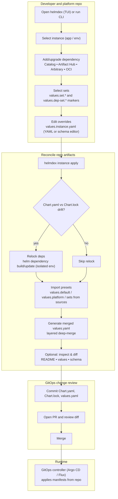

<div align="center">
  

  <h1>helmdex</h1>

  <p>TUI organizer for Helm umbrella chart instances — no rendering, no deploy.</p>
</div>

---

## helmdex in 30 seconds

`helmdex` is a **TUI-first organizer** for GitOps-friendly Helm **umbrella chart** instances.

- Create and manage multiple instances (one per app / env)
- Add / upgrade dependencies, from a curated catalog or Artifact Hub
- Manage layered values (defaults → platform → sets → instance)
- Generate a merged `values.yaml` designed to be committed and reviewed

**What it is not:** `helmdex` does **not** render templates and does **not** deploy (no `helm template`, no `helm install`).

## Key features

- 🧾 **GitOps-friendly umbrella chart instances** on disk: commit `Chart.yaml`, `Chart.lock`, and a generated `values.yaml` that’s meant to be reviewed in PRs.
- 🗂️ **Curated catalog + presets**: add approved dependencies from a team catalog and apply versioned defaults/platform/sets.
- 🔎 **Artifact Hub built-in**: search charts and pick versions without leaving the TUI (also available via CLI).
- 🧅 **Layered values → one merged output**: defaults → platform → sets → per-dep sets → `values.instance.yaml` → merged `values.yaml`.
- 🧠 **Schema-aware configuration**: when charts publish `values.schema.json`, edit values with a structured TUI editor.
- 🧪 **Safer upgrades**: preview diffs between chart versions (values + schema) before applying.
- 🤖 **CLI parity for automation**: use helmdex in CI (`catalog sync`, `instance apply`, values get/set, dependency inspect…).
- 🧯 **Escape hatches**: detach a dependency from a catalog entry to unblock urgent changes.
- 📌 **Reproducible dependency operations**: helmdex ships a pinned Helm binary and verifies downloads.
- 🔒 **Repo-local isolation**: Helm repos/caches and OCI auth are stored under `.helmdex/` (no pollution of user `~/.config/helm` or `~/.docker`).

<details>
<summary>How helmdex fits a GitOps PR workflow</summary>



</details>

---

## Install

Download the latest binary for your platform:

```bash
curl -fsSL "https://github.com/SocialGouv/helmdex/releases/latest/download/helmdex-$(uname -s | tr '[:upper:]' '[:lower:]')-$(uname -m | sed 's/x86_64/amd64/' | sed 's/aarch64/arm64/')" | sudo tee /usr/local/bin/helmdex > /dev/null && sudo chmod +x /usr/local/bin/helmdex
```

Or install to a local directory:

```bash
curl -fsSL "https://github.com/SocialGouv/helmdex/releases/latest/download/helmdex-$(uname -s | tr '[:upper:]' '[:lower:]')-$(uname -m | sed 's/x86_64/amd64/' | sed 's/aarch64/arm64/')" -o ./helmdex && chmod +x ./helmdex
```

**Windows** (PowerShell):

```powershell
Invoke-WebRequest -Uri "https://github.com/SocialGouv/helmdex/releases/latest/download/helmdex-windows-amd64.exe" -OutFile helmdex.exe
```

Verify the download (optional):

```bash
curl -fsSL "https://github.com/SocialGouv/helmdex/releases/latest/download/helmdex-$(uname -s | tr '[:upper:]' '[:lower:]')-$(uname -m | sed 's/x86_64/amd64/' | sed 's/aarch64/arm64/').sha256" | sha256sum -c
```

Or build from source:

```bash
go install github.com/SocialGouv/helmdex/cmd/helmdex@latest
```

## Quick start (TUI)

Requirements:

- Go (for installation)
- Helm is bundled automatically (pinned) for reproducible dependency operations.

```bash
helmdex init   # create helmdex.yaml at repo root
helmdex        # open TUI
```

### Bundled Helm behavior

By default, `helmdex` uses a pinned Helm binary (`v4.1.1`) installed at:

- `~/.helmdex/bin/helm` (or `helm.exe` on Windows)

If it is missing or not the pinned version, `helmdex` downloads it from `https://get.helm.sh` and verifies it against the official per-archive checksum file (`.sha256sum` / `.sha256`).

To disable this behavior (and require `helm` on `PATH`):

```bash
export HELMDEX_NO_BUNDLED_HELM=1
```

Running `helmdex` with no arguments opens the interactive dashboard when stdin is a TTY. Outside a TTY (pipe, CI) it prints help instead.

---

## TUI at a glance

### Navigation model

The TUI opens on the **Dashboard** — a list of all instances. Press `enter` to open an instance.

The terminal window title tracks your location:

```
🧭 HelmDex › my-app
🧭 HelmDex › my-app › Add dep › Catalog
🧭 HelmDex › my-app › Dependency detail
```

| Env var | Effect |
|---|---|
| `HELMDEX_NO_TITLE=1` | Disable window title updates |
| `HELMDEX_NO_ICONS=1` | Disable emoji/icons (inconsistent width in some terminals) |

### Instance tabs

| Tab | What you can do |
|---|---|
| **Dependencies** | Add, remove, inspect, and upgrade chart dependencies |
| **Values** | Browse all values layer files for this instance |
| **Instance** | Rename or delete the instance |

### Common keys

| Key | Action |
|---|---|
| `↑` / `↓` | Navigate list |
| `Enter` | Select / open |
| `Esc` | Back / close / clear filter |
| `q` | Quit |
| `a` | Add dependency |
| `m` | Command palette |
| `v` | Change dependency version (Deps tab) |
| `u` | Upgrade dependency to latest supported version (Deps tab) |
| `r` | Regenerate `values.yaml` (Instance view) |
| `d` | Delete (instance or dependency; confirms) |
| `space` | Toggle |
| `D` | Toggle all default sets |
| `?` | Help / about |

---

## Typical workflow

1. `helmdex init`
2. Configure at least one source (catalog + presets) in `helmdex.yaml`
3. `helmdex catalog sync`
4. Open the TUI → create an instance → add a dependency → pick sets → apply
5. Commit the resulting `Chart.yaml`, `Chart.lock`, and generated `values.yaml` for review

---

## Core concepts

| Term | Meaning |
|---|---|
| **Instance** | One umbrella chart project on disk (default: `apps/<name>/`) |
| **Dependency** | A chart entry in the instance’s `Chart.yaml` |
| **Values layers** | Ordered merge of multiple YAML files into one output |
| **Catalog** | Curated chart+version entries your team can add from |
| **Presets / sets** | Versioned YAML snippets shipped with catalog entries |
| **Source** | A Git repo (or local dir) that provides catalog + presets |

### Adding a dependency

From the **Dependencies** tab, press `a` to start the wizard:

- **Predefined catalog** — pick from synced catalog entries; toggle sets with `space`, `D` for all defaults, `enter` to add + apply
- **Artifact Hub** — search charts directly from the TUI
- **Arbitrary** — enter a repo URL, name, and version manually

### Working with presets on an existing dependency

The command palette is a first-class navigation surface: press `m` and type what you want.

Common flows:

- **Toggle sets**: in **Dependencies**, press `Enter` to open **Dependency detail** → go to the **Sets** tab (←/→) → `Space` toggles a set → `Enter` applies.
- **Sync presets for a dependency**: press `m` → run **Sync presets (selected dep)**.
- **Detach from catalog** (allow any version): press `m` → run **Detach from catalog (selected dep)**.
- **Regenerate merged values**: press `r` (or `m` → **Regenerate values.yaml**).

---

## Catalog and presets

A **catalog** is a curated list of chart+version entries. **Presets** are versioned YAML values files bundled with those entries. Both live in a *source* — a separate Git repo (or local directory).

### Configure a source (`helmdex.yaml`)

```yaml
apiVersion: helmdex.io/v1alpha1
kind: HelmdexConfig

repo:
  appsDir: apps        # where instances live (default: apps)

platform:
  name: eks            # used to resolve values.platform.<name>.yaml

sources:
  - name: my-catalog
    git:
      url: https://github.com/acme/helmdex-catalog.git
      ref: main        # branch, tag, or commit (optional)
    catalog:
      enabled: true
      path: catalog.yaml
    presets:
      enabled: true
      chartsPath: charts

artifactHub:
  enabled: true        # Artifact Hub integration (default: true)
```

### Sync sources

```bash
helmdex catalog sync
```

Downloads catalog entries into `.helmdex/catalog/` and preset files into `.helmdex/cache/`.

### Try the built-in example (no network)

This repo ships a self-contained fixture at [`fixtures/remote-source/`](fixtures/remote-source/README.md).

**Option A — filesystem source:**

```yaml
sources:
  - name: example
    git:
      url: fixtures/remote-source
    catalog:
      enabled: true
      path: catalog.yaml
    presets:
      enabled: true
      chartsPath: charts
```

**Option B — local git repo (mirrors real-world sync behavior):**

```bash
cp -a fixtures/remote-source /tmp/helmdex-example-remote-source
cd /tmp/helmdex-example-remote-source
git init && git config user.email e2e@example.invalid && git config user.name helmdex-example
git add -A && git commit -m 'example catalog + presets'
```

Point `git.url` at `/tmp/helmdex-example-remote-source`, then:

```bash
helmdex catalog sync
helmdex
```

> For filesystem sources (no `.git` folder), `git.ref` is ignored during sync and cleared on save.

### Preset version matching

Preset files are organized as `charts/<name>/<version-or-constraint>/values.*.yaml`. helmdex resolves the best match using SemVer constraints — a preset at `nginx/^15.0.0` matches any `15.x.x` dependency.

### If the local catalog is empty

When you open **Add dependency → Predefined catalog** and no entries are found, helmdex attempts a one-time auto-sync for the session. If there is no config or no sources, the wizard offers shortcuts to **Configure sources** and retry.

---

## Values and files (deeper)

### Values merge order

```
values.default.yaml               ← from preset source
values.platform.yaml              ← platform overrides (e.g. eks, gke)
values.set.<name>.yaml            ← named configuration sets
values.dep-set.<id>--<set>.yaml   ← per-dependency set files
values.instance.yaml              ← your overrides  ← highest priority, hand-edited
────────────────────────────────────────────────
values.yaml                       ← generated merged output (committed, reviewed in PRs)
```

### Instance directory layout

```
apps/my-app/
├── Chart.yaml                        # umbrella chart + dependencies
├── Chart.lock                        # dependency lock (from helm dependency build)
├── values.default.yaml               # from preset source  ─┐
├── values.platform.yaml              # platform layer       │  generated,
├── values.set.<name>.yaml            # named set(s)         │  do not edit
├── values.dep-set.<id>--<set>.yaml   # per-dep set(s)      ─┘
├── values.instance.yaml              # your overrides  ← edit this
└── values.yaml                       # merged output   ← generated
```

The **Values** tab in the TUI lists each file with a short description and lets you preview its contents with syntax highlighting.

---

## CLI reference

All TUI capabilities are also available as non-interactive commands, suitable for CI and scripts.

Common commands:

```bash
helmdex catalog sync
helmdex instance list
helmdex instance create <name>
helmdex instance apply <name>
helmdex instance values regen <name>
```

<details>
<summary>Full CLI reference</summary>

### Instances

```bash
helmdex instance create <name>
helmdex instance list
helmdex instance apply <name>          # lock deps, import presets, regen values.yaml
helmdex instance update <name>         # regen values (optionally relock)
helmdex instance rm <name> --yes
```

### Instance values

Read and write `values.instance.yaml` by JSONPath (`$.key.sub`):

```bash
helmdex instance values get    <name> --path '$.global.replicas'
helmdex instance values set    <name> --path '$.global.replicas' --value-yaml '3'
helmdex instance values unset  <name> --path '$.global.replicas'
helmdex instance values replace <name> --stdin
helmdex instance values replace <name> --file vals.yaml
helmdex instance values regen  <name>
```

### Dependency management

```bash
helmdex instance dep add <instance> \
  --repo https://charts.bitnami.com/bitnami \
  --name nginx --version 15.0.0 [--alias my-nginx] [--set production]

helmdex instance dep add <instance> \
  --repo oci://registry-1.docker.io/cloudpirates/postgres \
  --name postgres --version 0.16.0

helmdex instance dep add-from-catalog <instance> --id <entry-id> [--apply] [--set <set>]
helmdex instance dep list <instance>
helmdex instance dep detach <instance> <depID>
helmdex instance dep sync-presets <instance> <depID>
helmdex instance dep rm <instance> <depID>
helmdex instance dep set-version <instance> <depID> --version 15.1.0 [--apply]
helmdex instance dep upgrade <instance> <depID> [--apply]
```

### Per-dependency value overrides

Paths are relative to the dependency root in `values.instance.yaml`:

```bash
helmdex instance dep values get    <instance> <depID> --path '$.replicaCount'
helmdex instance dep values set    <instance> <depID> --path '$.replicaCount' --value-yaml '2'
helmdex instance dep values unset  <instance> <depID> --path '$.replicaCount'
```

### Dependency inspection

Uses vendored chart → archive cache → helm show cache → pull (best-effort, cached):

```bash
helmdex instance dep inspect readme  <instance> <depID>
helmdex instance dep inspect values  <instance> <depID>
helmdex instance dep inspect schema  <instance> <depID>
```

### Presets

```bash
helmdex instance presets resolve     <instance>
helmdex instance presets resolve-dep <instance> <depID>
```

### Catalog

```bash
helmdex catalog sync
helmdex catalog list  [--format json|table]
helmdex catalog get <id> [--format json|table]
```

### Artifact Hub

```bash
helmdex artifacthub search <query> [--limit 20] [--format json|table]
helmdex artifacthub versions <repoKey> <package> [--format json|table]
```

### OCI registry

```bash
helmdex registry login <registry> [--username <u>] [--password-stdin]
```

If you hit Docker Hub rate limits, login stores credentials in a helmdex-isolated store (separate from your system Docker config).

### Cache

```bash
helmdex cache clear [--helm]   # clear show/version cache; --helm also clears helm env
```

</details>

Tip: `helmdex --help` shows all commands, and most subcommands accept `--help`.

---

## Advanced

<details>
<summary>Pin a source to a specific git ref</summary>

`ref` in a source accepts any branch, tag, or commit SHA. On sync it is resolved to a commit and stored back in `helmdex.yaml` under `commit:` for reproducibility.

</details>

<details>
<summary>YAML syntax highlighting</summary>

YAML previews (instance values, Artifact Hub "Values", dependency "Default") are syntax-highlighted with ANSI colors, suppressed when `NO_COLOR` is set or `TERM=dumb`.

</details>

<details>
<summary>Markdown rendering</summary>

README previews (Artifact Hub detail, dependency detail "README") are rendered as Markdown to ANSI.

</details>

---

## Development

### Prerequisites

- **direnv** (recommended) — automatically loads the repo environment.
  - Install: https://direnv.net/docs/installation.html
  - After install (once):
    - `direnv allow`
- **devbox** — provides a reproducible toolchain (Go, Node, pnpm, task, etc.).
  - Install: https://www.jetify.com/devbox/docs/installing_devbox/
  - Note: devbox uses **Nix** under the hood; the devbox installer will guide you.

### Commands

```bash
devbox run -- go build ./...
devbox run -- go test ./...
devbox run -- pnpm install
devbox run -- task build
devbox run -- task test-tui
```

E2E tests live in `tests/`. The fixture at `fixtures/remote-source/` is a self-contained example catalog + presets source used by tests and local development.
