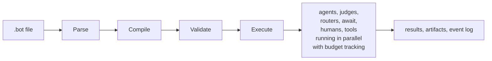
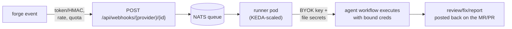

<p align="center">
  
</p>

# Iterion

**The control plane for AI agents.**
*Apps have Linux. The cloud has Kubernetes. AI agents have Iterion.*

Kubernetes gave cloud workloads a declarative control plane. Iterion brings that model to AI agents. Define agent workflows as readable `.bot` files — chain agents, judges, routers, human gates, parallel branches, bounded loops, and budget caps — and operate every run from a single, auditable execution graph.

> ⚠️ **This project is highly experimental.** APIs, DSL syntax, and storage formats may change without notice. Use at your own risk in production environments. Feedback and contributions are welcome!

> 📖 **New here? Read [Why Iterion?](docs/why-iterion.md)** — the origin story, the patterns we've seen work, the asymptote lens that motivated the engine, and the workflow-lab dimension. Helps you decide whether Iterion fits how you work before you install anything.

> 🧭 **Want the as-built picture? Read [Current state of Iterion](docs/current-state.md)** — shipped surfaces, execution architecture, backend status, security defaults, cloud control plane, and deliberate limits, verified against `main`.

---

## Table of Contents

- [Why Iterion?](docs/why-iterion.md) — origin + recipe + asymptote + lab
- [Philosophy](docs/philosophy.md) — maximum power, modularity, cloud-nativeness, git-native first class, product-open
- [Current state](docs/current-state.md) — as-built capabilities, architecture, defaults, and limits
- [What is Iterion?](#what-is-iterion)
- [Features](#features)
- [Ready-to-run agent workflows](#agent-workflows)
- [Getting Started](#getting-started)
  - [Installation](#installation)
  - [Your first bot](#your-first-bot)
- [Workflow files](#workflow-files)
- [A Taste of the DSL](#a-taste-of-the-dsl)
- [Documentation](#documentation)
- [License](#license)

---

<a id="what-is-iterion"></a>

## 🧩 What is Iterion?

AI agents can now hold a real task for an hour — plan a feature, implement it, review it, fix what the review found. Iterion is the **control plane** that makes that work *operable*: define it once as a readable `.bot` file, and every run becomes a single execution graph you can budget, isolate, audit, resume, and prove converges — on your laptop, in CI, or across a multi-tenant cloud.

*Concretely: if you've caught yourself repeating the same loop with an LLM — "ask the model, eyeball the diff, ask it to fix what it missed, run the tests, ask again" — Iterion is where that loop stops being manual.* Capture the pattern once, give it budget caps, parallel reviewers, judges, and human gates, and let the engine run it deterministically every time.

You describe *what* the agents should do — review code, plan fixes, check compliance, ask a human. Iterion handles *how*: scheduling branches in parallel, enforcing budgets, isolating writes in a sandbox, persisting every step, and routing between nodes.



More than a DAG runner: Iterion is built for long, autonomous, multi-agent work — first-class structured I/O, conversation sessions, human-in-the-loop pauses, per-run sandboxes, resumable checkpoints, and cost control, with a control plane to operate every run from launch to landed result.

<p align="center">
  
  <br/>
  <em>The studio's visual editor — drag-and-drop graph, live diagnostics, and an inspector for every node. See <a href="docs/visual-editor.md">more screenshots</a>.</em>
</p>

---

<a id="features"></a>

## 📋 Features

### Authoring & orchestration

- 📝 **Declarative DSL** — Human-readable `.bot` files with indentation-based syntax
- 🤖 **Multi-agent orchestration** — Chain agents, judges, routers, humans, deterministic tools/computes, sub-bots, and event nodes into complex graphs
- 🖥️ **Visual editor** — Browser-based workflow builder with drag-and-drop, live validation, and source view
- 🙋 **Human-in-the-loop** — Pause for human input, auto-answer via LLM, or let the LLM decide when to ask — see [docs/human-in-the-loop.md](docs/human-in-the-loop.md)
- 🔀 **Parallel branching** — Fan-out via routers, converge at downstream nodes with `await: wait_all` / `await: best_effort`
- 🧭 **5 routing modes** — `fan_out_all`, `fan_out_each`, `condition`, `round_robin`, and `llm`-driven routing
- 🧩 **Reusable composition** — Parameterised `group`/`use` macros, nested `subbot` runs, sequential `foreach`, and resource-aware fan-out
- 🔁 **Fuelled loops** — Fixed, templated, or convergence-driven loops with iteration and liveness backstops
- 📡 **In-bot events** — `emit` / `wait` nodes coordinate concurrent branches without polling
- 🔲 **Structured I/O** — Typed schemas for inputs and outputs with enum constraints
- 🔗 **MCP support** — Declare MCP servers directly in `.bot` files (`stdio`, `http`), and drive Iterion itself from any MCP client via `iterion mcp` (local runs/board + the remote instance) — see [docs/mcp-server.md](docs/mcp-server.md)
- 🧪 **Recipe system** — Bundle workflows with presets for comparison and benchmarking
- 📐 **Mermaid diagrams** — Auto-generate visual workflow diagrams (compact / detailed / full)

### Execution & runtime

- 🔌 **Multiple execution backends** — In-process `claw`, Claude Code, Codex CLI, `pi`, Kimi Code and Grok Build, selectable per node or workflow
- 🌐 **Provider routing** — `claw` validates Anthropic and OpenAI as first-class lanes and also wires xAI, Bedrock, Vertex, Foundry, and compatible endpoints with varying test coverage; OpenAI can use an API key or a ChatGPT/Codex OAuth forfait
- 💰 **Budget enforcement** — Shared, mutex-protected caps on tokens, cost (USD), duration, parallel branches, and loop iterations
- 🎛️ **Live control and recovery** — Queue operator/supervisor messages, raise budgets, grant loop iterations, retry eligible failures, and resume from persisted checkpoints
- 🛡️ **Tool-permission gate** — Shared `off` / `ask` / `deny` policy for `claude_code`, `claw`, and `pi`, with allow/ask/deny rule lists; restrictive modes are opt-in
- 🌳 **Worktree finalization** — `worktree: auto` runs in a fresh Git worktree and protects committed results with a named branch; CLI or studio merge policy decides when and how it lands — see [docs/merge-policy.md](docs/merge-policy.md)
- 🛡️ **Per-run sandbox** — Opt-in Docker/Podman/Kubernetes isolation. Local containers preserve the host worktree path by default; network mode is open unless the workflow selects an allowlist/denylist proxy — see [docs/sandbox.md](docs/sandbox.md)
- 🧰 **Reproducible bot tools** — A bot and its target repository can each declare a pinned `devbox.json`; Iterion composes both toolchains and exposes them to non-interactive nodes
- 🔐 **Privacy filter** — Built-in Go-native `privacy_filter` / `privacy_unfilter` tools redact and restore PII (emails, phones, IBANs, credit cards, URLs, ~25 secret patterns) — see [docs/privacy_filter.md](docs/privacy_filter.md)

### Persistence & observability

- 📦 **Artifact versioning** — Per-node, per-iteration versioned outputs persisted to disk
- 📊 **Event sourcing** — Append-only JSONL event log for full replay and debugging
- ⏯️ **Resumable runs** — Checkpoint-based resume from `failed_resumable` / `paused_waiting_human` / `cancelled` states — see [docs/resume.md](docs/resume.md)
- 🧭 **Run operations** — Run trees, files/diffs/commits, live steering, human answers, notes/tags, and a local post-mortem shell for preserved worktrees
- 📈 **Observability stack** — Prometheus `/metrics`, OTLP traces, and a self-contained docker-compose stack with pre-built Grafana dashboards — see [docs/observability/README.md](docs/observability/README.md)

<p align="center">
  
  <br/>
  <em>Run analytics — cost over time stacked by workflow, plus per-workflow run counts, fail rates, and P50/P95 durations.</em>
</p>

### Distribution & integration

- ☁️ **Multi-tenant agent control plane** — Self-hostable Helm deployment (MongoDB + S3 + NATS JetStream, KEDA-scaled runners, per-run Kubernetes sandboxes) with org → team tenancy, repo-first forge integrations, schedules/triggers/webhooks, bound credentials, quotas/metering, audit, SSO, PATs, SMTP onboarding, and a typed remote CLI — see the [Iterion Cloud overview](docs/cloud-overview.md)
- 🧩 **Skills, plugins, and marketplace** — Package bot resources, install project/global skills, contribute MCP/rewriter/skill/hook/lifecycle plugins, and distribute bots or plugins through one registry model
- 🧰 **TypeScript SDK** — [`@iterion/sdk`](sdks/typescript/) wraps the CLI with typed `run` / `resume` / `events` streaming for Node, Deno, and Bun apps
- 🧠 **AI agent skill** — Install as a skill in Claude Code, Codex, Cursor, Windsurf, GitHub Copilot, Cline, Aider, and other AI coding agents

---

## ☁️ Iterion Cloud — Agent orchestration at scale

The same engine, deployed for teams: an external event fires → an agent
workflow runs with your org's **bound** credentials → the result lands back in
your own system. Open a merge request, get Revi's review as inline
comments — no human in the loop, no secret ever in a prompt.

Run agent workflows as governed services.



Five steps to a working forge loop:

1. `helm install iterion oci://ghcr.io/socialgouv/charts/iterion -f values.yaml` — [chart README](charts/iterion/README.md)
2. Activate the bootstrap super-admin (temp password in the boot logs), create an org
3. In the studio, open **Integrations**, connect GitHub/GitLab/Forgejo, and select a repository
4. Enable a bot for that repository; Iterion provisions the managed hook, webhook secret, credential binding, and optional schedule
5. Open a PR/MR — watch the run in the studio and the result land back on the forge

Org quotas (runs / cost / concurrency / rate), audit log, personal
access tokens, DLQ ops and Prometheus metrics make it operable as a
real multi-tenant service. Start with the [Iterion Cloud overview](docs/cloud-overview.md).

---

<a id="agent-workflows"></a>

## 🤖 Ready-to-run agent workflows

Iterion ships a catalog of named, first-class agent workflows. Each is packaged as a general-purpose `.bot` you point at *any* repo: run it directly (`iterion run bots/<name>/main.bot`), dispatch it per issue, or schedule it.

| Workflow | Role | Bundle |
|---|---|---|
| 🧭 **Nexie** | Co-CTO orchestrator — surveys the repo, elicits priorities, proposes a roadmap, and emits kanban issues | [`whats-next`](bots/whats-next/) |
| 🛠️ **Featurly** | Ships a feature end-to-end — plan → implement → simplify → review-fix loop | [`feature_dev`](bots/feature-dev/) |
| 🌿 **Billy** | Branch reviewer-fixer — one adaptive campaign over the branch diff, with deterministic checks and convergence gates | [`branch_improve_loop`](bots/branch-improve-loop/) |
| 🌍 **Willy** | Whole-repo reviewer-fixer — the same unit-convergent campaign across the full codebase | [`whole_improve_loop`](bots/whole-improve-loop/) |
| 📚 **Doki** | Doc aligner — detects & fixes doc/code drift (the docs, never the code) | [`docs-refresh`](bots/docs-refresh/) |
| 🔎 **Revi** | Read-only code reviewer — one model family by default, optional cross-family dual mode, findings published to the board | [`review_pr`](bots/review-pr/) |
| 🛡️ **Seki** | Source security auditor — SAST + secret scan + LLM triage | [`sec-audit-source`](bots/sec-audit-source/) |
| 📦 **Depsy** | Supply-chain auditor — dependency malware / CVE scan | [`sec-audit-deps`](bots/sec-audit-deps/) |
| ⬆️ **Renovacy** | Security-aware dependency upgrader | [`secured-renovacy`](bots/secured-renovacy/) |

List them anytime with `iterion bots list`; see [docs/examples.md](docs/examples.md) for the full catalog (including the DSL demos under `examples/`).

---

<a id="getting-started"></a>

## 🚀 Getting Started

<a id="installation"></a>

### Installation

Same engine, eight delivery modes — pick the one that fits your workflow:

| Mode | Best for | Install | Docs |
|---|---|---|---|
| 🖥️ **CLI** | Scripted runs, CI/CD pipelines | `curl -fsSL https://socialgouv.github.io/iterion/install.sh \| sh` | [install.md](docs/install.md) |
| 🌐 **Studio (web app)** | Visual workflow design (browser-based) | Bundled with the CLI: `iterion studio` | [visual-editor.md](docs/visual-editor.md) |
| 🪟 **Desktop app** | Native window, multi-project, OS keychain, auto-update | Download `iterion-desktop` from [Releases](https://github.com/SocialGouv/iterion/releases/latest) | [desktop.md](docs/desktop.md) |
| 🐳 **Docker** | Zero-install runs, reproducible CI | `docker run --rm ghcr.io/socialgouv/iterion:latest` | [install.md#docker](docs/install.md#docker) |
| ☁️ **Cloud / server** | Multi-tenant deployment, shared run store, REST/WS API | `helm install iterion oci://ghcr.io/socialgouv/charts/iterion` | [cloud.md](docs/cloud.md) |
| 🎼 **Dispatcher** | Autonomous loop — poll a tracker, dispatch a workflow per issue | Bundled: `iterion dispatch iterion.dispatcher.yaml` | [dispatcher.md](docs/dispatcher.md) |
| ⏰ **Scheduler** | Cron recurring runs (weekly audits, nightly passes) — no resident daemon | Bundled: `iterion schedule add … && iterion schedule install` | [scheduling.md](docs/scheduling.md) |
| 📦 **TypeScript SDK** | Programmatic invocation from Node/Deno/Bun | `npm install @iterion/sdk` | [sdks/typescript/](sdks/typescript/) |

All eight use the same Go compiler and runtime contracts. They differ in launch
transport, persistence adapter, isolation driver, and whether execution is
in-process or queued to a runner.

### Your first bot

There is no mandatory setup step — `cd` into the repository you want bots to
work on and pick the entry point that matches your intent:

| You want to… | Start here |
|---|---|
| **Run a bot** on this repo | `iterion bots list` → `iterion run <bot>` |
| **Build your own bot** | `iterion bots create <slug>`, or the studio builder at `/bots/new` |
| **Wire bots into CI / a forge** | [`docs/repo-scope.md`](docs/repo-scope.md) — connect a repo, then trigger on PRs and issues |
| **Use a cloud instance** | `iterion remote login <url>` — see [`docs/cloud-cli.md`](docs/cloud-cli.md) |
| **Drive Iterion from your AI agent** | `claude mcp add iterion -- iterion mcp` — see [`docs/mcp-server.md`](docs/mcp-server.md) |

#### Run a bot from the catalog

Iterion ships a fleet (see [Ready-to-run agent workflows](#agent-workflows)) — the fastest
way to see it work is to point one at your repo:

```bash
cd /path/to/your/repo
claude login                    # authenticate a backend (or set an API key)

iterion bots list               # what's available
iterion run bots/review-pr/main.bot --store-dir "$PWD/.iterion"
```

#### Or create your own

```bash
iterion bots templates                        # blank, code-reviewer, docs-writer, …
iterion bots create my-bot --template code-reviewer

$EDITOR bots/my-bot/main.bot                  # write the mission
iterion validate bots/my-bot/main.bot
iterion run bots/my-bot/main.bot
```

This scaffolds a complete bot bundle (`main.bot` + `manifest.yaml` + `README.md`
+ the resource directories) — so the bot is immediately discoverable by
`iterion bots list`, editable in the studio, and dispatchable. The generated
workflow is parsed and compiled before anything is written, so a scaffold never
lands a broken bot.

`iterion studio` gives you the same thing with a visual builder, a live run
console, and a kanban board.

### Inspect results

```bash
iterion inspect                          # List all runs
iterion inspect --run-id <id> --events   # View a specific run with events
iterion report --run-id <id>             # Generate a detailed report
```

Run data lives under the resolved store. The example above opts into
`$PWD/.iterion` so the CLI and `iterion studio --dir "$PWD"` share it. Without
`--store-dir`, Iterion reuses an existing managed project `.iterion` or stores
the run in a deterministic project slot under `~/.iterion/projects/`; reuse the
same override when inspecting a run. See [the current storage contract](docs/current-state.md#state-and-observability).

---

<a id="workflow-files"></a>

## 🤖 Workflow files

**Agent workflows, as code.** Define readable, versioned workflows in `.bot` files. The DSL and visual editor are two views of the same source of truth.

Iterion accepts plain workflow sources as **`.bot`** files. Any other extension is rejected at the CLI, server, dispatcher, and studio boundaries.

Agent workflows can also be shipped as **`.botz`** bundles — deterministic ZIP archives (legacy tar.gz still readable) packaging the workflow with adjacent resources (Claude Code skills, reusable prompts, default attachments, manifest). Scaffold with `iterion bots create`, build with `iterion bundle pack`, run with `iterion run my.botz`. See [docs/bundles.md](docs/bundles.md).

---

<a id="a-taste-of-the-dsl"></a>

## ✨ A Taste of the DSL

Here's the simplest possible workflow — an agent reviews code and decides pass/fail:

```iter
prompt review_system:
  You are a code reviewer. Evaluate the submission
  and decide if it meets quality standards.

prompt review_user:
  Review this code:
  {{input.code}}

schema review_input:
  code: string

schema review_output:
  approved: bool
  summary: string

agent reviewer:
  model: "${MODEL}"
  input: review_input
  output: review_output
  system: review_system
  user: review_user

workflow minimal:
  entry: reviewer
  reviewer -> done when approved
  reviewer -> fail when not approved
```

That's it — 28 lines. The agent gets a code input, produces a structured `{approved, summary}` output, and the workflow routes to `done` or `fail` based on the verdict.

From here you can add judges for multi-pass review, routers for parallel or per-item fan-out, human gates, reusable groups, nested bots, event coordination, fuelled loops, and budget caps — see [docs/dsl.md](docs/dsl.md) for the language guide and reference map.

---

<a id="documentation"></a>

## 📚 Documentation

The full documentation lives under [`docs/`](docs/) — start with the [documentation index](docs/README.md). Highlights:

**Get going**
- [docs/current-state.md](docs/current-state.md) — as-built product, runtime, control-plane, and maturity snapshot
- [docs/install.md](docs/install.md) — every install method (CLI, desktop, Docker, Helm, SDK)
- [docs/visual-editor.md](docs/visual-editor.md) — studio (browser-based workflow editor)
- [docs/desktop.md](docs/desktop.md) — native desktop app
- [docs/examples.md](docs/examples.md) — workflows of increasing complexity (starter → advanced)
- [docs/skill.md](docs/skill.md) — install Iterion as an AI agent skill (Claude Code, Cursor, Copilot…)
- [docs/mcp-server.md](docs/mcp-server.md) — drive Iterion from any MCP client (`iterion mcp`): local runs/board + remote instance

**Author workflows**
- [docs/dsl.md](docs/dsl.md) — full `.bot` DSL reference
- [docs/routers.md](docs/routers.md) — routing modes deep dive
- [docs/human-in-the-loop.md](docs/human-in-the-loop.md) — pause for human input; all six interaction values and their node-specific behavior
- [docs/recipes.md](docs/recipes.md) — preset-driven runs (benchmarking, prompt comparison)
- [docs/backends.md](docs/backends.md) + [docs/delegation.md](docs/delegation.md) — model/provider routing and the `claw`, Claude Code, Codex, `pi`, Kimi and Grok execution paths
- [docs/cursors.md](docs/cursors.md) — prompt-engineering cursors (ambition / depth / rigor / autonomy dials)
- [docs/attachments.md](docs/attachments.md) — file/image attachments in prompts
- [docs/privacy_filter.md](docs/privacy_filter.md) — built-in PII redaction tools
- [docs/workflow_authoring_pitfalls.md](docs/workflow_authoring_pitfalls.md) — required reading before authoring workflows that commit code

**Run & operate**
- [docs/cli-reference.md](docs/cli-reference.md) — every `iterion` subcommand and flag
- [docs/resume.md](docs/resume.md) — resume / failure / cancellation matrix
- [docs/sandbox.md](docs/sandbox.md) — per-run container isolation
- [docs/observability/README.md](docs/observability/README.md) — Prometheus, OTLP, Grafana
- [docs/persisted-formats.md](docs/persisted-formats.md) — on-disk format spec
- [docs/cloud.md](docs/cloud.md) + [docs/cloud-deployment.md](docs/cloud-deployment.md) — cloud mode overview + operator runbook

**Architecture & contributing**
- [docs/architecture.md](docs/architecture.md) — compiler pipeline, runtime engine, persistence
- [docs/adr/](docs/adr/) — architecture decision records
- [docs/development.md](docs/development.md) — build, test, project structure for contributors

**References**
- [docs/references/dsl-grammar.md](docs/references/dsl-grammar.md) — readable grammar
- [docs/references/diagnostics.md](docs/references/diagnostics.md) — authoritative sparse catalogue: DSL C001–C199 plus async C240–C242, and bundle checks C200–C234
- [docs/references/patterns.md](docs/references/patterns.md) — 10 reusable workflow patterns
- [docs/grammar/iterion_v1.ebnf](docs/grammar/iterion_v1.ebnf) — formal EBNF grammar

---

<a id="license"></a>

## 📄 License

MIT. See `LICENSE` for the full text. Copyright © SocialGouv.
