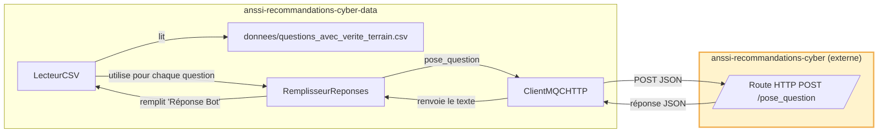

# anssi-recommandations-cyber-data

Une interface permettant d'évaluer le bot de l'ANSSI, basé sur [Albert](https://github.com/betagouv/anssi-recommandations-cyber), et d'y indexer de nouveaux documents RAG.

## 🗺️ Diagramme des interactions entre les composants de l'application

### Interactions pour générer des réponses



Le fichier `questions_avec_verite_terrain.csv` est le jeu de données utilisé par défaut par
`src/evaluation/evaluateur_mqc.py`.

## 📦 Comment installer ?

### Directement sur l'hôte

Il faut installer Python 3.13 et `uv`. Ensuite, la première fois, il faut créer un environnement virtuel avec `uv venv`.

Les dépendances déclarées sont installables via `uv sync`. Les commandes du projet peuvent
ensuite être lancées avec `uv run`, sans activation particulière de l'environnement virtuel.

## 🖥️ Démarrer le backoffice en local

Le backend du backoffice se lance directement sur l'hôte, depuis la racine du dépôt.

1. Créer le fichier `.env` à partir de `.env.template` :

```shell
cp .env.template .env
```

2. Vérifier les paramètres locaux suivants dans `.env` :

```shell
MQC_DATA_HOTE=localhost
MQC_DATA_PORT=3000
MQC_DATA_AUTH_RP_ID=localhost
MQC_DATA_AUTH_ORIGIN=http://localhost:3000
MQC_DATA_AUTH_CLEF_SECRETE_DE_SESSION=une-valeur-secrete
SECRET_JWT=une-autre-valeur-secrete
UTILISATEURS_MQC={}
```

`ALBERT_CLE_API` est nécessaire pour les fonctionnalités qui appellent Albert, notamment la
gestion et l'indexation des collections.

3. Démarrer le backend :

```powershell
$env:PYTHONPATH="C:\Users\pleroy\Project\anssi-recommandations-cyber-data\src"
uv run --env-file .env python src/main.py
```

Le backend écoute par défaut sur le port `3000`. Si `MQC_DATA_PORT` est modifié dans `.env`,
l'URL d'accès doit être adaptée en conséquence. Ouvrir
[http://localhost:3000](http://localhost:3000). La page racine permet de lancer
l'enrôlement ou la connexion ; le tableau de bord est ensuite disponible à l'adresse
[/tableau-de-bord](http://localhost:3000/tableau-de-bord).

Le mécanisme d'enrôlement avec une YubiKey, la validation par l'administrateur et le format
des utilisateurs autorisés sont décrits dans
[`documentation/authentification_yubikey.md`](documentation/authentification_yubikey.md).
Après l'enrôlement, l'administrateur doit ajouter le credential de l'utilisateur dans
`UTILISATEURS_MQC`, puis redémarrer le backend avant la première connexion.

Le démarrage du backend ne lance pas l'application MQC externe. Cette dernière doit être
démarrée séparément et exposer `/pose_question` avant de lancer une évaluation.

## 🧪 Comment valider ?

Dans un environnement virtuel :

```shell
uv run ruff check
uv run mypy
uv run pytest
```

## ⚙️ Comment définir mes variables d'environnement ?

Il faut créer à la racine du projet un fichier `.env` à partir de `.env.template`. Ce fichier doit notamment définir `ALBERT_CLE_API` lorsque les appels à Albert sont nécessaires.

## 🧪 Générer les réponses du bot pour le jeu de validation

### 🎒 Prérequis

1. Lancer séparément l'application [anssi-recommandations-cyber](https://github.com/betagouv/anssi-recommandations-cyber) et rendre son endpoint `/pose_question` accessible.
2. Vérifier que l'application MQC démarre bien en local.

### ▶️ Génération des réponses

Exécuter la commande suivante depuis la racine du dépôt :

```shell
PYTHONPATH=src uv run --env-file .env python src/evaluation/evaluateur_mqc.py \
  --fichier-evaluation donnees/questions_avec_verite_terrain.csv \
  --fichier-mapping donnees/jointure-nom-guide.csv
```

- `--fichier-evaluation` : chemin vers le fichier CSV contenant les questions à évaluer.
- `--fichier-mapping` : chemin vers le mapping des noms de documents.

Les réponses collectées sont écrites dans `/tmp/collecte_reponses` et l'évaluation est ensuite lancée et journalisée.

## 📚 Indexer des documents RAG dans Albert

### 🎒 Prérequis

1. Avoir défini dans `.env` la variable `ALBERT_CLE_API` avec une clé API Albert valide.
2. Placer les documents PDF à indexer dans `donnees/guides_de_lANSSI/`.

### ▶️ Créer une collection et indexer les documents

```shell
PYTHONPATH=src uv run --env-file .env python src/documents/indexe_documents_rag.py \
  --nom LE_NOM_DE_LA_COLLECTION \
  --description "Contient l'ensemble des guides de l'ANSSI disponibles publiquement"
```

- `--nom` : nom de la collection à créer dans Albert.
- `--description` : description de la collection.

La commande crée une collection privée dans Albert, indexe les fichiers PDF présents dans `donnees/guides_de_lANSSI/` et associe chaque document à son URL publique via les métadonnées.
