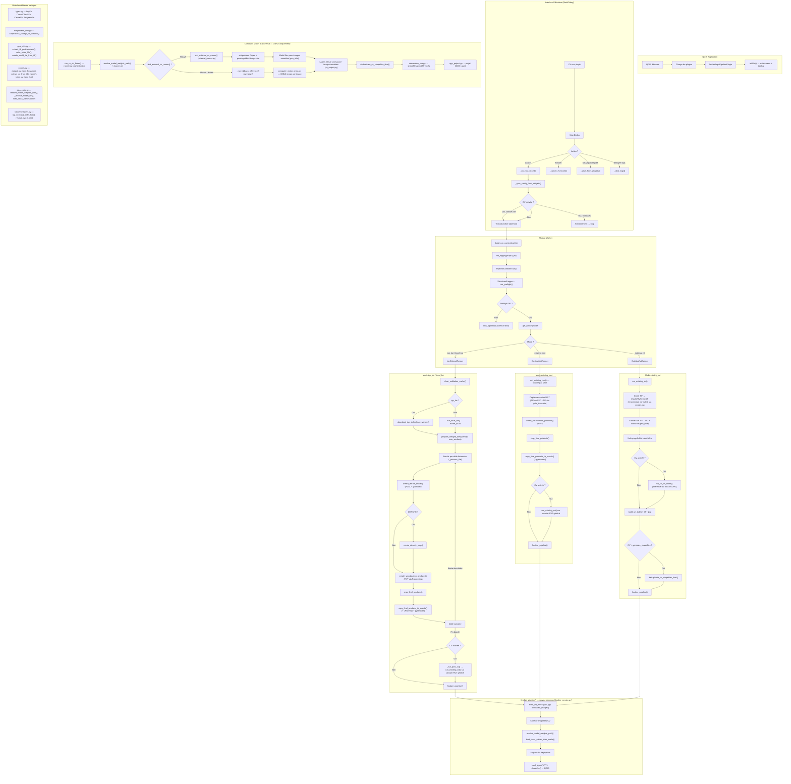

# Archeolog'IA pipeline (Plugin QGIS)

Plugin QGIS pour exécuter un pipeline de traitement LiDAR et produire des rasters de type MNT / densité / indices RVT, avec une étape optionnelle de détection par *computer vision*.

- Nom du plugin : **Archeolog'IA pipeline**
- Version : **0.1.0**
- QGIS minimum : **3.0**

## Fonctionnalités

- Génération de produits raster :
  - **MNT**
  - **Densité**
  - Indices **RVT** (via *Processing*) : **M-HS**, **SVF**, **SLO**, **LD**, **VAT**
- Export optionnel en **JPG + world file (JGW)** pour certains produits.
- (Optionnel) Détection par computer vision à partir des JPG produits (via runner externe ou dépendances Python).
- Option (configurable) : génération de **pyramides / overviews** GDAL pour les GeoTIFF de sortie.

## Modes de données supportés

Le pipeline peut être lancé dans plusieurs modes (selon l’UI/config) :

- `ign_laz` : téléchargement/consommation de tuiles LAZ depuis une liste IGN.
- `local_laz` : consommation de tuiles LAZ/LAS déjà présentes localement.
- `existing_mnt` : calcul d’indices RVT à partir d’un MNT existant.
- `existing_rvt` : opérations sur RVT existants (selon fonctionnalités disponibles).

## Pré-requis

Le plugin s’exécute dans QGIS et s’appuie sur des outils externes. Un contrôle est effectué au lancement via le **préflight**.

### Dépendances QGIS

- **QGIS 3.x**
- Module **Processing** (fourni avec QGIS)
- Les algorithmes RVT accessibles via Processing (selon installation QGIS)

### Outils externes (CLI)

- **PDAL** (`pdal`) requis pour les modes `ign_laz` et `local_laz`
- **GDAL** utilitaires :
  - `gdalwarp` requis pour `ign_laz`, `local_laz`, `existing_mnt`
  - `gdal_translate` requis pour `existing_mnt` / `existing_rvt` (et utilisé dans d’autres modes)
  - `gdaladdo` optionnel (pyramides / overviews) — si absent, la génération est ignorée

### Computer vision (optionnel)

Deux options :

- **Runner ONNX externe** (recommandé) : `third_party/cv_runner_onnx/windows/cv_runner_onnx.exe` (Windows) / `third_party/cv_runner_onnx/linux/cv_runner_onnx` (Linux)
- Ou dépendances Python dans l'environnement de QGIS (si pas de runner externe) :
  - `onnxruntime`, `sahi`, `PIL` (Pillow)
  - `geopandas` (optionnel)

**Note** : Les modèles doivent être exportés au format ONNX avant utilisation (voir section dédiée).

## Installation

### Installation dans QGIS (utilisateur)

1. Ouvrir **QGIS**.
2. Aller dans :
   - `Profils utilisateurs` → `Ouvrir le dossier du profil actif`
3. Ouvrir le dossier :
   - `python/plugins`
4. Dézipper le plugin : on obtient le dossier :
   - `archeologia-pipeline-lidar-processing`
5. Copier le dossier `archeologia-pipeline-lidar-processing` dans `python/plugins`.
6. Fermer puis relancer QGIS.
7. Activer le plugin :
   - `Extensions` → `Installer/Gérer les extensions…` → rechercher **Archeolog'IA pipeline** → activer.

### Où se trouve le dossier des plugins

Sous Windows (profil par défaut) :

```text
%APPDATA%\QGIS\QGIS3\profiles\default\python\plugins\
```

### Dépendances à avoir dans QGIS

Le plugin exécute un **préflight** (contrôle des dépendances) au lancement.

- **Processing** : doit être disponible (dans QGIS : `Traitement` → `Boîte à outils`).
- **Algorithmes RVT via Processing** : nécessaires si tu actives des produits RVT (M-HS/SVF/SLO/LD/VAT).

Si un élément est manquant, le préflight affichera une erreur et empêchera le lancement.

### Dépendances externes (CLI)

Certaines étapes reposent sur des exécutables dans le `PATH` :

- `pdal` requis pour `ign_laz` / `local_laz`
- `gdalwarp` requis pour `ign_laz` / `local_laz` / `existing_mnt`
- `gdal_translate` requis pour `existing_mnt` / `existing_rvt`
- `gdaladdo` optionnel (pyramides / overviews). Si absent, la génération de pyramides est ignorée.

## Computer vision : runner ONNX + modèles

### Activer la computer vision

La computer vision est optionnelle. Quand elle est activée, le pipeline peut lancer une étape de détection à partir des images (JPG) exportées.

Le plugin utilise un **runner ONNX unifié** qui supporte les modèles YOLO et RF-DETR exportés au format ONNX.

### Export des modèles vers ONNX

Avant d'utiliser le runner, vous devez exporter vos modèles PyTorch (.pt/.pth) vers le format ONNX.

#### 1. Créer un environnement virtuel dédié à l'export

```bash
cd <racine_du_plugin>
python -m venv .venv_export

# Windows
.venv_export\Scripts\activate

# Linux/Mac
source .venv_export/bin/activate
```

#### 2. Installer les dépendances d'export

**Pour YOLO uniquement :**
```bash
pip install ultralytics onnx onnxsim
```

**Pour RF-DETR uniquement :**
```bash
pip install rfdetr torch onnx onnxsim pyyaml
```

**Pour SMP (DeepLabV3Plus, Unet, etc.) :**
```bash
pip install segmentation-models-pytorch torch onnx onnxsim pyyaml
```

**Complet (tous les types) :**
```bash
pip install ultralytics rfdetr segmentation-models-pytorch torch onnx onnxsim pyyaml
```

#### 3. Exporter le modèle

```bash
# Exporter un modèle YOLO
python dev\runner_onnx\export_to_onnx.py --model models\mon_modele\weights\best.pt --output models\mon_modele\weights\best.onnx

# Exporter un modèle RF-DETR
python dev\runner_onnx\export_to_onnx.py --model models\mon_modele_rfdetr\weights\best.pt --output models\mon_modele_rfdetr\weights\best.onnx

# Exporter un modèle SMP (DeepLabV3Plus) — exemple concret
python dev\runner_onnx\export_to_onnx.py \
  --model models\formes_lineaires_ld_a15_rmin10_rm_512_1\weights\best_model.pth \
  --output models\formes_lineaires_ld_a15_rmin10_rm_512_1\weights\best.onnx \
  --type smp \
  --arch DeepLabV3Plus \
  --encoder resnet101 \
  --num-classes 3 \
  --class-names "background,parcellaire,talus-fosse_fossebutte" \
  --imgsz 512

# Options supplémentaires
python dev\runner_onnx\export_to_onnx.py --model best.pt --output model.onnx --imgsz 640 --simplify
```

Le script détecte automatiquement le type de modèle (YOLO, RF-DETR ou SMP).

### Création du runner ONNX (Windows)

Objectif : produire un exécutable :

```text
third_party/cv_runner_onnx/windows/cv_runner_onnx.exe
```

#### Compilation automatique

Le script `runner_onnx/build.py` automatise la création du runner :

```bash
cd runner_onnx

# Compiler le runner (CPU)
python build.py

# Compiler le runner avec support GPU
python build.py --gpu

# Nettoyer les builds précédents
python build.py --clean
```

Le script :
1. Crée un environnement virtuel isolé (`.venv_onnx`)
2. Installe les dépendances nécessaires
3. Compile le runner avec PyInstaller
4. Copie le binaire vers `third_party/cv_runner_onnx/windows/`

**Taille du binaire** : ~1 GB (inclut les dépendances SAHI et ONNX Runtime)

#### Compilation manuelle (alternative)

```bash
cd runner_onnx
python -m venv .venv_onnx
.venv_onnx\Scripts\activate
pip install pyinstaller onnxruntime sahi pillow numpy pyyaml shapely geopandas fiona
python -m PyInstaller --clean cv_runner_onnx.spec
copy dist\cv_runner_onnx.exe ..\third_party\cv_runner_onnx\windows\
```

### Modèles (dossier `models/`)

Structure attendue (1 modèle = 1 dossier) :

```text
models/
  <nom_du_modele>/
    args.yaml
    classes.txt
    weights/
      best.pt      # Modèle PyTorch original
      best.onnx    # Modèle exporté (requis pour le runner)
```

Le fichier `classes.txt` doit contenir **un nom de classe par ligne** :

```text
nomclasse1
nomclasse2
...
```

### Configuration

Dans `config.json`, le modèle doit pointer vers le fichier `.onnx` :

```json
{
  "cv": {
    "enabled": true,
    "selected_model": "models/mon_modele/weights/best.onnx"
  }
}
```

Ou vers le dossier du modèle (le runner cherchera automatiquement `best.onnx`) :

```json
{
  "cv": {
    "enabled": true,
    "selected_model": "mon_modele"
  }
}
```

## Utilisation

1. Ouvrir le plugin : menu **Archeolog'IA pipeline**.
2. Choisir le **mode** de données (IGN / local / MNT existant / RVT existant).
3. Configurer :
   - le répertoire de sortie
   - les paramètres de résolution
   - les produits à générer
   - (optionnel) la génération de pyramides
4. Lancer le pipeline.

## Configuration (`config.json`)

Le plugin persiste sa configuration dans un fichier `config.json` à la racine du plugin.

### Structure (extraits)

- `app.files.output_dir` : dossier de sortie
- `app.files.data_mode` : mode (`ign_laz`, `local_laz`, `existing_mnt`, `existing_rvt`)
- `app.files.input_file` : fichier de liste (IGN ou liste locale selon le mode)
- `processing.mnt_resolution` : résolution du MNT (m)
- `processing.density_resolution` : résolution densité (m)
- `processing.tile_overlap` : recouvrement inter-tuiles (m)
- `processing.filter_expression` : filtre de classes (expression PDAL)
- `processing.products` : activation des produits (MNT/DENSITE/M_HS/SVF/SLO/LD/VAT)
- `processing.output_formats.jpg` : exports JPG par produit
- `processing.pyramids` : génération d’overviews GDAL

Exemple pyramides :

```json
{
  "processing": {
    "pyramids": {
      "enabled": true,
      "levels": [2, 4, 8, 16, 32, 64]
    }
  }
}
```

## Sorties

Les sorties sont écrites dans le dossier `output_dir` configuré.

Selon les produits et options, la structure typique est :

- `results/`
  - `MNT/…/tif/*.tif`
  - `RVT/<PRODUIT>/tif/*.tif`
  - `RVT/<PRODUIT>/jpg/*.jpg` (+ `*.jgw` si activé)

Les GeoTIFF peuvent contenir des **overviews** si l’option pyramides est activée et si `gdaladdo` est disponible.

## Développement

- Point d’entrée plugin : `main.py` (classe `ArcheologiaPipelinePlugin`)
- UI : `src/ui/main_dialog.py`
- Pipeline : `src/pipeline/`
  - prérequis : `src/pipeline/preflight.py`

## Git : Talisman (pre-push)

Le dépôt inclut un hook `pre-push` basé sur **Talisman** pour éviter de pousser des secrets (tokens, clés, etc.).

### Installation de Talisman

Installe `talisman` et assure-toi qu’il est disponible dans le `PATH`.

### Activer les hooks du dépôt

Les hooks Git ne sont pas versionnables directement dans `.git/hooks/`. À la place, ce dépôt fournit un dossier `.githooks/`.

À exécuter **à la racine du dépôt** :

```bash
git config core.hooksPath .githooks
```

Ensuite, un `git push` déclenchera automatiquement Talisman et pourra bloquer le push si un secret est détecté.

## Dépannage

- **Préflight KO** : vérifier que `pdal`, `gdalwarp`, `gdal_translate` sont accessibles dans le `PATH`.
- **Pyramides absentes** : vérifier la présence de `gdaladdo` et que l’option pyramides est activée.
- **RVT indisponible** : vérifier que les algorithmes RVT sont disponibles via QGIS Processing.
- **Computer vision** :
  - soit fournir le runner externe dans `third_party/cv_runner_onnx/...`
  - soit installer les dépendances Python (`onnxruntime`, `sahi`) dans l’environnement QGIS

## Architecture

### Diagramme de flux



### Structure des fichiers

```text
run_tests.py                        # Point d'entrée unique : python run_tests.py
conftest.py                         # Config pytest (sys.path + fixtures)
pytest.ini                          # Config pytest (testpaths, addopts, filters)

dev/                                # Outillage développeur (exclu du ZIP distribué)
├── requirements.txt                #   Chapeau : inclut les 3 fichiers ci-dessous
├── requirements/
│   ├── test.txt                    #   pytest, ruff
│   ├── export.txt                  #   ultralytics, torch, onnx (export modèles)
│   └── build.txt                   #   pyinstaller, onnxruntime (compilation runner)
├── package_plugin.py               #   Packaging plugin → ZIP
└── runner_onnx/
    ├── build.py                    #   Compilation runner ONNX (PyInstaller)
    ├── export_to_onnx.py           #   Export modèles → ONNX
    ├── cv_runner_onnx_cli.py       #   Point d'entrée du runner
    └── cv_runner_onnx.spec         #   Spec PyInstaller

tests/
├── TESTS_MANUELS_QGIS.txt         # Checklist tests manuels dans QGIS
├── unit/                           # Tests unitaires (sans dépendances externes)
│   ├── test_cancel_token.py
│   ├── test_existing_rvt.py        #   _cleanup_orphans
│   ├── test_external_runner.py     #   RunnerPayload, find_external_cv_runner
│   ├── test_helpers.py             #   safe_float, log_section
│   ├── test_preflight.py           #   CheckResult, _check_input_path
│   ├── test_progress_reporter.py
│   ├── test_registry.py            #   get_runner (instanciation, modes)
│   ├── test_run_context.py
│   └── test_structured_logger.py
└── integration/                    # Tests d'intégration (config réelle, fichiers temp)
    ├── test_pipeline_controller_integration.py
    ├── test_preflight.py
    ├── test_run_context_integration.py
    └── test_runners_integration.py

src/
├── app/                            # Orchestration pipeline
│   ├── cancel_token.py             # Encapsule threading.Event
│   ├── cancellable_feedback.py     # Feedback QGIS annulable
│   ├── pipeline_controller.py      # Orchestre preflight + dispatch + file logging
│   ├── progress_reporter.py        # Protocol pour reporting
│   ├── qt_progress_reporter.py     # Implémentation Qt (signaux)
│   ├── run_context.py              # Dataclass config pipeline
│   ├── structured_logger.py        # Logs structurés avec sections visuelles
│   ├── runners/
│   │   ├── base.py                 # ModeRunner Protocol
│   │   ├── helpers.py              # log_section(), safe_float(), resolve_rvt_tif_dir()
│   │   ├── registry.py             # get_runner(mode)
│   │   ├── ign_local_runner.py     # ign_laz + local_laz (_process_tile, _run_post_cv)
│   │   ├── existing_mnt_runner.py  # existing_mnt
│   │   └── existing_rvt_runner.py  # existing_rvt (fonctionne avec ou sans CV)
│   └── services/
│       ├── cv_service.py           # DEPRECATED — voir cv/runner.py
│       └── finalize_service.py     # finalize_pipeline() — VRT, shapefiles, load_layers
│
├── config/
│   └── config_manager.py           # Lecture/écriture config.json
│
├── pipeline/                       # Logique métier
│   ├── types.py                    # Type aliases partagés (LogFn, CancelFn, etc.)
│   ├── subprocess_utils.py         # subprocess_kwargs_no_window() partagé
│   ├── geo_utils.py                # Extraction geotransform, world files
│   ├── coords.py                   # Extraction coordonnées (filename + metadata + tile name)
│   ├── preflight.py                # Vérification dépendances et chemins
│   ├── cv/                         # Computer vision
│   │   ├── class_utils.py          # Palette couleurs, résolution modèle, utilitaires classes
│   │   ├── computer_vision.py      # DEPRECATED — voir computer_vision_onnx.py
│   │   ├── computer_vision_onnx.py # Inférence ONNX (YOLO / RF-DETR / SegFormer) — seul backend CV
│   │   ├── conversion_shp.py       # Conversion labels → shapefiles géoréférencés
│   │   ├── cv_output.py            # Gestion sorties CV (labels, annotations, légende)
│   │   ├── external_runner.py      # Subprocess runner ONNX externe + RunnerPayload
│   │   ├── qgs_project.py          # Génération projet QGIS (.qgs) pour validation
│   │   ├── runner.py               # run_cv_on_folder, _run_fallback_inference, deduplicate
│   │   └── sahi_lite.py            # Slicing SAHI léger (numpy-only)
│   ├── ign/                        # Téléchargement + prétraitement
│   │   ├── coords_fallback.py      # Fallback extraction coordonnées
│   │   ├── downloader.py           # Téléchargement dalles IGN
│   │   ├── pdal_validation.py      # Validation PDAL + cache
│   │   ├── preprocess.py           # Fusion tuiles (voisins + merge)
│   │   └── products/               # Génération produits
│   │       ├── convert_tif_to_jpg.py
│   │       ├── crop.py             # Découpe aux limites dalle
│   │       ├── density.py          # Carte de densité
│   │       ├── indices.py          # Indices RVT (M-HS, SVF, SLO, LD, SLRM, VAT)
│   │       ├── mnt.py              # MNT (PDAL + gdalwarp)
│   │       ├── qgis_processing.py  # Wrapper QGIS Processing
│   │       ├── results.py          # Copie résultats, VRT, pyramides
│   │       └── rvt_naming.py       # Nommage dossiers RVT avec paramètres
│   └── modes/                      # Modes spécifiques
│       ├── existing_mnt.py         # Traitement MNT existants
│       ├── existing_rvt.py         # Traitement RVT existants (avec ou sans CV)
│       └── local_laz.py            # Indexation nuages locaux
│
└── ui/
    └── main_dialog.py              # Interface Qt (config + logs + actions)
```

## Environnement développeur

### Prérequis

- **Python 3.10+** (recommandé : la même version que celle embarquée par QGIS)
- **QGIS 3.34+** installé (fournit `qgis.core`, `osgeo`, `processing`)

### Organisation des dépendances

Tout l'outillage développeur est regroupé dans le dossier `dev/` (exclu du ZIP distribué).
Les dépendances sont découpées en fichiers ciblés dans `dev/requirements/` :

```text
dev/
├── requirements.txt          # Chapeau : installe tout
├── requirements/
│   ├── test.txt              # pytest, ruff
│   ├── export.txt            # ultralytics, torch, onnx, onnxsim
│   └── build.txt             # pyinstaller, onnxruntime, opencv, geopandas
├── package_plugin.py         # Packaging plugin → ZIP
└── runner_onnx/              # Export modèles + compilation runner ONNX
```

> **Note** : Les dépendances QGIS (`qgis.core`, `osgeo`, `processing`) sont fournies par l'installation QGIS et ne figurent pas dans ces fichiers.

### Installation rapide (tout installer)

```bash
python -m venv .venv
.venv\Scripts\activate            # Windows
# source .venv/bin/activate       # Linux/macOS
pip install -r dev/requirements.txt
```

### Installation ciblée (une seule tâche)

```bash
pip install -r dev/requirements/test.txt      # Tests & lint uniquement
pip install -r dev/requirements/export.txt    # Export modèles → ONNX uniquement
pip install -r dev/requirements/build.txt     # Compilation runner ONNX uniquement
```

---

### Tâche 1 — Exécuter les tests

```bash
pip install -r dev/requirements/test.txt

python run_tests.py                       # Tous les tests (110 tests)
python run_tests.py unit                  # Tests unitaires uniquement
python run_tests.py integration           # Tests d'intégration uniquement
python run_tests.py -k helpers            # Filtrer par nom
ruff check src/                           # Lint
```

Les tests manuels dans QGIS sont documentés dans `tests/TESTS_MANUELS_QGIS.txt`.

### Tâche 2 — Exporter un modèle vers ONNX

Convertit un modèle PyTorch (`.pt`) en ONNX (`.onnx`) pour l'inférence dans le plugin.

```bash
pip install -r dev/requirements/export.txt

cd dev/runner_onnx
python export_to_onnx.py --model path/to/best.pt --output path/to/model.onnx
```

Options :

| Flag | Description | Défaut |
|---|---|---|
| `--type` | `yolo`, `rfdetr`, `segformer` ou `auto` | `auto` |
| `--imgsz` | Taille d'image pour l'export | `640` |
| `--simplify` | Simplifier le graphe ONNX | activé |
| `--opset` | Version opset ONNX | `12` |

Le script détecte automatiquement le type de modèle, exporte le `.onnx`, crée un fichier de métadonnées `.json` et copie `classes.txt` / `args.yaml` si présents.

### Tâche 3 — Compiler le runner ONNX

Produit un exécutable autonome (via PyInstaller) qui sera distribué avec le plugin dans `third_party/cv_runner_onnx/`.

```bash
pip install -r dev/requirements/build.txt

cd dev/runner_onnx
python build.py                # Runner CPU (~100-150 MB)
python build.py --gpu          # Runner GPU (~300 MB)
python build.py --clean        # Nettoyer les artefacts de build
```

Le script :
1. Crée un venv isolé (`.venv_onnx`)
2. Installe les dépendances depuis `dev/requirements/build.txt`
3. Compile avec PyInstaller (`cv_runner_onnx.spec`)
4. Copie le binaire dans `third_party/cv_runner_onnx/<os>/`

### Tâche 4 — Packager le plugin (ZIP)

Crée un fichier `main.zip` prêt à être installé dans QGIS via *Installer depuis un ZIP*.

```bash
python dev/package_plugin.py
```

Aucune dépendance externe requise (stdlib uniquement). Le script exclut automatiquement le dossier `dev/` et les fichiers de développement (tests, venvs, etc.).

## Licence

Le dépôt contient un fichier `LICENSE.txt` (MIT).
