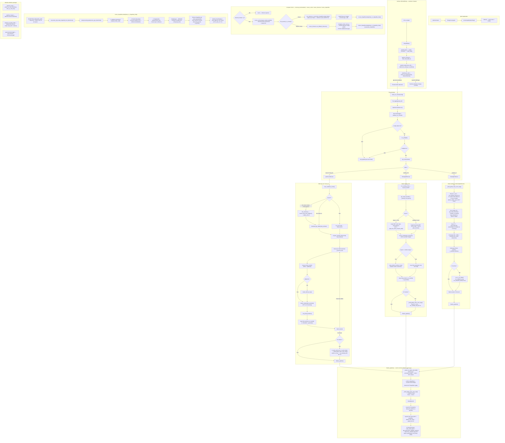

# Archeolog'IA pipeline (Plugin QGIS)

Plugin QGIS pour exécuter un pipeline de traitement LiDAR et produire des rasters de type MNT / densité / indices RVT, avec une étape optionnelle de détection / segmentation par *computer vision*.

- Nom du plugin : **ArchéologIA**
- Version : **0.11.0**
- QGIS : **3.34+ (Qt5) ou 4.x (Qt6)** — base de code unique

## Fonctionnalités

- Génération de produits raster :
  - **MNT**
  - **Densité**
  - **Couverture** (*QA points sol*) — carte qualité des zones où le MNT est interpolé faute de points sol (raster + polygones des zones sous le seuil). Disponible uniquement quand le nuage de points est traité (modes `ign_laz` / `local_laz`).
  - Indices **RVT** (via *Processing*) : **HS**, **M-HS**, **SVF**, **SLO**, **LD**, **SLRM**, **VAT**, **MSTP**, **PRISM** (ouverture prismatique)
  - Indices **CVAT** (*Combined VAT*) et **CRIM** (*Color Relief Image Map*) — calculés *in-process* via le paquet `rvt` du plugin rvt-qgis (non exposés par *Processing*)
- Export optionnel en **JPG + world file (JGW)** pour certains produits.
- (Optionnel) Détection / segmentation d'instances par computer vision à partir des JPG produits (via runner externe ou dépendances Python) :
  - **Sélection par entités archéologiques** (UI étape 3) : on coche les entités à détecter (parcellaire, trous d'obus…) et un orchestrateur résout automatiquement quels modèles lancer, sur quel indice RVT, avec quelles classes. Plusieurs modèles peuvent ainsi tourner en parallèle, chacun ciblant un RVT. En interne, le filtrage par classes subsiste : si aucune classe n'est retenue pour un modèle, l'inférence est ignorée (court-circuit `selected_classes=[]` avant toute inférence).
  - **Filtrage par aire minimale** (`min_area_m2`) par modèle : les détections trop petites sont écartées dans un shapefile séparé (`detections_filtered_too_small.shp`).
  - **Post-processing global** (appliqué après toutes les inférences, avant génération des shapefiles) :
    - Fusion des polygones de même classe qui se touchent ou sont séparés par ≤ 0.5 m (y compris **inter-dalles**), avec confiance = moyenne pondérée par l'aire des polygones sources. **Optionnel par modèle** via `postprocess.merge_adjacent` dans `args.yaml`.
    - Suppression des superpositions inter-classes (le polygone le plus confiant conserve sa géométrie, les autres sont découpés). **Optionnel par modèle** via `postprocess.remove_overlaps`.
  - **Clustering spatial DBSCAN** (optionnel, par modèle) : regroupe les détections individuelles en zones (ex : `cratere_obus` → `zone_crateres`), configurable via `args.yaml` du modèle. Supporte hystérésis (`min_confidence_extend`), pondération par confiance (`confidence_weight`) et plusieurs géométries de sortie (`convex_hull`, `concave_hull`, `bounding_box`).
  - **Nettoyage automatique** du workdir JPG (`detections/<modele>/jpg/`) si *Générer des images annotées* est désactivé.
- **Projet QGIS consolidé** : un seul fichier `.qgs` multi-modèles est généré à la racine de `detections/` (`detections_validation.qgs`).
- Option (configurable) : génération de **pyramides / overviews** GDAL pour les GeoTIFF de sortie.

## Modes de données supportés

Le pipeline peut être lancé dans plusieurs modes (selon l’UI/config) :

- `ign_laz` : téléchargement/consommation de tuiles LAZ depuis l'IGN. Trois façons de désigner les dalles à l'étape 1 :
  - **Sélection sur la carte** (bouton « Sélectionner les dalles ») : la grille IGN s'affiche sur le canevas QGIS et on **clique les dalles** (ou on les encadre) directement — WYSIWYG, sans fichier ni piège de CRS. La sélection est écrite dans un `dalles_selection.txt` consommé directement par le téléchargeur.
  - **Zone d'étude vecteur** : un fichier (`.shp/.geojson/.gpkg`) intersecté avec la grille IGN par `tile_resolver.py`. Toute géométrie convient (polygones, lignes, points) et **toutes les couches** du fichier sont unionnées, chacune reprojetée depuis son propre CRS. Le bouton « Couche / groupe QGIS » permet de désigner une couche du projet **ou un groupe entier du panneau Couches** : les couches du groupe sont alors empaquetées dans un `data/temp_zones/zone_<groupe>.gpkg` multi-couches.
  - **Liste de dalles** : un `.txt` de `nom,url` (ou d'URLs) déjà préparé.
- `local_laz` : consommation de tuiles LAZ/LAS déjà présentes localement.
- `existing_mnt` : calcul d'indices RVT à partir d'un MNT existant. Supporte les MNT au format dalle IGN 1 km (ex. `LHD_FXX_xxxx_yyyy_*`), les MNT plus petits (< 1 km, emprise native conservée) **et les MNT de grande emprise** (plusieurs km²) qui sont traités **d'un seul bloc** : les indices RVT sont calculés sur le raster complet et SAHI assure le slicing 640 × 640 à l'inférence CV. Voir la section [MNT / RVT non-IGN](#mnt--rvt-non-ign--traitement-des-grandes-emprises). Formats acceptés : GeoTIFF (`.tif`/`.tiff`) ou grille ASCII ESRI (`.asc`).
- `existing_rvt` : opérations sur RVT existants (TIF). Dans ce mode, le dossier de sortie est `indices/RVT/` (nom générique) ; dans les autres modes, le nom du dossier combine le code de l'indice **et ses paramètres RVT** (`SVF_R10_D16_V1_N0`, `LD_A15_Rmin10_Rmax20_H1p7_V1`, etc.), si bien que relancer avec d'autres paramètres ne réécrit pas les dossiers existants (cf. la section *Sorties*). Comme pour `existing_mnt`, les rasters RVT de grande emprise sont **traités sans pré-découpage** : la limite PIL `MAX_IMAGE_PIXELS` est désactivée et SAHI découpe l'image en mémoire au moment de l'inférence.

## Pré-requis

Le plugin s’exécute dans QGIS et s’appuie sur des outils externes. Un contrôle est effectué au lancement via le **préflight**.

### Dépendances QGIS

- **QGIS 3.34+ (Qt5) ou QGIS 4.x (Qt6)**
- Module **Processing** (fourni avec QGIS)
- Les algorithmes RVT accessibles via Processing (selon installation QGIS)

### Réseau d'entreprise (proxy)

Le téléchargement des dalles LiDAR (IGN, `data.geopf.fr`) se fait en HTTPS direct. Sur un réseau d'entreprise où l'accès Internet n'est autorisé **que via un proxy** (Ministère de la Culture, collectivités, etc.), il faut le déclarer dans QGIS :

**Préférences → Options → Réseau → « Utiliser un proxy pour l'accès Internet »**
- Type : `HttpProxy`
- Hôte / Port : ceux fournis par la DSI (ex. `proxy.culture.fr` / `8000`)
- Authentification : renseigner identifiant / mot de passe si le proxy l'exige

Le plugin lit automatiquement cette configuration pour télécharger les dalles. **Sans proxy déclaré alors que le réseau l'impose**, les téléchargements échouent en `ConnectTimeoutError` (`Connection to data.geopf.fr timed out`).

> **Limites** : l'authentification **NTLM / Kerberos** n'est pas prise en charge (seule l'authentification basique l'est). Si le proxy l'exige, demandez à la DSI une exception réseau pour `data.geopf.fr` ou un proxy acceptant l'auth basique. À défaut de proxy QGIS, le plugin tente aussi les variables d'environnement `HTTP_PROXY` / `HTTPS_PROXY`.

### Outils externes (CLI)

- **PDAL** (`pdal`) requis pour les modes `ign_laz` et `local_laz`
- **GDAL** utilitaires :
  - `gdalwarp` requis pour `ign_laz`, `local_laz`, `existing_mnt`
  - `gdal_translate` requis pour `existing_mnt` / `existing_rvt`
  - `gdaladdo` optionnel (pyramides / overviews). Si absent, la génération de pyramides est ignorée

### Computer vision (optionnel)

Deux options pour l'**inférence** :

- **Runner ONNX externe** (recommandé) : `data/third_party/cv_runner_onnx/windows/cv_runner_onnx.exe` (Windows) / `data/third_party/cv_runner_onnx/linux/cv_runner_onnx` (Linux)
  - Le runner externe ne fait **que l'inférence** (JSON/TXT + images annotées). La génération des shapefiles et le post-processing global sont toujours réalisés côté plugin Python.
- Ou dépendances Python dans l'environnement de QGIS (si pas de runner externe) :
  - `onnxruntime`, `sahi`, `PIL` (Pillow)

Pour la **génération de shapefiles et le post-processing global** (fusion polygones, suppression superpositions), le plugin Python requiert :
- `shapely` (opérations géométriques : union, buffer, difference)
- `geopandas` + `fiona` (écriture shapefiles)

Ces dépendances sont disponibles dans l'environnement QGIS standard.

> **Faux positif antivirus / SmartScreen (Windows).** Le runner `cv_runner_onnx.exe` est un exécutable **compilé avec PyInstaller** et **non signé numériquement**. Certains antivirus le signalent à tort par heuristique générique (p. ex. `Win64:Malware-gen`) : c'est un **faux positif** (auto-extraction PyInstaller + absence de signature), pas un code malveillant. Si l'antivirus le met en quarantaine, autorisez/restaurez le fichier ou ajoutez une exception sur le dossier `data/third_party/cv_runner_onnx/`. À défaut, le plugin **bascule automatiquement** sur l'inférence ONNX en pur Python (`onnxruntime` dans l'environnement QGIS) : la détection reste possible, simplement sans l'exécutable dédié.

**Note** : Les modèles doivent être exportés au format ONNX avant utilisation (voir section dédiée).

## Installation

### Installation dans QGIS (utilisateur)

1. Ouvrir **QGIS**.
2. Aller dans :
   - `Profils utilisateurs` → `Ouvrir le dossier du profil actif`
3. Ouvrir le dossier :
   - `python/plugins`
4. Dézipper le ZIP `ArcheologIA_v<version>.zip` (ex. `ArcheologIA_v0.7.0.zip`) : on obtient le dossier :
   - `archeologia`
5. Copier le dossier `archeologia` dans `python/plugins`.
6. Fermer puis relancer QGIS.
7. Activer le plugin :
   - `Extensions` → `Installer/Gérer les extensions…` → rechercher **Archeolog'IA pipeline** → activer.

> Le nom du dossier généré (`archeologia`) est défini par la constante `PLUGIN_NAME` dans `dev/package_plugin.py`.

### Où se trouve le dossier des plugins

Sous Windows (profil par défaut) — `QGIS3` pour QGIS 3.x, `QGIS4` pour QGIS 4.x :

```text
%APPDATA%\QGIS\QGIS3\profiles\default\python\plugins\   (QGIS 3.x)
%APPDATA%\QGIS\QGIS4\profiles\default\python\plugins\   (QGIS 4.x)
```

### Dépendances à avoir dans QGIS

Le plugin exécute un **préflight** (contrôle des dépendances) au lancement.

- **Processing** : doit être disponible (dans QGIS : `Traitement` → `Boîte à outils`).
- **Algorithmes RVT via Processing** : nécessaires si tu actives des produits RVT (HS/M-HS/SVF/SLO/LD/SLRM/VAT/MSTP/PRISM). Fournis par le plugin QGIS **« Relief Visualization Toolbox » (rvt-qgis)**.
  ⚠️ Le plugin rvt-qgis doit être **installé, activé et à jour** : sous QGIS 4, toute version ≤ 0.10.0 est refusée au chargement (marquée incompatible) et les algorithmes `rvt:*` deviennent introuvables — mettre à jour via *Extensions → Installer/Gérer les extensions* (version ≥ 1.0.1 recommandée). Le préflight de l'étape 4 signale ce cas par un ✗ critique **« Algorithmes RVT (Processing) »** et bloque le lancement.
- **CVAT** (*Combined VAT*) et **CRIM** (*Color Relief Image Map*) : nécessitent également le plugin **rvt-qgis** installé — ils ne sont pas exposés par *Processing*, le plugin réutilise donc directement son paquet Python `rvt`.

Si un élément est manquant, le préflight affichera une erreur et empêchera le lancement.

### Dépendances externes (CLI)

Certaines étapes reposent sur des exécutables dans le `PATH` :

- `pdal` requis pour `ign_laz` / `local_laz`
- `gdalwarp` requis pour `ign_laz` / `local_laz` / `existing_mnt`
- `gdal_translate` requis pour `existing_mnt` / `existing_rvt`
- `gdaladdo` optionnel (pyramides / overviews). Si absent, la génération de pyramides est ignorée

## Utilisation : l'assistant en 4 étapes

Depuis la **v0.3.0**, le plugin s'utilise via un **assistant (wizard) en 4 étapes**. On navigue avec **Précédent / Suivant** ; un rail latéral indique l'étape courante et signale les erreurs bloquantes. La configuration est **auto-sauvegardée** entre deux sessions (`last_ui_config.json`) ; l'en-tête propose aussi **Charger / Enregistrer config** (profils `.json`).

1. **Source** — Choix du mode de données (`ign_laz`, `local_laz`, `existing_mnt`, `existing_rvt`) et des chemins d'entrée (zone/liste IGN, dossier LAZ, dossier MNT ou dossier RVT selon le mode).
2. **Produits** — Sélection des produits : **MNT / Densité / Couverture** (modèle de base) + indices **RVT**, tous présentés sur le même gabarit de carte (**HS, M-HS, SVF, SLO, LD, SLRM, VAT, MSTP, CVAT, PRISM, CRIM**). Le bouton **« Réglages avancés… »** ouvre une vue à onglets pour régler finement chaque indice (paramètres RVT : azimut/élévation solaire, directions, rayons, échelles multi-niveaux, etc.) ainsi qu'un onglet par produit du modèle de base — **MNT** (filtre PDAL, **résolution MNT** : 0,50 m/pixel par défaut), **Densité** (résolution du raster de densité), **Couverture** (seuil de zones mal couvertes) — et la **marge de tuilage**, commune à tous les indices. Tous les paramètres se règlent là et nulle part ailleurs : la vue d'ensemble ne sert qu'à choisir les produits. *(HS = hillshade simple, mono-directionnel ; M-HS = multi-directionnel ; MSTP = position topographique multi-échelle, sortie RGB ; CVAT = VAT combiné general+flat, composition figée ; PRISM = ouverture prismatique, la couleur dit l'orientation du versant ; CRIM = relief coloré, la couleur dit la pente.)* Chaque carte de produit porte une **fiche** (vignette + lien « Fiche », même accès qu'à l'étape 3) : ce que montre l'image, dans quelle optique s'en servir, ce qu'elle ne montre **pas**, comment elle est calculée, ses réglages et ses sources (documentation et manuel RVT, QGIS/PDAL/GDAL, descriptif de contenu IGN LiDAR HD, articles fondateurs). En tête de la fiche, deux **tableaux comparatifs** (« ce que chaque produit sait faire », « quel produit pour quelle forme ») répondent à la question que la fiche d'un seul produit ne résout pas : lequel cocher. Textes dans `data/indices_fiches.json`, images dans `data/indices_vignettes/`, logique pure dans `src/app/services/indice_fiche.py`.
3. **Détection IA** *(optionnelle)* — On coche les **entités archéologiques** à détecter (parcellaire, trous d'obus, talus/fossés…). L'orchestrateur choisit automatiquement le(s) modèle(s) ONNX adapté(s) et l'indice RVT cible. Les seuils de **confiance** et d'**aire minimale** sont réglables par entité. La valeur par défaut de chaque entité vient du `model_card.yaml` du modèle : elle est **choisie sous le seuil F1-max** mesuré au banc (le F1 pèse un oubli comme un faux positif, alors qu'en prospection un faux positif se rejette en quelques secondes), dans la fenêtre [bas du plateau F1 ≥ 95 % ; F1-max] — la lecture qui l'a fixée est consignée dans `seuils_provenance`. Le seuil de confiance est **filtrant** : les détections sous le seuil sont écartées du `.gpkg` de l'entité (après clustering, donc l'hystérésis de regroupement reste alimentée), et la **légende** du `.qgs` part du seuil propre à chaque entité — une entité dont rien ne dépasse son seuil donne une couche vide. Pour les modèles qui portent une table de fiabilité (`thresholds.fiabilite` du `model_card.yaml`), la légende ne montre plus des tranches de score mais quatre catégories **douteux / possible / probable / très probable**, définies par la part de vrais objets mesurée au banc (≥ 35 / 60 / 85 %) : les mots ont le même sens pour tous les modèles, seules les coupures de score changent, par classe. Le rendu reste celui des tranches d'origine : un contour sans remplissage dans la couleur de l'entité, déclinée en luminosité par catégorie (plus sombre = plus sûr), pour laisser lire le relief à l'intérieur ; le détail mesuré (« ≥ 85 % de vrais objets sur le banc, mesuré 95 % sur 1 013 détections ») est dans l'infobulle de la couche, l'infobulle de chaque détection et les champs `fiabilite` / `fiabilite_pct`. En mode avancé, l'étape 3 affiche les coupures effectives sous la case « Confiance ».
4. **Lancer** — Un panneau **« État du système »** exécute le préflight en tâche de fond (outils CLI, Processing, runner ONNX, espace disque…) ; un **récapitulatif** résume les choix ; le nombre de **workers** parallèles est réglable dans les paramètres avancés repliables. Le bouton **▶ Lancer le pipeline** démarre le traitement : l'écran bascule alors sur la **vue d'exécution** (timeline 5 étapes + journal défilant avec auto-défilement / copier / effacer).

## Computer vision : runner ONNX + modèles

### Activer la computer vision

La computer vision est optionnelle. Quand elle est activée, le pipeline peut lancer une étape de détection à partir des images (JPG) exportées.

Le plugin utilise un **runner ONNX unifié** qui supporte les types de modèles suivants :

| Type | Tâche | Format fichier |
|---|---|---|
| **YOLO** | Détection d'objets | `.onnx` |
| **RF-DETR** | Détection d'objets | `.onnx` |
| **RF-DETR Seg** | Segmentation d'instances | `.onnx` |
| **SegFormer** | Segmentation sémantique | `.onnx` |
| **SMP** (DeepLabV3+, Unet…) | Segmentation sémantique | `.onnx` |

### Contrat des modèles

Un dossier modèle dans `data/models/<nom>/` doit contenir **7 fichiers obligatoires** (`model_card.yaml`, `args.yaml`, `classes.txt`, `training_params.json`, `config.json`, `weights/best.onnx`, `weights/best.json`) + `evaluation_results.json` recommandé. Voir [`docs/model_contract.md`](docs/model_contract.md) pour les schémas détaillés et les règles de cohérence inter-fichiers (doublons de classes autorisés, divergences `imgsz`/SAHI documentées dans `model_card.inference_choices`).

Pour valider un dossier modèle :

```bash
python scripts/validate_models_metadata.py                 # tous les modèles
python scripts/validate_models_metadata.py data/models/X   # un seul modèle
```

Les tests pytest `tests/unit/test_models_metadata.py` et `tests/unit/test_models_connectivity.py` lancent automatiquement la même validation sur chaque modèle versionné et vérifient que les readers du pipeline (`ModelProfile.load`, `load_sahi_config_from_model`, …) restent compatibles.

### Export des modèles vers ONNX

Avant d'utiliser le runner, vous devez exporter vos modèles PyTorch (.pt/.pth) vers le format ONNX.

#### 1. Créer un environnement virtuel dédié à l'export

```bash
cd <racine_du_plugin>
python -m venv .venv_export

# Windows
.venv_export\Scripts\activate

# Linux/Mac
source .venv_export/bin/activate
```

#### 2. Installer les dépendances d'export

**Pour YOLO uniquement :**
```bash
pip install ultralytics onnx onnxsim
```

**Pour RF-DETR uniquement :**
```bash
pip install rfdetr torch onnx onnxsim pyyaml
```

**Pour SMP (DeepLabV3Plus, Unet, etc.) :**
```bash
pip install segmentation-models-pytorch torch onnx onnxsim pyyaml
```

**Complet (tous les types) :**
```bash
pip install ultralytics rfdetr segmentation-models-pytorch torch onnx onnxsim pyyaml
```

#### 3. Exporter le modèle

```bash
# Exporter un modèle YOLO
python dev\runner_onnx\export_to_onnx.py --model models\mon_modele\weights\best.pt --output models\mon_modele\weights\best.onnx

# Exporter un modèle RF-DETR (détection)
python dev\runner_onnx\export_to_onnx.py --model models\mon_modele_rfdetr\weights\best.pth --output models\mon_modele_rfdetr\weights\best.onnx --type rfdetr --imgsz 560

# Exporter un modèle RF-DETR Seg (segmentation d'instances)
# Les paramètres patch_size et positional_encoding_size sont lus automatiquement depuis le checkpoint ;
# les spécifier explicitement si la détection automatique échoue.
python dev\runner_onnx\export_to_onnx.py \
  --model models\mon_modele_rfdetr_seg\weights\best.pth \
  --output models\mon_modele_rfdetr_seg\weights\best.onnx \
  --type rfdetr \
  --imgsz 1032 \
  --patch-size 12 \
  --positional-encoding-size 42

# Exporter un modèle SMP (DeepLabV3Plus)
python dev\runner_onnx\export_to_onnx.py \
  --model models\mon_modele_smp\weights\best.pth \
  --output models\mon_modele_smp\weights\best.onnx \
  --type smp \
  --arch DeepLabV3Plus \
  --encoder resnet101 \
  --num-classes 3 \
  --class-names "background,parcellaire,talus-fosse_fossebutte" \
  --imgsz 512
```

Le script détecte automatiquement le type de modèle (YOLO, RF-DETR, RF-DETR Seg, SegFormer ou SMP).

### Création du runner ONNX (Windows)

Objectif : produire un exécutable :

```text
data/third_party/cv_runner_onnx/windows/cv_runner_onnx.exe
```

#### Compilation automatique

Le script `runner_onnx/build.py` automatise la création du runner :

```bash
cd runner_onnx

# Compiler le runner (CPU)
python build.py

# Compiler le runner avec support GPU
python build.py --gpu

# Nettoyer les builds précédents
python build.py --clean
```

Le script :
1. Crée un environnement virtuel isolé (`.venv_onnx`)
2. Installe les dépendances nécessaires
3. Compile le runner avec PyInstaller
4. Copie le binaire vers `data/third_party/cv_runner_onnx/windows/`

**Taille du binaire** : ~100-150 MB (inclut les dépendances SAHI et ONNX Runtime)

#### Compilation manuelle (alternative)

```bash
cd runner_onnx
python -m venv .venv_onnx
.venv_onnx\Scripts\activate
pip install pyinstaller onnxruntime sahi pillow numpy pyyaml
python -m PyInstaller --clean cv_runner_onnx.spec
copy dist\cv_runner_onnx.exe ..\..\data\third_party\cv_runner_onnx\windows\
```

> **Note** : `shapely`, `geopandas` et `fiona` ne sont **pas** nécessaires dans le runner. La génération de shapefiles et le post-processing sont réalisés côté plugin Python (QGIS).

### Modèles (dossier `data/models/`)

Tous les modèles sont placés dans `data/models/` à la racine du plugin (dossier gitignored). Structure attendue (1 modèle = 1 dossier) :

```text
data/
  models/
    <nom_du_modele>/
      args.yaml              # Paramètres du modèle (imgsz, task, sahi config, clustering…)
      classes.txt            # Un nom de classe par ligne (sans background)
      config.json            # Métadonnées entraînement (architecture, classes, hyperparamètres)
      weights/
        best.pt / best.pth   # Modèle PyTorch original
        best.onnx            # Modèle exporté (requis pour le runner)
        best.json            # Métadonnées ONNX (type, tâche, résolution, classes)
  third_party/
    cv_runner_onnx/
      windows/
        cv_runner_onnx.exe   # Runner ONNX compilé (Windows)
      linux/
        cv_runner_onnx       # Runner ONNX compilé (Linux)
```

Le fichier `classes.txt` doit contenir **un nom de classe par ligne** (sans classe background) :

```text
nomclasse1
nomclasse2
...
```

Le fichier `args.yaml` décrit les paramètres d'inférence. Exemple pour un modèle RF-DETR Seg avec clustering et post-traitement personnalisé :

```yaml
imgsz: 1032
model: RF-DETR-Seg-Large
task: instance_segmentation

sahi:
  overlap_ratio: 0.2
  slice_height: 1032
  slice_width: 1032

# (Optionnel) Désactiver certaines étapes de post-processing global.
# Défauts : merge_adjacent=true, remove_overlaps=true, merge_buffer_m=0.5.
postprocess:
  merge_adjacent: false   # ex. cratères disjoints → on ne fusionne pas
  remove_overlaps: true
  merge_buffer_m: 0.5     # distance MAX (m) de fusion intra-classe (vraie distance)

clustering:
  - target_classes: ["cratere_obus"]
    eps_m: 25
    min_cluster_size: 3
    min_samples: 2
    min_confidence: 0.3              # seuil "core" (initie/étend un cluster)
    min_confidence_extend: 0.1       # (optionnel) hystérésis : seuil bas pour
                                     # absorber des détections "border" sans
                                     # qu'elles puissent initier un cluster.
                                     # Défaut = min_confidence (DBSCAN classique).
    output_class_name: "zone_crateres"
    output_geometry: convex_hull     # convex_hull | concave_hull | bounding_box
    concave_ratio: 0.3               # (optionnel, si concave_hull) 0=très concave, 1≈convex_hull
    buffer_m: 5
    min_area_m2: 500                 # (optionnel) écarte les clusters trop petits
    confidence_weight: 0.5           # 0.0 = DBSCAN classique
    min_conf_p90: 0.60               # (optionnel) filtre de ZONE : 90e centile de confiance
                                     # des cratères membres ≥ ce seuil, sinon la zone est écartée
    max_elong_med: 1.32              # (optionnel) filtre de ZONE : allongement médian des boîtes
                                     # ≤ ce seuil (les terrasses font des « cratères » allongés)
```

Valeurs possibles pour `task` : `detect`, `instance_segmentation`, `semantic_segmentation`.

La section `postprocess` est optionnelle. Si elle est absente, les valeurs par défaut historiques s'appliquent (`merge_adjacent=true`, `remove_overlaps=true`, `merge_buffer_m=0.5`). C'est utile pour des classes où la fusion intra-classe est indésirable (ex. détections ponctuelles disjointes telles que des cratères d'obus). `merge_buffer_m` est la **vraie distance** (en mètres) en deçà de laquelle deux polygones de même classe sont fusionnés (test `dwithin`, et non l'intersection de polygones bufferisés qui doublait la portée).

Le clustering DBSCAN est optionnel. Si la section `clustering` est absente de `args.yaml`, il est désactivé. Les classes générées par clustering contournent le filtre `selected_classes` et sont toujours incluses dans les shapefiles. La logique se trouve dans `src/pipeline/cv/clustering.py` (DBSCAN avec hystérésis et pondération par confiance).

### Détection par entités (UI)

Depuis la v0.3.0, l'utilisateur ne sélectionne plus des *modèles* puis filtre leurs *classes* : il coche des **entités** à détecter (étape 3 de l'assistant). Un **orchestrateur** (`src/app/services/model_orchestrator.py`) résout ce choix en *runs* concrets :

- `data/entities_catalog.json` (versionné) fournit le **vocabulaire d'entités** présentable (id, libellé, description, ordre d'affichage) ;
- le `model_card.yaml` de chaque modèle installé déclare sa **couverture** : son indice RVT (`preferred_rvt.type`) et ses `classes`, chacune pouvant pointer vers une entité du catalogue (`entity:` en alias, sinon le nom de classe fait foi). C'est une découverte **« drop-in »** : ajouter un modèle conforme suffit pour qu'il couvre ses entités.

L'orchestrateur regroupe les entités cochées par couple `(modèle, target_rvt)` — chaque couple devient un *run* — et **peuple le tableau `computer_vision.runs`** ci-dessous.

**Comparaison A/B (plusieurs modèles pour une même entité).** Le menu « Changer ▾ » d'une carte d'entité est à cases **non exclusives** : cocher un 2ᵉ modèle lance un run **par modèle** pour cette entité. Les sorties de chaque variante sont alors **qualifiées par modèle** pour rester isolées et comparables : dossier `detections/<slug>--<modèle>/` (GPKG propre → pas d'écrasement, seuils de symbologie corrects par variante), couches nommées `<classe> — <modèle>` (couleur distincte via le registre), et les variantes sont regroupées dans QGIS sous un groupe commun `« <Entité> (comparaison) »`. Chaque détection porte l'attribut `model_name` du run qui l'a produite. Avec un seul modèle coché, rien ne change (`detections/<slug>/`). La surcharge persistée `computer_vision.entity_model_overrides` accepte une chaîne (historique) ou une **liste** de modèles. ⚠️ Les surcharges de seuils par entité s'appliquent identiquement aux deux variantes (comparaison à seuil égal), et si les deux modèles préfèrent le même type de RVT avec des paramètres divergents, un seul raster est calculé (avertissement dans le log). Ce format de configuration reste donc le **contrat sous-jacent** du pipeline (auto-rempli par l'UI). Pour un usage avancé : partir de `config.example.json` (schéma complet, verrouillé par test), éditer un profil `.json`, puis l'importer via le bouton **« Charger une config »** de l'assistant — le plugin ne lit **pas** de fichier `config.json` à la racine.

**Cibles dérivées.** Une sortie de clustering peut aussi être présentée comme une **entité cochable à part entière** — une *cible dérivée*. Le modèle la déclare dans son `model_card.yaml` via une section `derived_targets` qui rattache l'`output_class` d'une règle de `args.yaml:clustering` à une entité du catalogue :

```yaml
derived_targets:
  - output_class: zone_crateres          # sortie d'une règle args.yaml:clustering
    entity: regroupement_crateres        # entité du catalogue (data/entities_catalog.json)
    include_source: true                 # inclure aussi les détections individuelles
```

Sélectionner une cible dérivée active le regroupement **d'office** : pas de case « Regrouper en clusters » mais un badge « regroupement automatique en zones ». C'est ainsi qu'est exposée l'entité **« Regroupement de cratères »** (regroupement des dépressions circulaires détectées par un modèle de cratères : le libellé nomme l'usage, la description reste honnête sur la méthode). ⚠️ L'`entity:` doit référencer un **id présent dans le catalogue** — un id inconnu est silencieusement ignoré par l'orchestrateur (pas de case à l'étape 3). L'orchestrateur replie la cible dans la couverture du modèle (`classes` = `output_class` + classes sources si `include_source`) — la résolution des runs et le pipeline CV restent inchangés.

**Entité incluse par une cible dérivée** (2026-09-15). Avec `include_source`, cocher la cible produit déjà la couche de ses classes sources (une seule couche « Cratères », dans le groupe « Regroupement de cratères » — jamais en double à la racine). L'entité de base correspondante (« Cratères ») est donc **cochée d'office** quand la cible est cochée : badge « ↳ inclus dans « Regroupement de cratères » », carte non décochable (décocher la cible la libère, elle retrouve alors son état antérieur), seuils en lecture seule. Le seuil des détections sources se règle **sur la carte de la cible** (libellé « Confiance des cratères ») : il pilote les zones, et la règle de regroupement est calibrée au seuil du modèle. Une surcharge de seuil posée sur l'entité incluse est ignorée par l'orchestrateur tant que la cible est cochée (`InstalledModel.implied_entities`).

### Configuration

Dans un profil de configuration (cf. `config.example.json`), la section computer vision est sous la clé `computer_vision`. Le format **multi-modèles** utilise un tableau `runs`, chaque entrée ciblant un RVT (`target_rvt`) avec son propre modèle :

```json
{
  "computer_vision": {
    "enabled": true,
    "runs": [
      {
        "model": "data/models/run_rfdetr_parcellaire/weights/best.onnx",
        "target_rvt": "LD",
        "min_area_m2": 0.0
      },
      {
        "model": "data/models/formes_lineaires_rfdetr_seg/weights/best.onnx",
        "target_rvt": "LD",
        "selected_classes": ["parcellaire", "talus-fosse_fossebutte"],
        "min_area_m2": 50.0
      }
    ],
    "confidence_threshold": 0.3,
    "iou_threshold": 0.5,
    "generate_annotated_images": false,
    "generate_shapefiles": true,
    "models_dir": "data/models"
  }
}
```

Le format historique mono-modèle est conservé pour rétrocompatibilité (sans `runs`) :

```json
{
  "computer_vision": {
    "enabled": true,
    "selected_model": "data/models/mon_modele/weights/best.onnx",
    "target_rvt": "LD"
  }
}
```

`selected_model` peut aussi être un nom de dossier modèle relatif à `models_dir` ; le runner cherchera alors automatiquement `weights/best.onnx`.

### Inférence avec halo inter-dalles

**Modes `ign_laz` / `local_laz` (TIF non rognés d'`intermediaires/`).**

En modes IGN / LAZ local, l'inférence CV ne tourne plus sur le TIF rogné à 1 km mais sur le **TIF non rogné** d'`intermediaires/` (dalle + marge `processing.tile_overlap`, 200 m par défaut — de la vraie donnée voisine fusionnée par `prepare_merged_tiles`). Un objet à cheval sur une frontière de dalles est ainsi vu **en entier** par au moins une des deux dalles (halo ≥ taille/2) ; les détections en double dans la bande de recouvrement se superposent exactement en Lambert-93 et sont fusionnées par le post-traitement géo global (`merge_adjacent` / `remove_overlaps`). Pour les modèles **bbox** (object detection), la déduplication passe par `overlap_strategy: relation` — **défaut automatique** pour ces modèles (la stratégie historique `difference` rogne le perdant sans jamais le supprimer) — et chaque groupe de doublons est réduit à la **boîte la plus confiante** (pas d'union en L de rectangles décalés). En pratique :

- le PNG d'inférence garde le **nom** du TIF rogné mais des dimensions plus grandes (ex. 2800×2800 px à 20 % / 0,5 m) ; la garde GEO-03 (PNG ≡ raster source), le géotransform et le world file sont tous référencés sur le TIF non rogné — jamais de panachage ;
- les détections sont **clippées à l'union des emprises rognées du run** : la marge extérieure au périmètre commandé (sans voisin → aplat NoData, noyaux RVT repliés en miroir) ne produit pas de bruit ;
- **règle du centroïde** (`postprocessing.owned_by_cell`, appliquée à la lecture des labels par `conversion_shp` via `cell_bounds_by_stem`) : chaque dalle ne rapporte que les détections dont le **centre est dans sa cellule rognée**. Un objet à cheval sur une frontière est vu entier par les deux dalles → une seule le rapporte (plus de doublon cross-dalles à dédoublonner) ; un objet coupé au **bord du halo** d'une dalle (fragment rectiligne à ± marge) a son centre dans la cellule voisine, qui le voit entier → le fragment est écarté. Le journal compte les détections écartées (`Halo inter-dalles : N détection(s) centrée(s) hors de la cellule…`) ;
- un cache `raw_detections/` plus ancien que son PNG est **purgé automatiquement** (des coordonnées normalisées calculées sur l'ancienne géométrie seraient décalées de la marge) — le premier re-run dans un `output_dir` antérieur ré-infère donc toutes les images ;
- coût : surface d'inférence ≈ ×2 à marge 20 % (le halo utile plancher est ~50 m pour un enclos de 90 m — réduire `tile_overlap` réduit le halo *et* le contexte des noyaux RVT, cf. avertissements de l'étape 2) ; temps MNT/RVT inchangé (la marge était déjà calculée) ;
- les JPG annotés montrent l'image élargie : un objet frontière apparaît sur les JPG des deux dalles voisines (cosmétique, assumé) ;
- si le TIF non rogné est introuvable (`intermediaires/` purgé, re-run CV seul), repli sur le **halo fabriqué depuis les voisins** (ci-dessous), puis sur le TIF rogné.

**Modes `existing_rvt` / `existing_mnt` (halo fabriqué depuis les voisins).** Sans `intermediaires/`, chaque dalle 1 km était inférée seule : un objet à cheval sur une frontière sortait **coupé au bord** (ou pas du tout quand la moitié visible ne passait plus le seuil de confiance). `run_existing_rvt` découpe désormais **dalle + 50 m** dans la mosaïque des dalles *fournies* (`pipeline/modes/neighbor_halo.py`, VRT GDAL → `intermediaires/halo/<indice>/`) : vraie donnée là où un voisin existe, aplat 0 ailleurs (clippé comme ci-dessus). 50 m suffit à voir entier un objet de 100 m et ne coûte **aucune tuile SAHI** (2 000 + 2 × 100 px = 2 200 px < 2 202 px, la grille 4×4 des modèles 648/672 px est conservée — à 200 m on passerait à 6×6, × 2,25). Fraîcheur comme le LAZ fusionné : un halo est réutilisé tant que son jeu de voisins (sidecar `.inputs.json`) et leurs mtimes sont inchangés ; sinon il est re-découpé et son mtime frais régénère le PNG puis purge le cache CV de la dalle. Raster « large » (> 1 km) ou dalle sans voisin → pas de halo. Le résolveur explicite (`intermediaires/`) reste prioritaire, le halo voisin est le repli, valable dans tous les modes. La règle du centroïde ci-dessus s'applique de la même façon (mesuré sur Fénétrange, 43 dalles LD : coupes sur lignes de dalles 13 → 2 pour les dépressions, 7 → 0 pour les charbonnières et 50 → 2 pour le parcellaire, IoU des entités à cheval 0,73 → 0,80, structures linéaires continues (41 → 97 polygones à cheval sur plusieurs dalles), sans tuile SAHI supplémentaire ; une marge de 200 m n'apporte rien de plus pour × 1,85 le temps).

## MNT / RVT non-IGN : traitement des grandes emprises

Les modes `existing_mnt` et `existing_rvt` ne se limitent pas aux dalles IGN LiDAR HD 1 km. Le pipeline inspecte les **bornes géographiques** de chaque raster d'entrée (Lambert-93) puis choisit un flux adapté :

| Régime | Condition (tolérance 50 m) | Traitement |
|---|---|---|
| **standard** | ≈ 1 000 × 1 000 m **et** aligné sur la grille IGN | Comportement d'origine (crop 1 km, renommage `LHD_FXX_{x}_{y}_*`). |
| **small** | < 1 km ou non aligné sur la grille | Aucun crop : l'emprise native est préservée (évite d'introduire du NoData). Nommage IGN conservé pour la dédup et la conversion shapefile. |
| **large** | largeur **ou** hauteur > 1,05 km | **Pas de pré-découpage**. Les indices RVT sont calculés sur l'emprise complète, puis SAHI assure le slicing 640 × 640 en mémoire au moment de l'inférence CV. |

Conséquences pratiques pour le régime **large** :

- **Indices RVT continus** : un MNT 7 × 5 km produit un unique GeoTIFF `LD`, `SVF`, etc. couvrant toute la scène, sans discontinuités sur les bords de sous-dalles. Les algorithmes RVT (angle, voisinage) bénéficient ainsi de l'intégralité du contexte local.
- **Pas de sous-dalles NoData** : on évite le problème des cellules 1 km à l'extérieur de la couverture réelle du LiDAR qui se retrouvaient sinon rendues en noir dans QGIS.
- **Limite PIL désactivée** : `Image.MAX_IMAGE_PIXELS = None` est positionné dans `src/pipeline/ign/products/convert_tif_to_png.py` et `src/pipeline/cv/computer_vision_onnx.py` pour autoriser le chargement d'un grand TIF/PNG. À l'usage interne uniquement (rasters locaux maîtrisés).
- **SAHI gère le slicing** : le raster est lu une fois en numpy, puis `sahi_lite.slice_image()` produit les tuiles 640 × 640 avec chevauchement (`overlap_ratio=0.2` par défaut). Les détections de chaque tuile sont décalées vers l'espace image global puis fusionnées (NMS). Le nom du fichier est conservé, donc une seule entrée apparaît dans `tif_transform_data` pour le géoréférencement des bounding boxes.
- **Consommation RAM** : un PNG 20 000 × 20 000 RGB = 1,2 Go en numpy ; les slices SAHI ajoutent ~50-100 Mo selon l'overlap. Compter **~3 Go de pic** pour une scène 10 × 10 km à 0,5 m/px.
- **Le nom de sortie reprend le stem du fichier source** : un MNT `mon_site.tif` produit `mon_site_LD.tif`, `mon_site_SVF.tif`, etc. (les caractères non alphanumériques sont convertis en `_` pour la compatibilité GDAL, et un éventuel suffixe `_MNT` est retiré pour éviter `*_MNT_MNT.tif`).

> La logique se trouve dans `src/pipeline/modes/existing_mnt.py` (`_classify_mnt_layout`, `_large_tile_name_for`) et `src/pipeline/modes/existing_rvt.py` (`_classify_rvt_layout`).

## Sorties

Les sorties sont écrites dans le dossier `output_dir` configuré.

Structure typique (modes `local_laz` / `ign_laz` / `existing_mnt`) :

```text
output_dir/
  metadata.json                          # Résumé du run (version, dalles, produits, runs CV, entités)
  pipeline_log_<date>.txt                # Log complet du run
  sources/
    dalles/                              # Fichiers LAZ/LAS sources (modes local_laz / ign_laz)
  indices/
    MNT/                                 # MNT/Densité : pas de paramètres → code brut
      tif/                               # GeoTIFF des dalles + index_MNT.vrt (mosaïque)
    LD_A15_Rmin10_Rmax20_H1p7_V1/        # Nom = code indice + paramètres RVT utilisés
      tif/
      png/                               # Images d'inférence (entrée Computer Vision)
    SVF_R10_D16_V1_N0/  HS_Az315_E35_V1/  …
  detections/                            # Organisé PAR ENTITÉ (vocabulaire utilisateur)
    detections_validation.qgs            # Projet QGIS consolidé (point d'entrée)
    parcellaire/                         # Un dossier PAR ENTITÉ cochée
      parcellaire.gpkg                   # 1 GeoPackage par entité (couches par classe)
    chemins_creux/  fours/  charbonnieres/  regroupement_de_crateres/  …
    _technique/                          # Échafaudage non-livrable (traçabilité/debug)
      <nom_modele>/
        raw_detections/                  # Sorties brutes (JSON/TXT)
        annotated_images/                # PNG annotés + legend.png (si option activée)
```

**Routage des détections.** Un run UI normal (où l'utilisateur coche des entités à l'étape 3) écrit en **entité-centré** : un dossier `detections/<entity_slug>/` par entité cochée, avec un seul `.gpkg` à l'intérieur (couches par classe). Les sorties brutes du runner ONNX et les images annotées sont reléguées sous `detections/_technique/<modèle>/`. **Repli legacy** : un run construit programmatiquement sans champ `entities` retombe sur `detections/<modèle>/<modèle>.gpkg` (un seul `.gpkg` modèle-centré). Cf. `src/pipeline/output_paths.py` et `src/pipeline/cv/runner_shapefiles.py`.

Le nom de chaque dossier d'indice RVT inclut les paramètres de génération (azimut, élévation,
rayons, directions, etc.) sous forme de suffixe court (`SVF_R10_D16_V1_N0`,
`LD_A15_Rmin10_Rmax20_H1p7_V1`…). Relancer le pipeline dans le **même** `output_dir` avec des
paramètres différents crée donc un **nouveau** dossier au lieu d'écraser le précédent — les
variantes coexistent. `MNT`/`DENSITE` (sans paramètres) gardent leur code brut, et un éventuel
dossier hérité non suffixé (`indices/LD/`) n'est pas supprimé. Sur des `output_dir` très profonds,
attention à la limite Windows MAX_PATH (260 caractères) avec ces noms plus longs.

**Relance dans un même dossier de sortie et cache.** Les paramètres de **traitement** qui ne sont
pas encodés dans les noms de fichiers (résolution MNT, résolution densité, marge inter-dalles,
filtre de classification PDAL) sont suivis par un sidecar `intermediaires/run_params.json` : s'ils
ont changé depuis le run précédent, le cache `intermediaires/` est **automatiquement invalidé**
(message « cache des intermédiaires invalidé » au journal) — les dalles du run courant sont
recalculées puis **re-publiées par-dessus** les TIF finaux de `indices/` (publication par
fraîcheur : un intermédiaire recalculé, plus récent, écrase le fichier publié de même nom).
`indices/` n'est **jamais supprimé** : les dalles d'autres zones accumulées dans le même dossier
restent en place — attention, elles conservent leurs anciens paramètres tant qu'on ne les relance
pas (leurs `.laz` sont conservés dans `sources/`). À paramètres identiques, les fichiers déjà
produits sont réutilisés (reprise rapide après annulation — lignes « réutilisé (cache
intermédiaire) » dans le fichier de log). Cas particulier du halo inter-dalles : **étendre la
sélection** à une dalle voisine re-fusionne automatiquement les dalles dont la marge devient de la
vraie donnée (sidecar `<dalle>_merged.inputs.json`, log « Jeu de voisins modifié → re-fusion ») et
les recalcule en cascade. Un dossier de sortie créé avant cette version (pas de sidecar) adopte les paramètres
courants comme référence à la première relance, sans recalcul forcé. Les dossiers `sources/`
(dalles LiDAR téléchargées) et `detections/` (résultats CV) ne sont **jamais** purgés.

En mode `existing_rvt`, le dossier d'indices est `indices/RVT/` (nom générique, paramètres inconnus).

Chaque dossier `<PRODUIT>/tif/` contient une **mosaïque VRT** nommée `index_<PRODUIT>.vrt` (`index_MNT.vrt`, `index_SVF_R10_D16_V1_N0.vrt`, `index_COUVERTURE.vrt`…) — c'est le fichier à charger dans QGIS. Son nom reprend celui de la couche, donc reste identifiable lors d'un chargement manuel (et non un générique `index.vrt`).

Les GeoTIFF peuvent contenir des **overviews** si l'option pyramides est activée et si `gdaladdo` est disponible.

## Développement

- Point d’entrée plugin : `main.py` (classe `ArcheologiaPipelinePlugin`)
- UI : `src/ui/wizard_dialog.py` (assistant 4 étapes ; pages dans `src/ui/steps/`, vue d'exécution `src/ui/run_view.py`)
- Pipeline : `src/pipeline/`
  - prérequis : `src/pipeline/preflight.py`

## Git : Talisman (pre-push)

Le dépôt inclut un hook `pre-push` basé sur **Talisman** pour éviter de pousser des secrets (tokens, clés, etc.).

### Installation de Talisman

Installe `talisman` et assure-toi qu’il est disponible dans le `PATH`.

### Activer les hooks du dépôt

Les hooks Git ne sont pas versionnables directement dans `.git/hooks/`. À la place, ce dépôt fournit un dossier `.githooks/`.

À exécuter **à la racine du dépôt** :

```bash
git config core.hooksPath .githooks
```

Ensuite, un `git push` déclenchera automatiquement Talisman et pourra bloquer le push si un secret est détecté.

## Dépannage

- **Préflight KO** : vérifier que `pdal`, `gdalwarp`, `gdal_translate` sont accessibles dans le `PATH`.
- **Pyramides absentes** : vérifier la présence de `gdaladdo` et que l’option pyramides est activée.
- **RVT indisponible** (✗ « Algorithmes RVT (Processing) » au préflight, ou erreur « Algorithm rvt:… not found ») : vérifier dans *Extensions → Installer/Gérer les extensions* que **Relief Visualization Toolbox** est installé, **coché** (activé) et à jour — obligatoire en version ≥ 1.0.1 sous QGIS 4, les versions ≤ 0.10.0 n'y étant pas chargées.
- **Computer vision** :
  - soit fournir le runner externe dans `third_party/cv_runner_onnx/...`
  - soit installer les dépendances Python (`onnxruntime`, `pillow`) dans l'environnement QGIS
  - les modèles doivent être exportés en ONNX **avant** utilisation (voir section dédiée)
  - pour les modèles RF-DETR Seg, `opencv-python` est requis dans le runner (inclus dans le binaire compilé)
- **Post-processing non appliqué** : vérifier que `shapely` et `geopandas` sont disponibles dans l'environnement Python de QGIS. Le runner externe ne fait que l'inférence ; la fusion de polygones et la génération de shapefiles sont réalisées côté plugin Python.
- **Polygones non fusionnés entre dalles** : le post-processing global fusionne les polygones de même classe séparés par ≤ 0.5 m. Si les polygones ne sont pas fusionnés, vérifier que les fichiers de détection (`.txt`/`.json`) de toutes les dalles sont présents dans le même dossier `jpg/`.
- **Détections bbox au lieu de polygones** : vérifier que le fichier `weights/best.json` du modèle contient bien `"task": "instance_segmentation"` pour les modèles RF-DETR Seg
- **Pipeline bloqué au démarrage** : si beaucoup de fichiers TIF/JPG (>1000), la première exécution peut prendre plusieurs minutes pour créer les liens/copies vers les dossiers modèles — c'est normal
- **Classes non filtrées** : vider les fichiers `.txt`/`.json` existants dans le dossier `jpg/` du modèle si les anciens résultats ont été générés sans filtrage de classes
- **Inférence lancée malgré 0 classe cochée** : s'assurer que `selected_classes` est bien une liste vide `[]` dans la config et non `null` — le court-circuit dans `run_cv_on_folder` ne s'active que pour `[]` explicite
- **Dossier `jpg/` persistant** : le workdir est supprimé après génération des shapefiles uniquement si *Générer des images annotées* est désactivé. Si le dossier persiste, vérifier que l'option est bien décochée
- **Projet QGIS manquant** : `detections_validation.qgs` est écrit par `ui/qgs_writer.write_validation_project` (API QGIS, thread principal), déclenché depuis `run_view._on_load_layers` lors du chargement des couches — **pas** par `finalize_service` (qui tourne sur le thread worker et se contente d'émettre le signal `load_layers`). Si absent, vérifier que le pipeline s'est terminé sans erreur (section `PIPELINE TERMINÉ AVEC SUCCÈS` dans les logs) et que les couches ont bien été chargées dans QGIS
- **MNT/RVT de grande emprise** (plusieurs km²) : le régime `large` est déclenché dès que largeur ou hauteur > 1,05 km. Vérifier dans les logs la ligne `emprise > 1 km → RVT et CV sur le raster complet` (mode MNT) ou `SAHI assure le slicing à l'inférence (pas de pré-découpage)` (mode RVT). Le raster d'entrée **doit** être projeté en Lambert-93 (EPSG:2154) pour que `_classify_*_layout` puisse évaluer correctement l'emprise.
- **PIL `DecompressionBombError`** sur un grand raster : la limite est désactivée via `Image.MAX_IMAGE_PIXELS = None` dans `convert_tif_to_png.py` et `computer_vision_onnx.py`. Si l'erreur réapparaît, vérifier qu'un autre module PIL importé plus tôt n'a pas réinitialisé la limite (ordre d'import).
- **Pic de RAM élevé** sur un grand raster : prévoir ~3 Go de mémoire libre pour une scène 10 × 10 km à 0,5 m/px (PNG 20 000² en numpy + slices SAHI). Pour réduire, fermer les autres projets QGIS ou passer par `existing_rvt` après avoir pré-calculé les indices hors ligne (ex. via `rvt-py` en script).
- **Détections décalées ou vides** sur un grand raster : vérifier que le TIF source contient un géoréférencement valide (un `gdalinfo mon_site.tif` doit afficher `Pixel Size`, `Origin`, `Coordinate System`). Sans geotransform, les bounding boxes ne peuvent pas être transformées en polygones Lambert-93 dans le shapefile.

## Architecture

### Diagramme de flux


```mermaid
flowchart TD
    subgraph QGIS["QGIS Application"]
        A[QGIS démarre] --> B[Charge les plugins]
        B --> C["ArcheologiaPipelinePlugin"]
        C --> D["initGui() → action menu + toolbar"]
    end

    subgraph UI["Interface (WizardDialog — assistant 4 étapes)"]
        E["Clic sur plugin"] --> F["WizardDialog"]
        F --> S1["Étape 1 · Source (mode + chemins)"]
        S1 --> S2["Étape 2 · Indices (produits + réglages avancés RVT)"]
        S2 --> S3["Étape 3 · Détection (entités → model_orchestrator → runs CV)"]
        S3 --> S4["Étape 4 · Lancer (préflight + récap + workers)"]
        S4 -->|"▶ Lancer le pipeline"| H3["Thread worker (daemon)"]
        S4 -.->|"bascule l'affichage"| RV["RunView (timeline 5 étapes + journal)"]
    end

    subgraph Worker["Thread Worker"]
        H3 --> W1["build_run_context(config)"]
        W1 --> W2["file_logging(output_dir)"]
        W2 --> W3["PipelineController.run()"]
        W3 --> W4["StructuredLogger + validate_run_context()"]
        W4 --> W4b{"Config métier OK ?"}
        W4b -->|"Non"| W6["end_pipeline(success=False)"]
        W4b -->|"Oui"| W4c["run_preflight()"]
        W4c --> W5{"Preflight OK ?"}
        W5 -->|"Non"| W6["end_pipeline(success=False)"]
        W5 -->|"Oui"| W7["get_runner(mode)"]
        W7 --> N{"Mode ?"}
        N -->|"ign_laz / local_laz"| O["IgnOrLocalRunner"]
        N -->|"existing_mnt"| P["ExistingMntRunner"]
        N -->|"existing_rvt"| Q["ExistingRvtRunner"]
    end

    subgraph IgnLocal["Mode ign_laz / local_laz"]
        O --> R0["clear_validation_cache()"]
        R0 --> R1{"ign_laz ?"}
        R1 -->|"Oui, input vecteur (.shp/.geojson)"| R1b["tile_resolver.py → resolve_tiles_from_polygon() → dalles_urls.txt"]
        R1b --> R2["download_ign_dalles(max_workers)"]
        R1 -->|"Oui, input .txt"| R2
        R1 -->|"Non"| R3["run_local_laz() → fichier_tri.txt"]
        R2 --> R4["prepare_merged_tiles(overlap, max_workers)"]
        R3 --> R4
        R4 --> R5["Boucle par dalle fusionnée (_process_tile)"]
        R5 --> R6["create_terrain_model() (PDAL + gdalwarp)"]
        R6 --> R7{"DENSITE ?"}
        R7 -->|"Oui"| R8["create_density_map()"]
        R7 -->|"Non"| R9["create_visualization_products() (RVT via Processing)"]
        R8 --> R9
        R9 --> R10["crop_final_products()"]
        R10 --> R11["copy_final_products_to_results() (+ JPG/JGW + pyramides)"]
        R11 --> R14["Dalle suivante"]
        R14 -->|"Reste des dalles"| R5
        R14 -->|"Fin boucle"| R17{"CV activée ?"}
        R17 -->|"Oui"| R18["cv_post_service.run_cv_post_loop() → _build_global_class_color_map()\nboucle cv_runs → run_existing_rvt() par run"]
        R17 -->|"Non"| FIN1["finalize_pipeline()"]
        R18 --> FIN1
    end

    subgraph ExistingMnt["Mode existing_mnt"]
        P --> P1["run_existing_mnt() — boucle par MNT"]
        P1 --> P1z["get_raster_bounds() + _classify_mnt_layout()"]
        P1z --> PLAY{"layout ?"}
        PLAY -->|"large (&gt; 1 km)"| P1aL["Copie MNT entier dans intermediaires/\n(nom = _large_tile_name_for(mnt_path))"]
        P1aL --> P1b["create_visualization_products() (RVT) sur MNT complet"]
        PLAY -->|"standard / small"| P1a["Copie/conversion MNT (TIF ou ASC→TIF via gdal_translate)"]
        P1a --> P1b
        P1b --> P1c{"layout == small ou large ?"}
        P1c -->|"Oui"| P1cs["copy_products_without_crop()\n(emprise native conservée)"]
        P1c -->|"Non"| P1cc["crop_final_products() (crop 1 km IGN)"]
        P1cs --> P1d["copy_final_products_to_results() (+ pyramides)"]
        P1cc --> P1d
        P1d --> P2{"CV activée ?"}
        P2 -->|"Oui"| P3["_build_global_class_color_map()\nboucle cv_runs → run_existing_rvt() par run"]
        P2 -->|"Non"| FIN2["finalize_pipeline()"]
        P3 --> FIN2
    end

    subgraph ExistingRvt["Mode existing_rvt (ExistingRvtRunner)"]
        Q --> Q0["_build_global_class_color_map()"]
        Q0 --> Q1["Boucle cv_runs → run_existing_rvt() par run\nou 1 passe sans inférence si aucun modèle\n(indices_folder_name='RVT' forcé)"]
        Q1 --> QPRE["Pour chaque TIF : get_raster_bounds() + _classify_rvt_layout()\n(log seulement si layout=='large')"]
        QPRE --> Q1a["Copie TIF → indices/RVT/tif/ (renommage normalisé via coords.py)"]
        Q1a --> Q1b["Conversion TIF→PNG + world file (PIL, limite désactivée)"]
        Q1b --> Q1c["Nettoyage fichiers orphelins (_cleanup_orphans)"]
        Q1c --> Q1d{"CV activée ?"}
        Q1d -->|"Oui"| Q1e["run_cv_on_folder() (cv_config=run_cfg, run_shapefile_dedup=True)"]
        Q1d -->|"Non"| Q1f["Dalle suivante / fin boucle"]
        Q1e --> Q1f
        Q1f --> FIN3["finalize_pipeline()"]
    end

    subgraph Finalize["finalize_pipeline() — service commun (finalize_service.py)"]
        FIN1 --> F1["_collect_vrt_paths_and_build()\nVRT tif/ png/ annotated_images/ — skip si VRT existant"]
        FIN2 --> F1
        FIN3 --> F1
        F1 --> F2["_collect_shapefiles() — couches GeoPackage\n detections/**/shapefiles/*.gpkg"]
        F2 --> F3["_build_global_class_color_map() — mapping unique classe→couleur"]
        F3 --> F3d["metadata.json"]
        F3d --> F4["Logs de fin de pipeline (slog.end_pipeline ou reporter)"]
        F4 --> F5["reporter.load_layers(VRT + shapefiles, global_color_map) → signal vers l'UI"]
        F5 --> F6["UI thread principal : load_result_layers + qgs_writer.write_validation_project()\n→ detections_validation.qgs (API QGIS, symbologie conf_bin par entité)"]
    end

    subgraph CV["Computer Vision — runner.py (orchestration) + runner_cache / runner_inference / runner_shapefiles"]
        CV0{"selected_classes = [] ?"}
        CV0 -->|"Oui"| CVskip["return — inférence ignorée"]
        CV0 -->|"Non"| CV1["runner_cache.prepare_model_workdir() → detections/<model>/raw_detections/\n+ classes.txt"]
        CV1 --> CV2{"find_external_cv_runner() ?"}
        CV2 -->|"Trouvé"| CV3["run_external_cv_runner(run_shapefile_dedup=False)\nsubprocess Popen — inférence seule (JSON/TXT)"]
        CV3 --> CV3b["World files pour images annotées (geo_utils)"]
        CV3b --> CV3c["runner_shapefiles.deduplicate_cv_shapefiles_final()"]
        CV2 -->|"Absent / échec"| CV4["runner_inference.run_fallback_inference()"]
        CV4 --> CV5["computer_vision_onnx.py — ONNX image par image (SAHI)\nProduit List[Detection] typé"]
        CV5 --> CV5b["runner_shapefiles.deduplicate_cv_shapefiles_final() (si generate_shapefiles)"]
    end

    subgraph Dedup["runner_shapefiles.deduplicate_cv_shapefiles_final()"]
        D0["ModelProfile.load(weights_path) — args.yaml + sidecar .json en une passe"]
        D0 --> D1["conversion_shp.create_shapefile_from_detections()"]
        D1 --> D2["postprocessing.postprocess_geo_detections()"]
        D2 --> D2a["1. Validation géométries (shapely make_valid)"]
        D2a --> D2b["2. Fusion intra-classe (connexion dwithin 0.5m → buffer/union/débuffer)"]
        D2b --> D2c["3. Suppression superpositions inter-classes (par confiance)"]
        D2c --> D3["clustering.py → DBSCAN confidence-weighted (si config args.yaml)"]
        D3 --> D4["Écriture shapefiles par classe (geopandas)\nFiltre selected_classes (None=tout, []=rien, [x,y]=filtre)"]
        D4 --> D5["Écriture GeoPackage + _filter_gpkg_by_min_area() (si min_area_m2 > 0)"]
    end

    subgraph Shared["Modules utilitaires partagés"]
        S1["pipeline.types — LogFn, CancelFn… + safe_float()"]
        S2["pipeline.constants — IGN_TILE_SIZE_M"]
        S3["pipeline.subprocess_utils — subprocess_kwargs_no_window()"]
        S4["pipeline.geo_utils — extract_tif_geotransform(), write_world_file()"]
        S5["pipeline.coords — extract_xy_from_filename(), infer_xy_from_file()"]
        S6["pipeline.cv.types — Detection (frozen dataclass)"]
        S7["pipeline.cv.model_profile — ModelProfile (source unique args.yaml + sidecar)"]
        S8["app.structured_logger — log_section() + StructuredLogger"]
    end
```

### Structure des fichiers

```text
run_tests.py                        # Point d'entrée unique : python run_tests.py
conftest.py                         # Config pytest (sys.path + fixtures)
pytest.ini                          # Config pytest (testpaths, addopts, filters)
last_ui_config.json                 # Dernière config UI sauvegardée automatiquement

data/                               # Ressources statiques (gitignored sauf icon.png + entities_catalog.json)
├── icon.png                        #   Icône plugin
├── entities_catalog.json           #   Catalogue d'entités (vocabulaire UI étape 3, versionné)
├── models/                         #   Modèles ONNX (gitignored)
│   └── <nom_modele>/
│       ├── args.yaml               #   Paramètres inférence + clustering
│       ├── classes.txt
│       ├── config.json
│       └── weights/best.onnx
├── third_party/                    #   Runners compilés (gitignored)
│   └── cv_runner_onnx/
│       ├── windows/cv_runner_onnx.exe
│       └── linux/cv_runner_onnx
└── quadrillage_france/             #   Grille IGN LiDAR HD (gitignored, ~180 MB)
    ├── TA_diff_pkk_lidarhd_classe.shp   # shapefile des dalles (nom_pkk + url_telech)
    └── TA_diff_pkk_lidarhd_classe.qix   # index spatial R-tree (dev/build_quadrillage_index.py)

dev/                                # Outillage développeur (exclu du ZIP distribué)
├── requirements.txt                #   Chapeau : inclut les 3 fichiers ci-dessous
├── requirements/
│   ├── test.txt                    #   pytest, ruff
│   ├── export.txt                  #   ultralytics, torch, onnx (export modèles)
│   └── build.txt                   #   pyinstaller, onnxruntime (compilation runner)
├── package_plugin.py               #   Packaging plugin → ZIP (PLUGIN_NAME="archeologia")
├── build_quadrillage_index.py      #   Index spatial .qix du quadrillage IGN (one-shot)
├── docs/
│   ├── generate_doc.py             #   Générateur de la doc utilisateur (.docx)
│   └── documentation_utilisateur_v1.docx
└── runner_onnx/
    ├── build.py                    #   Compilation runner ONNX (PyInstaller)
    ├── export_to_onnx.py           #   Export modèles → ONNX
    ├── cv_runner_onnx_cli.py       #   Point d'entrée du runner
    └── cv_runner_onnx.spec         #   Spec PyInstaller

tests/
├── TESTS_MANUELS_QGIS.md          # Checklist tests manuels dans QGIS (markdown)
├── TESTS_MANUELS_QGIS.txt         # Version texte historique
├── unit/                           # Tests unitaires (sans dépendances externes)
│   ├── test_cancel_token.py
│   ├── test_detection.py           #   Detection (round-trip in-memory + disk)
│   ├── test_existing_rvt.py        #   _cleanup_orphans
│   ├── test_external_runner.py     #   RunnerPayload, find_external_cv_runner
│   ├── test_helpers.py             #   safe_float (pipeline.types), log_section (app.structured_logger)
│   ├── test_indices_model.py       #   Catalogue produits / indices (étape 2)
│   ├── test_model_orchestrator.py  #   Entités → modèles → runs (étape 3)
│   ├── test_model_profile.py       #   ModelProfile.load (args.yaml + sidecar + classes)
│   ├── test_preflight.py           #   CheckResult, _check_input_path, collect_preflight_results
│   ├── test_progress_reporter.py
│   ├── test_registry.py            #   get_runner (instanciation, modes)
│   ├── test_run_context.py
│   ├── test_source_modes.py        #   Métadonnées des modes (étape 1)
│   └── test_structured_logger.py
└── integration/                    # Tests d'intégration (config réelle, fichiers temp)
    ├── test_pipeline_controller_integration.py
    ├── test_preflight.py
    ├── test_run_context_integration.py
    └── test_runners_integration.py

src/
├── app/                            # Orchestration pipeline
│   ├── cancel_token.py             # Encapsule threading.Event
│   ├── cancellable_feedback.py     # Feedback QGIS annulable
│   ├── pipeline_controller.py      # Orchestre preflight + dispatch + file logging
│   ├── progress_reporter.py        # Protocol pour reporting
│   ├── qt_progress_reporter.py     # Implémentation Qt (signaux)
│   ├── run_context.py              # Dataclass config pipeline
│   ├── structured_logger.py        # Logs structurés avec sections visuelles
│   ├── runners/
│   │   ├── base.py                 # ModeRunner Protocol
│   │   ├── registry.py             # get_runner(mode)
│   │   ├── input_strategy.py       # IgnDownloadStrategy / LocalLazStrategy (acquisition LAZ + plan progression)
│   │   ├── ign_local_runner.py     # ign_laz + local_laz (_process_tile + délégation à InputStrategy)
│   │   ├── existing_mnt_runner.py  # existing_mnt
│   │   └── existing_rvt_runner.py  # existing_rvt (indices_folder_name="RVT" forcé)
│   └── services/
│       ├── model_orchestrator.py   # Entités → modèles → runs CV (catalogue + model_card)
│       ├── indices_model.py        # Catalogue produits / indices RVT (étape 2)
│       ├── source_modes.py         # Métadonnées des modes de données (étape 1)
│       ├── cv_post_service.py      # run_cv_post_loop() — boucle CV partagée entre runners
│       └── finalize_service.py     # finalize_pipeline() — VRT, metadata.json, signal load_layers (le .qgs est écrit côté UI)
│
├── config/
│   └── config_manager.py           # Lecture/écriture config.json + last_ui_config.json
│
├── pipeline/                       # Logique métier
│   ├── types.py                    # Type aliases partagés (LogFn, CancelFn, etc.)
│   ├── constants.py                # Constantes partagées (IGN_TILE_SIZE_M…)
│   ├── subprocess_utils.py         # subprocess_kwargs_no_window() partagé
│   ├── geo_utils.py                # Extraction geotransform, world files
│   ├── coords.py                   # Extraction coordonnées (filename + metadata + tile name)
│   ├── output_paths.py             # Chemins de sortie normalisés (indice_base_dir, detection_model_dir…)
│   ├── preflight.py                # Vérification dépendances et chemins
│   ├── cv/                         # Computer vision
│   │   ├── types.py                # Detection (dataclass) + (dé)sérialisation in-memory / disk
│   │   ├── model_profile.py        # ModelProfile.load() — source unique args.yaml + sidecar .json
│   │   ├── class_utils.py          # Palette couleurs, utilitaires classes (façade vers model_profile)
│   │   ├── clustering.py           # DBSCAN spatial (scipy, confidence-weighted)
│   │   ├── computer_vision_onnx.py # Inférence ONNX (YOLO / RF-DETR / RF-DETR Seg / SegFormer / SMP)
│   │   ├── conversion_shp.py       # Labels → shapefiles géoréférencés + clustering + filtre selected_classes + filtrage confiance < seuil (après clustering)
│   │   ├── cv_output.py            # Gestion sorties CV (labels, annotations, légende) — consomme List[Detection]
│   │   ├── external_runner.py      # Subprocess runner ONNX externe (inférence seule) + RunnerPayload
│   │   ├── model_config.py         # resolve_cv_runs(), resolve_model_weights_path (façade legacy)
│   │   ├── postprocessing.py       # Post-processing : validation, fusion intra-classe (optionnelle), suppression superpositions (optionnelle)
│   │   ├── runner.py               # run_cv_on_folder — orchestration pure (court-circuit si selected_classes=[])
│   │   ├── runner_cache.py         # get_model_slug, prepare_model_workdir, has_cached_detection, list_candidate_pngs
│   │   ├── runner_inference.py     # run_fallback_inference (fallback Python ONNX si runner externe absent)
│   │   ├── runner_shapefiles.py    # deduplicate_cv_shapefiles_final (production GeoPackage + métadonnées modèle)
│   │   └── sahi_lite.py            # Slicing SAHI léger (numpy-only)
│   ├── ign/                        # Téléchargement + prétraitement
│   │   ├── coords_fallback.py      # Fallback extraction coordonnées
│   │   ├── downloader.py           # Téléchargement dalles IGN
│   │   ├── pdal_validation.py      # Validation PDAL + cache
│   │   ├── preprocess.py           # Fusion tuiles (voisins + merge)
│   │   ├── tile_resolver.py        # Résolution tuiles depuis polygone (OGR + grille IGN)
│   │   └── products/               # Génération produits
│   │       ├── convert_tif_to_jpg.py
│   │       ├── crop.py             # Découpe aux limites dalle + copy_products_without_crop (MNT < 1 km)
│   │       ├── crim.py             # CRIM (Color Relief Image Map) — calcul in-process via le paquet rvt
│   │       ├── cvat.py             # CVAT (Combined VAT) — calcul in-process via le paquet rvt de rvt-qgis
│   │       ├── density.py          # Carte de densité
│   │       ├── indices.py          # Indices RVT (HS, M-HS, SVF, SLO, LD, SLRM, VAT, MSTP, CVAT, PRISM, CRIM)
│   │       ├── mnt.py              # MNT (PDAL + gdalwarp)
│   │       ├── qgis_processing.py  # Wrapper QGIS Processing
│   │       ├── results.py          # Copie résultats, VRT, pyramides
│   │       └── rvt_naming.py       # Nommage dossiers RVT avec paramètres
│   └── modes/                      # Modes spécifiques
│       ├── existing_mnt.py         # Traitement MNT existants
│       ├── existing_rvt.py         # Traitement RVT existants (indices_folder_name param)
│       └── local_laz.py            # Indexation nuages locaux
│
└── ui/                            # Interface Qt V2 (assistant 4 étapes)
    ├── wizard_dialog.py            # Assistant : rail + 4 pages + navigation + validation
    ├── run_view.py                 # Vue d'exécution : timeline 5 étapes + journal
    ├── icons.py                    # Chargement / teinte des icônes SVG
    ├── layer_loader.py             # Chargement live des couches dans QGIS + fabrique build_detection_vector_layer (symbologie conf_bin par couche)
    ├── qgs_writer.py               # Écriture du .qgs consolidé via l'API QGIS (QgsProject.write, thread principal)
    ├── log_bridge.py               # Pont logs → signaux Qt (QtLogEmitter / QtLogHandler)
    ├── steps/                      # Pages du wizard
    │   ├── step_1_source.py        #   Mode de données + chemins
    │   ├── step_2_indices.py       #   Produits + réglages avancés RVT (onglets)
    │   ├── step_3_detection.py     #   Sélection par entités
    │   └── step_4_launch.py        #   Préflight + récap + workers + bascule run
    ├── widgets/                    # Composants réutilisables
    │   ├── card.py                 #   Carte « fieldset »
    │   ├── collapsible.py          #   Section repliable
    │   ├── entity_card.py          #   Carte d'entité (étape 3)
    │   ├── no_wheel.py             #   Spinbox insensibles à la molette
    │   ├── stage_button.py         #   Bouton de frise (étape 1)
    │   ├── stepper_rail.py         #   Rail latéral du wizard
    │   ├── toast.py                #   Notifications éphémères
    │   └── toggle_switch.py        #   Interrupteur (étape 3)
    └── theme/
        ├── v2.qss                  # Thème QSS V2
        └── icons/                  # Icônes SVG
```

## Environnement développeur

### Prérequis

- **Python 3.10+** (recommandé : la même version que celle embarquée par QGIS)
- **QGIS 3.34+ (Qt5) ou 4.x (Qt6)** installé (fournit `qgis.core`, `osgeo`, `processing`)

### Organisation des dépendances

Tout l'outillage développeur est regroupé dans le dossier `dev/` (exclu du ZIP distribué).
Les dépendances sont découpées en fichiers ciblés dans `dev/requirements/` :

```text
dev/
├── requirements.txt          # Chapeau : installe tout
├── requirements/
│   ├── test.txt              # pytest, ruff
│   ├── export.txt            # ultralytics, torch, onnx, onnxsim
│   └── build.txt             # pyinstaller, onnxruntime, opencv, geopandas
├── package_plugin.py         # Packaging plugin → ZIP
└── runner_onnx/              # Export modèles + compilation runner ONNX
```

> **Note** : Les dépendances QGIS (`qgis.core`, `osgeo`, `processing`) sont fournies par l'installation QGIS et ne figurent pas dans ces fichiers.

### Installation rapide (tout installer)

```bash
python -m venv .venv
.venv\Scripts\activate            # Windows
# source .venv/bin/activate       # Linux/macOS
pip install -r dev/requirements.txt
```

### Installation ciblée (une seule tâche)

```bash
pip install -r dev/requirements/test.txt      # Tests & lint uniquement
pip install -r dev/requirements/export.txt    # Export modèles → ONNX uniquement
pip install -r dev/requirements/build.txt     # Compilation runner ONNX uniquement
```

---

### Tâche 1 — Exécuter les tests

```bash
pip install -r dev/requirements/test.txt

python run_tests.py                       # Tous les tests
python run_tests.py unit                  # Tests unitaires uniquement
python run_tests.py integration           # Tests d'intégration uniquement
python run_tests.py -k detection          # Filtrer par nom
ruff check src/                           # Lint
```

Les tests manuels dans QGIS sont documentés dans `tests/TESTS_MANUELS_QGIS.md`
(une version `.txt` historique reste également disponible).

### Tâche 2 — Exporter un modèle vers ONNX

Convertit un modèle PyTorch (`.pt`) en ONNX (`.onnx`) pour l'inférence dans le plugin.

```bash
pip install -r dev/requirements/export.txt

cd dev/runner_onnx
python export_to_onnx.py --model path/to/best.pt --output path/to/model.onnx
```

Options :

| Flag | Description | Défaut |
|---|---|---|
| `--type` | `yolo`, `rfdetr`, `segformer`, `smp` ou `auto` | `auto` |
| `--imgsz` | Taille d'image pour l'export | `640` |
| `--simplify` | Simplifier le graphe ONNX | activé |
| `--opset` | Version opset ONNX | `17` |
| `--patch-size` | (RF-DETR) Taille des patches — auto-détecté si omis | — |
| `--positional-encoding-size` | (RF-DETR) Taille encodage positionnel — auto-détecté si omis | — |
| `--arch` | (SMP) Architecture (DeepLabV3Plus, Unet, FPN…) | auto |
| `--encoder` | (SMP) Encoder (resnet101, resnet50…) | auto |
| `--num-classes` | (SMP) Nombre de classes | auto |
| `--class-names` | Noms de classes séparés par virgules | — |

Le script détecte automatiquement le type de modèle, exporte le `.onnx`, crée un fichier de métadonnées `.json` et copie `classes.txt` / `args.yaml` si présents.

### Tâche 3 — Compiler le runner ONNX

Produit un exécutable autonome (via PyInstaller) qui sera distribué avec le plugin dans `third_party/cv_runner_onnx/`.

```bash
pip install -r dev/requirements/build.txt

cd dev/runner_onnx
python build.py                # Runner CPU (~100-150 MB)
python build.py --gpu          # Runner GPU (~300 MB)
python build.py --clean        # Nettoyer les artefacts de build
```

Le script :
1. Crée un venv isolé (`.venv_onnx`)
2. Installe les dépendances depuis `dev/requirements/build.txt`
3. Compile avec PyInstaller (`cv_runner_onnx.spec`)
4. Copie le binaire dans `third_party/cv_runner_onnx/<os>/`

### Tâche 4 — Packager le plugin (ZIP)

Crée un fichier `ArcheologIA_v<version>.zip` (le nom reflète la version lue dans `metadata.txt`, ex. `ArcheologIA_v0.7.0.zip`) prêt à être installé dans QGIS via *Installer depuis un ZIP*.

```bash
python dev/package_plugin.py
```

Aucune dépendance externe requise (stdlib uniquement). Le script exclut automatiquement le dossier `dev/` et les fichiers de développement (tests, venvs, etc.).

## Licence

Le dépôt contient un fichier `LICENSE.txt` (MIT).
