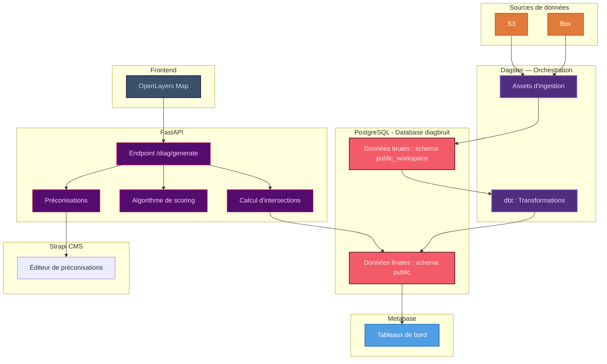

# 🙉 diagBruit 🙉

[](https://github.com/betagouv/diagbruit.beta.gouv.fr/actions/workflows/ci.yml)

Venez tester l'outil : [https://diagbruit.fr](https://diagbruit.fr)

Objectif : permettre aux instructeurs de permis de construire des collectivités d’alerter les porteurs de projet sur les risques sonores et de leur proposer des préconisations actionnables, pour que les constructions de demain respectent les principes d’un urbanisme favorable à la santé.

Le reste du README est en anglais, dans un souci de cohérence et d'accessibilité.

## 🧰 Prerequisites

- Python 3.8+
- Node.js v22 is required. You can check your version with:
  ```bash
  node -v
  ```
  If needed, install or switch to Node 22 using a version manager like nvm:
  ```bash
  nvm install 22
  nvm use 22
  ```
- Yarn
  ```bash
  npm install -g yarn
  ```
- GEOS library for spatial data processing:

  ```bash
  # On Ubuntu/Debian
  sudo apt-get install libgeos-dev

  # On macOS
  brew install geos

  # On CentOS/RHEL
  sudo yum install geos-devel
  ```

## 🐘 Start the PostgreSQL Database with PostGIS

The project uses PostgreSQL with PostGIS extension for spatial data. Launch it using Docker Compose:

```bash
docker compose up -d
```

This will start a PostgreSQL database with the PostGIS extension on port 5433.

## ⚡ Quick Setup

For a quick setup of all virtual environments:

```bash
./setup-dev.sh
```

This will create and configure all virtual environments for the different components of the project. You can then activate the environment you need to work with.

## 🥣 Data ingestion

Ingestion is orchestrated by Dagster (see the Dagster section below). There is no
standalone ingestion component anymore — the legacy `ingestion/launch-ingestion.sh`
was replaced by Dagster assets.

```bash
cd dagster
uv sync

# Relaunch pipelines by domain × department (landing-only from S3 by default).
# Locally you only need one dept — 033 by tradition (the first dept injected):
uv run python run_pipelines.py --domain all --dept 033          # all dept-scoped domains for 033
uv run python run_pipelines.py --domain noisemap --dept 033     # one domain for 033

# Landing-only CI provisioning (S3 → PostGIS, no Box; what CI runs):
uv run python ci_ingest.py ci_landing_by_codedept_job 033
```

See [`dagster/README.md`](dagster/README.md#relaunching-pipelines) for the full
relaunch/reset guide (all departments, `--with-launcher`, `--full-refresh`, Scalingo).

## ⚙️ Dagster + DBT (Orchestration)

### From dagster folder

```bash
cd dagster
```

### Launch dedicated Virtual Environment

```bash
source dagster-venv/bin/activate
```

### Install dependencies

```bash
uv sync
```

### dbt Profile

The dbt profile (`dagster/dbt/profiles.yml`, where Dagster's dbt component reads it — not `~/.dbt`) is committed and env-templated. It defaults to the docker-compose db and reads `DB_HOST` / `DB_PORT` / `DB_NAME` / `DB_USER` / `DB_PASSWORD` when set, so no setup step is required.

### Authenticate with Box (first-time only)

```bash
uv run python box_auth.py
```

### Start the Application

```bash
uv run dagster dev -p 3001
```

The Dagster UI will be available at http://localhost:3001

## 🚀 FastApi

### Launch dedicated Virtual Environment

```bash
source fastapi-venv/bin/activate
```

### From fastapi folder

```bash
cd fastapi
```

### Configure Environment Variables

```bash
cp .env.example .env
```

### Run the Application

```bash
uvicorn app.main:app --reload
```

The API will be available at http://127.0.0.1:8000

### API Documentation

- Swagger UI: http://127.0.0.1:8000/docs
- ReDoc: http://127.0.0.1:8000/redoc

## 🗺️ Frontend

### Install Dependencies

```
cd frontend
cp .env.example .env
yarn
```

### Start the Application

```
yarn start
```

The frontend will be available at http://localhost:3000

## 📁 Strapi (CMS)

### Install Dependencies

```
cd cms
cp .env.example .env
yarn
```

### Start the Application

```
yarn develop
```

The strapi interface will be available at http://localhost:1337

## ✅ Tests

### Run tests manually (local)

Depuis le dossier `fastapi` :

```bash
pytest
```

### Automated tests in Pull Requests

Tests are automatically run on each pull request or push to the main branch via a GitHub Action.
This CI pipeline performs the following steps:

1. Launches a PostgreSQL database with PostGIS.
2. Runs the Dagster landing ingestion (`dagster/ci_ingest.py ci_landing_by_codedept_job 033`, S3 → PostGIS).
3. Executes the dbt run pipeline in `dagster/dbt`.
4. Runs all FastAPI tests located in fastapi/tests/.

The badge at the top of the README reflects the status of this CI.

## ☁️ Deployment (Scalingo via GitHub Actions)

Deployments are fully automated via GitHub Actions. Each component (FastAPI, Frontend, CMS, Metabase) has its own workflow that triggers automatically on push when files in its directory change.

### Production

Push to the `main` branch automatically deploys changed components to production:
- `fastapi/**` → diag-bruit-back-prod
- `frontend/**` → diag-bruit-front-prod
- `cms/**` → diag-bruit-cms-prod
- `metabase/**` → diag-bruit-metabase

### Preprod

Push to the `preprod` branch automatically deploys changed components to preprod:
- `fastapi/**` → diag-bruit-back-preprod
- `frontend/**` → diag-bruit-front-preprod
- `cms/**` → diag-bruit-cms-preprod

### Configuration

The GitHub Actions workflows require the `SCALINGO_SSH_PRIVATE_KEY` secret to be configured in the repository settings. The workflow files are located in `.github/workflows/deploy-*.yml`.

## 🧬 Macro architecture



## 🗂️ Project Structure

```
diagbruit/
│
├── fastapi/
│   ├── app/
│   │   ├── main.py
│   │   ├── database.py
│   │   ├── algorithm/
│   │   ├── models/
│   │   ├── references/
│   │   ├── routes/
│   │   ├── schemas/
│   │   └── utils/
│   ├── tests/
│   │   ├── integration/
│   │   └── unit/
│   ├── .env.example
│   └── requirements.txt
│
├── dagster/
│   ├── dbt/
│   │   ├── models/
│   │   │   ├── bdnb/
│   │   │   ├── noisemap/
│   │   │   ├── osm/
│   │   │   ├── peb/
│   │   │   └── soundclassification/
│   │   ├── macros/
│   │   ├── dbt_project.yml
│   │   └── profiles.yml.example
│   ├── src/dagster_project/
│   │   ├── defs/
│   │   │   ├── assets/
│   │   │   │   ├── bdnb/
│   │   │   │   ├── noisemap/
│   │   │   │   ├── osm/
│   │   │   │   ├── peb/
│   │   │   │   ├── soundclassification/
│   │   │   │   └── defs.py
│   │   │   ├── jobs/
│   │   │   ├── resources/
│   │   │   └── schedules/
│   │   ├── ingestion/         # GeoPandas → PostGIS helpers
│   │   ├── reference_data/    # committed static fixtures (departments)
│   │   └── io/
│   ├── ci_ingest.py           # in-process job runner used by CI
│   ├── box_auth.py
│   └── pyproject.toml
│
├── frontend/
│   ├── .env.example
│   ├── package.json
│   ├── public/
│   ├── src/
│   └── tsconfig.json
│
├── cms/
│   ├── .env.example
│   ├── package.json
│   ├── config/
│   ├── database/
│   ├── public/
│   ├── src/
│   └── types/
│
├── metabase/
│
├── setup-dev.sh
├── setup-ingestion-dev.sh
└── docker-compose.yaml
```

## 🔧 Troubleshooting

### Force Push to Scalingo

If the automated deployment fails due to git history issues (e.g., rejected pushes or conflicts), you can manually force push. You will need to add the Scalingo remote temporarily:

**Example for FastAPI preprod:**

```bash
# Add the Scalingo remote
git remote add scalingo-fastapi-preprod git@ssh.osc-fr1.scalingo.com:diag-bruit-back-preprod.git

# Create a temporary branch with only the fastapi folder
git subtree split --prefix fastapi -b align-preprod

# Force push to Scalingo
git push -f scalingo-fastapi-preprod align-preprod:main

# Clean up
git branch -D align-preprod
git remote remove scalingo-fastapi-preprod
```
