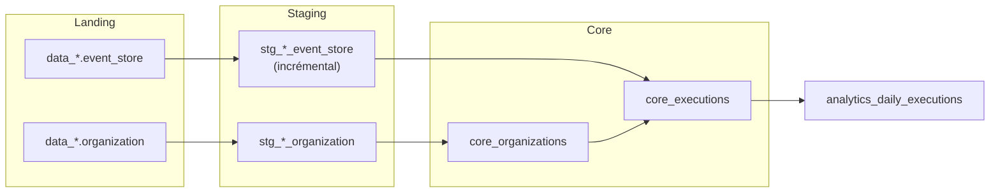
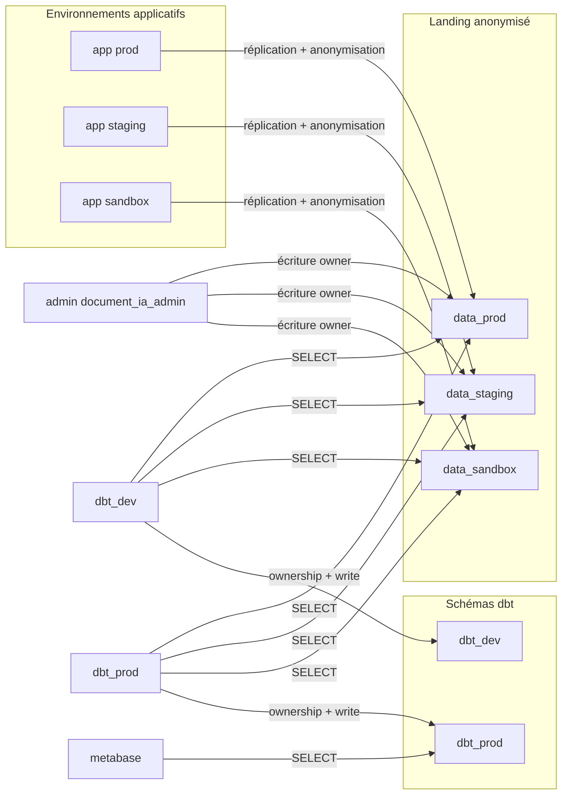

# document-ia-data

Models de transformation de données pour Document-IA.

Projet [dbt Core](https://docs.getdbt.com/) (>= 1.12) avec l'adaptateur PostgreSQL,
exécuté contre l'add-on PostgreSQL de l'application (Scalingo). Les trois
environnements applicatifs (prod, staging, sandbox) sont consolidés dans les
mêmes schémas dbt.

## Prérequis

- Python 3.10 ou plus (3.12 en CI)
- `make`
- [CLI Scalingo](https://doc.scalingo.com/platform/cli/start) (`scalingo login`),
  avec accès à l'application qui porte l'add-on PostgreSQL
- Identifiants du rôle Postgres `dbt_dev` (mot de passe hors git)

## Installation

```bash
make install          # virtualenv .venv + dépendances + packages dbt (dbt_utils)
cp .env.example .env  # variables de connexion (chargées automatiquement par dbt)
```

Renseigner dans `.env` le nom de la base, le mot de passe `dbt_dev` et le port
du tunnel (voir ci-dessous).

`make install` suffit : les cibles `make` appellent `.venv/bin/dbt` sans activer
le virtualenv. Pour utiliser `dbt` / `sqlfluff` directement :

```bash
source .venv/bin/activate
```

## Configuration

Aucun secret n'est versionné. `profiles.yml` lit uniquement des variables
d'environnement (fichier `.env` local, ou export shell).

En **dev**, dbt tourne sur la machine locale mais lit et écrit sur l'add-on
PostgreSQL Scalingo : lecture des schémas landing `data_*`, écriture dans le
schéma `dbt_dev`, avec le rôle `dbt_dev`. La cible `prod` utilise le rôle
`dbt_prod` et le schéma `dbt_prod` sur le même add-on.

| Variable | `.env` local (dev) | Défaut `profiles.yml` (`dev` / `prod`) | Rôle |
| --- | --- | --- | --- |
| `DBT_TARGET` | `dev` | `dev` / — | Cible dbt (`dev` ou `prod`) |
| `DBT_HOST` | `127.0.0.1` | `localhost` | Bout local du tunnel Scalingo |
| `DBT_PORT` | port affiché par `db-tunnel` (ex. `10000`) | `5432` | Port du tunnel |
| `DBT_DBNAME` | nom de la base de l'add-on | `document_ia` | Base PostgreSQL Scalingo |
| `DBT_USER` | `dbt_dev` | `document_ia` | Rôle d'exécution (`dbt_dev` en dev, `dbt_prod` en prod) |
| `DBT_PASSWORD` | mot de passe du rôle | `document_ia` | Mot de passe (jamais commité) |
| `DBT_SCHEMA` | `dbt_dev` | `dbt_dev` / `dbt_prod` | Schéma d'écriture des modèles |
| `DBT_SSLMODE` | `require` | `prefer` / `require` | Mode SSL vers l'add-on |
| `DBT_THREADS` | `4` | `4` | Parallélisme dbt |

Les défauts de `profiles.yml` servent surtout à la CI (Postgres éphémère). En
développement, `.env` doit pointer vers le tunnel et le rôle `dbt_dev`.

## Développement en local

dbt s'exécute en local, contre le schéma `dbt_dev` de l'add-on. Un tunnel SSH
Scalingo est obligatoire : Postgres n'est pas exposé publiquement.

1. Ouvrir le tunnel (le laisser tourner) :

```bash
scalingo --app <app> db-tunnel SCALINGO_POSTGRESQL_URL
```

Noter le port local affiché (souvent `10000`). Le nom de la base se lit dans
l'URL (`scalingo --app <app> env-get SCALINGO_POSTGRESQL_URL`) ; le user et le
mot de passe à utiliser sont ceux du rôle **`dbt_dev`**, pas ceux de l'URL
admin.

2. Compléter `.env` :

```bash
DBT_TARGET=dev
DBT_HOST=127.0.0.1
DBT_PORT=10000          # port affiché par db-tunnel
DBT_DBNAME=<dbname>     # base de l'add-on
DBT_USER=dbt_dev
DBT_PASSWORD=<password>
DBT_SCHEMA=dbt_dev
DBT_SSLMODE=require
```

3. Vérifier puis construire (le tunnel doit rester ouvert) :

```bash
make debug            # vérifie la configuration et la connexion
make build            # seeds, modèles, snapshots et tests → schéma dbt_dev
make lint             # lint SQL (sqlfluff + templater dbt ; besoin du tunnel)
make docs             # génère et sert la documentation dbt
```

Autres cibles : `make run`, `make test`, `make deps`, `make clean`. Liste :
`make help`.

Le lint utilise [SQLFluff](https://docs.sqlfluff.com/) 4.x, dialecte Postgres,
templater dbt (voir [`.sqlfluff`](.sqlfluff) ; `macros/` et `scripts/` sont
ignorés). Corriger automatiquement :

```bash
sqlfluff fix models/
```

En cible `dev`, les modèles incrémentaux `stg_*_event_store` ne chargent que
les événements des **N derniers mois** (défaut : 1), via la macro
`limit_event_store_by_created_at` et la variable
`dev_event_store_lookback_months`. Pour élargir :

```bash
dbt build --vars '{dev_event_store_lookback_months: 3}'
```

Un `--full-refresh` ignore le watermark incrémental (la fenêtre de lookback
`dev` s'applique toujours).

## Modèles

Détail des couches et conventions : [models/README.md](models/README.md).



| Couche | Modèles | Notes |
| --- | --- | --- |
| Staging | `stg_{prod,staging,sandbox}_organization` | Table ; colonne `env` ajoutée |
| Staging | `stg_{prod,staging,sandbox}_event_store` | Incrémental (`delete+insert` sur `id`, watermark `created_at`) |
| Core | `core_organizations` | Union des trois envs ; grain `(env, id)` |
| Core | `core_executions` | Une ligne par `(env, execution_id)` à partir des événements Started / Completed / Failed |
| Analytics | `analytics_daily_executions` | Agrégat journalier (volume et durée) par env, workflow, organisation et statut |

## Cible `prod`

Même add-on PostgreSQL, autre rôle et autre schéma : `dbt_prod` écrit dans
`dbt_prod`. Le tunnel Scalingo est le même qu'en dev ; seuls user, mot de passe
et `DBT_TARGET` / `DBT_SCHEMA` changent.

```bash
DBT_TARGET=prod \
DBT_HOST=127.0.0.1 DBT_PORT=10000 DBT_DBNAME=... \
DBT_USER=dbt_prod DBT_PASSWORD=... \
DBT_SCHEMA=dbt_prod \
DBT_SSLMODE=require \
dbt build
```

En `prod`, pas de lookback temporel sur `event_store` : historique complet, puis
incrémental sur `created_at`. Ne pas lancer `prod` depuis un poste de
développement sauf besoin explicite.

## Permissions base de données

Les schémas et grants de l'add-on Scalingo sont posés par des scripts SQL versionnés
dans [`scripts/sql/`](scripts/sql/) :



| Utilisateur | Étape | Droits |
| --- | --- | --- |
| `document_ia_admin` (admin) | Réplication / anonymisation | Owner et écriture sur `data_*` ; ownership de `public` (config Metabase) |
| `dbt_dev` | Transformation (dev local via tunnel) | SELECT sur les 3 `data_*` ; ownership complet de `dbt_dev` |
| `dbt_prod` | Transformation (env de production) | SELECT sur les 3 `data_*` ; ownership complet de `dbt_prod` |
| `metabase` | Analytics | SELECT sur `dbt_prod` uniquement (y compris tables recréées par `dbt build`) |

À appliquer une fois, dans l'ordre, avec trois connexions distinctes. Détail et
vérifications : [scripts/sql/README.md](scripts/sql/README.md).

## Structure

| Chemin                | Contenu                                                            |
| --------------------- | ------------------------------------------------------------------ |
| `dbt_project.yml`     | Configuration du projet et des couches de modèles                  |
| `profiles.yml`        | Connexions `dev` (`dbt_dev`) et `prod` (`dbt_prod`), pilotées par l'environnement |
| `packages.yml`        | Packages dbt (`dbt_utils`)                                         |
| `models/`             | Modèles, organisés en `staging` / `core` / `analytics` (voir [models/README.md](models/README.md)) |
| `macros/`             | Macros Jinja (`limit_event_store_by_created_at`)                   |
| `seeds/`              | Données de référence versionnées en CSV                            |
| `snapshots/`          | Historisation des tables sources                                   |
| `tests/`              | Tests SQL sur mesure                                               |
| `analyses/`           | Requêtes exploratoires, compilées mais non matérialisées           |
| `scripts/sql/`        | Scripts de permissions Postgres (schémas, grants, default privileges) |
| `.sqlfluff`           | Règles de lint SQL (dialecte postgres, templater dbt)              |

Les modèles sont matérialisés dans le schéma `DBT_SCHEMA` de l'add-on
(`dbt_dev` en cible `dev`, `dbt_prod` en cible `prod`). Les sources staging
lisent les trois schémas landing `data_prod` / `data_staging` / `data_sandbox`.

## Intégration continue

Le workflow [`.github/workflows/ci.yml`](.github/workflows/ci.yml) n'utilise
**pas** l'add-on Scalingo. Il exécute sur chaque pull request (et push sur
`main`) un Postgres 16 éphémère et Python 3.12 :

1. `dbt deps` puis `dbt debug`
2. `sqlfluff lint models/`
3. création des schémas landing (`organization` + `event_store`), puis `dbt build --fail-fast`
